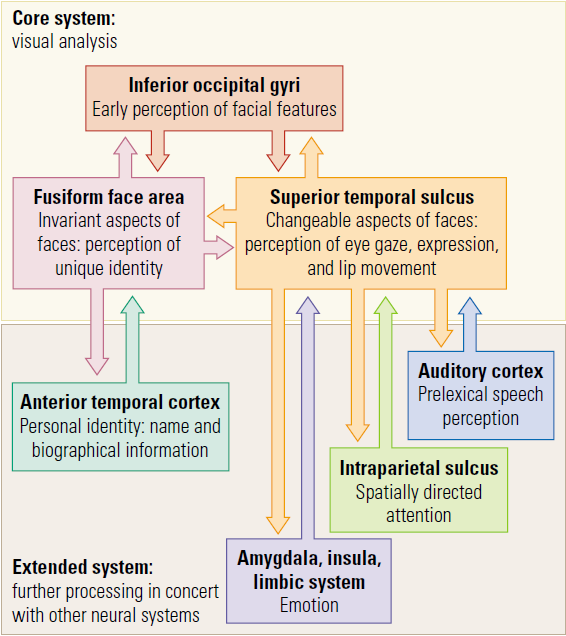
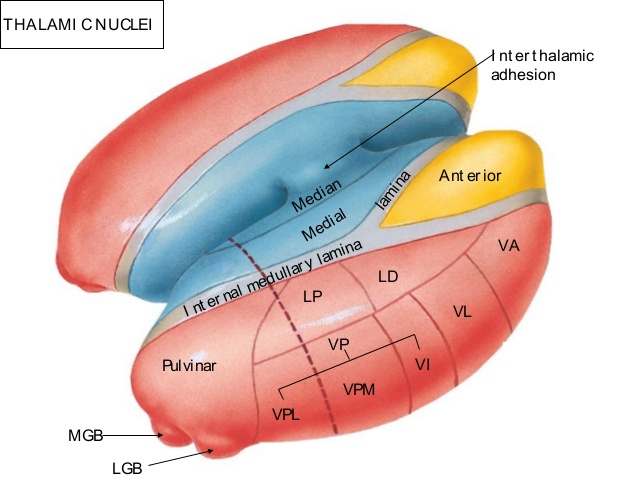
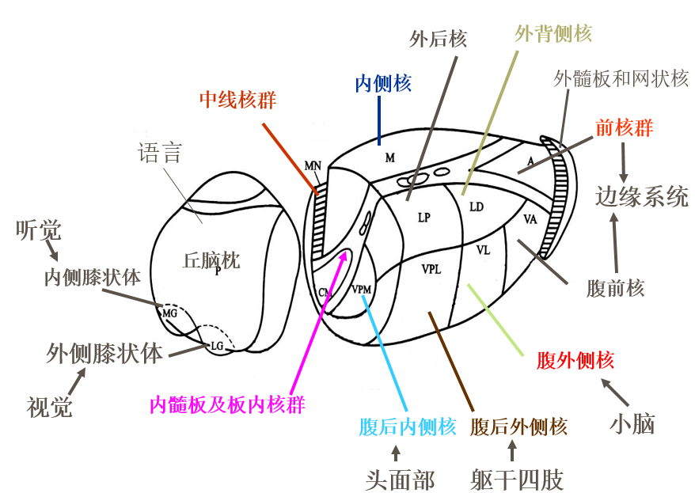
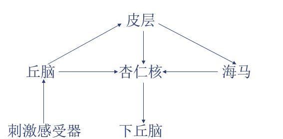
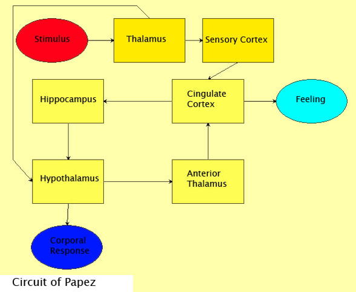

# 神经心理学提纲

陈睿祺

## 绪论

### 历史

- 神经心理学用神经科学的方法研究心理学的问题，由Boring等人在苏联学者鲁利亚的工作基础上建立。

### 研究领域

- 实验神经心理学

- 临床神经心理学

- 发展神经心理学

- （新）认知神经心理学

  即用信息处理的观点来研究

### 研究方法

- 观察法

  摄食饮水、修饰行为、暴力行为等等

- 实验法

  在严格控制条件下研究，手段包括EEG/MEG/PET/fMRI/CT/脑血管造影/脑相图等等

- 流行病学调查

  SNP（单核苷酸多态性），GWAS（全基因组关联分析）等等

### 研究水平

- 全脑
- 大脑的三个功能联合区
- 两半球偏侧化
- 各脑区
- 神经元活动
- 分子
- 基因、遗传

### 鲁利亚的基本功能联合区学说

- 第一功能联合区：控制醒觉和紧张度

  中脑腹侧被盖区上行网状激活系统

- 第二功能联合区：接收处理和保存外界输入

  各初级感觉皮层（投射区）- 联络区 - 顶枕颞叶联合部位

- 第三级联合区：决策和行为控制

  前额叶 - 中央前回 - 运动区

### 表观遗传

- DNA序列不改变而修饰改变造成的遗传改变

  例：经历母婴分离的雄性大鼠出现异常行为，且它们与正常母鼠的后代同样有此行为，延续六代。

- 主要依靠DNA甲基化（甲基化程度高，则基因表达被抑制）

### 一些热点

- 意识
  - 意识能级:stuck_out_tongue_winking_eye:，反正越高越积极
- 行为遗传
- 生态心理学
- 脑肠轴（共生微生物对心理的影响）

## 神经系统基础知识

### 大体解剖

- 端脑
  - 皮质
  
    - 额叶：外侧裂上方，中央沟前方
  
      执行功能，运动，思维，自我意识，语言，社会认知，等等
  
    - 颞叶：听觉，物体识别，共情，利他行为（后上颞叶），天才
  
    - 顶叶：一般感觉，计算，空间认知，体象障碍
  
    - 枕叶：视觉
  
  - 基底神经节
  
    - 尾状核，壳核（二者组成新纹状体）和苍白球
    - 协调运动，病变导致帕金森和迟发型运动障碍
  
  - 边缘系统（除丘脑前核外基本上属于端脑）
  
    - 包括海马、杏仁核、丘脑前核、扣带回等等，与情绪有关。
    - （讲义上甚至包括中脑被盖，因此称之为情感、体温、内分泌和血压、摄食饮水的高级调节中枢。）
  
- 间脑
  
  - 丘脑：感觉中继站
  - 下丘脑：神经内分泌中枢，控制交感和副交感神经活动，控制肾上腺性腺甲状腺活动，调节体温
  
- 脑干
  - 中脑
    - 顶盖（上丘（视觉）、下丘（听觉））
    - 被盖（网状结构，红核，黑质）
  - 脑桥
  - 延髓

- 小脑

- 外周神经系统

  - 共计12对脑神经和31对脊神经
  - 自主（或植物）神经系统：支配内脏，分为交感和副交感神经
    - 交感神经从脊髓各个位置发出，中途一般经过交感神经节中继
    - 副交感神经从脊髓的首尾发出

### 细胞水平

- 细胞类型：神经元和胶质细胞，体积大约1:1，分别用神经节苷脂和胶质纤维酸性蛋白鉴定

  神经元：

  - 单极：一根轴突分叉成两头，分别传入传出
  - 双极
  - 多极：多树突 + 一根轴突

  胶质细胞：

  - 室管膜细胞
  - 星状胶质细胞
  - 小胶质细胞
  - 少突胶质细胞
  - 雪旺氏细胞

- 神经元间的信息传递
  - 位置：树突上的树突棘接纳突触，也有到胞体的突触
  - 化学突触或电突触：产生EPSP或IPSP
    - 电突触也有间隙，只不过很窄
    - 存在一些“沉默突触”，有结构而不起作用
    - 神经肌肉接头处产生终板电位，不是全或无而是有加合效应，以电紧张形式扩布，没有不应期
  - 非突触传递：比如腺体分泌

- 神经发育
  - 由神经管发育而来，需要叶酸
  - 大部分神经元与胶质细胞来自外胚层，而小胶质细胞来自中胚层，与免疫系统同源
  - 脑室区的干细胞分化为祖细胞，祖细胞分裂为一个祖细胞和一个神经元或胶质细胞
  - 神经细胞顺着放射状胶质细胞的投射向皮层表面迁移到最终位置
  - 自发失活：凋亡和焦亡（剧烈炎症反应）

### 神经元

- 细胞器

  - 内质网，高尔基体，线粒体等等

  - 尼氏小体（粗面内质网和核糖体等大量平行排列），被碱性染料染成深色，可以用于判断轴突是否断裂
  - 微管：用于进行轴浆运输（消耗ATP，从胞体到轴突终扣快，反过来慢）

- 细胞核

  - 端粒：DNA两端的序列
    - 孕期压力和童年abuse可导致端粒变短

- 树突棘
  - 接纳突触
  - 信息传递：膜上有大量受体，胞内有第二信使系统
  - 神经可塑性的基础
  - 独立的钙室，使细胞免受兴奋性氨基酸的毒害

### 胶质细胞

- 室管膜细胞
  - 即脑室和中脑导水管、脊髓中央管等等之间的膜的细胞
- 星状胶质细胞
  - 与毛细血管上皮细胞一起形成血脑屏障
    - 主要阻挡蛋白质和脂质进入脑脊液
    - 精分、脑膜炎、组织胺等增强通透性
    - 吗啡等增强隔离作用
  - 填充突触的空隙
  - 固定神经元
  - 神经系统受到损伤时膨大填充，形成胶质瘢痕
  - 为神经元储存营养排泄废物
  - 参与神经元的修剪，与社会行为有关
  - 吸收K+和GABA

- 少突胶质细胞：形成CNS的髓鞘，若受攻击可能引起多发性硬化
- 小胶质细胞：免疫功能，类似吞噬细胞
- 雪旺氏细胞：形成PNS的髓鞘

### 神经递质

- 定义
  - 由神经元合成
  - 兴奋时由前膜释放，经间隙到达后膜并作用于受体
    - 轴突终扣：轴突末梢的芽状突起，与其他神经元形成突触传递信息
  - 直接添加也能引起突触后的效果
  - 有激动剂拮抗剂，能产生一样的效果
  - 有重摄取或灭活途径

- 种类

  - 胆碱类：乙酰胆碱Ach

  - 单胺类

    - 儿茶酚胺类CA：去甲肾上腺素NE，多巴胺DA，肾上腺素E

    - 吲哚类IA：五羟色胺5-HT

  - 氨基酸类

    - 兴奋性：谷氨酸Glu，天冬氨酸Asp……都有两个羧基和一个氨基（“三点学说”）
    - 抑制性：γ-氨基丁酸GABA，甘氨酸……都有一个羧基和一个氨基（“两点学说”）

  - 其他小分子

    - 神经肽
    - NO、组胺等

- Dale原则：一个神经元只释放一种递质（有少量例外，基本上是一种经典递质（氨基酸或单胺）加一种神经肽）

- 含量：氨基酸类 = 1000 单胺类， 单胺类 = 1000 多肽类

- 受体：

  - 按位置分类

    突触前受体的功能：

    - 调节合成和释放量
    - 调节共存递质的释放
    - 重吸收或灭活神经递质

  - 按作用类型分类

    - 离子通道型：快（毫秒级）
    - 促代谢型：受体引发一系列生化反应（消耗代谢的能量），比如通过第二信使（秒到分钟级）甚至第三信使（调节基因表达，小时级）
    - G蛋白偶联受体：促代谢型受体与膜上的G蛋白偶联
      - 受体激活G蛋白脱掉一个亚基打开离子通道
      - 受体激活G蛋白脱掉一个亚基，激活酶，合成第二信使

- 乙酰胆碱

  - 分布：
    - 是神经肌肉接头以及脊髓发出的交感、副交感神经节前纤维的递质
    - 某些细菌或植物的代谢产物
    - 毒素和局部激素的作用
  - 胞体定位和投射：
    - 脑干的一些神经核，内脏和躯体运动通路
    - 脑干上行网络激活系统（基本是胆碱能的），腹侧被盖通路到达基底节或嗅球等还有胆碱能神经元再向上投射
  - 合成和失活：
    - 在细胞质内由胆碱和乙酰辅酶A生成
    - 由乙酰胆碱酯酶灭活
  - 受体：
    - M受体：G蛋白偶联受体
    - N受体：阳离子通道
    - 拮抗剂：东莨菪碱
  - 作用：
    - 感觉：感觉投射系统（三级）中后两级很可能是胆碱能
    - 学习记忆：海马、边缘系统胆碱能神经元是学习记忆的基础
    - 运动：纹状体胆碱能神经元，促进多巴胺释放
    - 意识：M1的胆碱与清醒-睡眠周期有关（东莨菪碱麻醉）
    - 有机磷中毒：抑制乙酰胆碱酯酶
    - 美容：肉毒素为拮抗剂
    - 摄食饮水体温血压注意等等

- 多巴胺

  - 定位与投射：
    - 胞体基本上位于中脑腹侧被盖区，黑质附近
    - 黑质 - 纹状体通路：与运动有关
    - 腹侧被盖区 - 杏仁核伏隔核：成瘾
    - 腹侧被盖区 - 前额叶：短时记忆，问题解决，set-shifting等等
  - 作用：靶酶为腺苷酸环化酶
    - 运动：黑质多巴胺能神经元减少与帕金森有关
    - 精神活动：多巴胺是妄想症的基础
    - 神经内分泌：调节神经内分泌，使中枢神经元兴奋性增加，调节心血管中枢
    - 成瘾，奖赏，母爱，注意等
  
- 去甲肾上腺素

  - 定位及投射：胞体主要在延髓脑桥（如蓝斑核）；有上行和下行投射系统
  - 作用：
    - 觉醒：在自然睡眠中，慢波睡眠由5-HT支持，快速眼动由CA和Ach支持，而觉醒由NE神经元控制
    - 欣悦情绪
    - 注意

- 五羟色胺

  - 定位及投射：胞体主要位于中脑的中缝核，向大脑皮层投射
  - 合成和灭活：由色氨酸合成，代谢产物为5-羟吲哚乙酸
  - 作用：增强记忆，调节情绪，使细胞免受兴奋毒性攻击；有5-HT症候群

- GABA
  - 定位及投射：分布广泛
  - 合成和灭活：由谷氨酸经谷氨酸脱羧酶合成
  - 受体：
    - GABAA受体，突触后的氯离子通道受体
    - GABAB受体，G蛋白偶联受体，一般在突触前，通过抑制钙内流起作用；若在突触后则通过促进钾内流起作用
  - 作用
    - 对中枢神经元的普遍抑制作用：抗惊厥
    - 抗焦虑，止痛
    - 对学习记忆的作用：与长时程抑制LTD有关
    - 调节神经内分泌：对下丘脑摄食中枢以及垂体等有重要作用
- 甘氨酸
  - 定位及投射：胞体位于脊髓和脑干
  - 作用：脊髓中的甘氨酸对感觉和运动进行抑制性调控，但大脑中的甘氨酸能促进兴奋性氨基酸与受体结合
- 兴奋性氨基酸
  - 作用：
    - 广泛的兴奋作用，但太兴奋可能导致钙超载和细胞坏死
    - 对学习记忆认知等等有作用，尤其是短时记忆和空间认知
    - 谷氨酸是GABA的前体
    - 解毒作用：谷氨酸与氨结合生成谷氨酰胺解毒

### 神经内分泌

- 下丘脑分泌活性物质：
  - 如催产素OT与心理资源（记忆广度）、社会行为有关
  - 加压素VP与社会行为有关
- 应激系统：
  - 交感 - 肾上腺髓质（快）
  - 下丘脑 - 垂体 - 肾上腺轴（慢）

## 额叶

### 概述

- 最晚成熟最早退化的区域；进化上最晚的区域；所有脑神经的汇聚地

- 与各个部位都有广泛双向投射（基底节除外，仅额叶到基底节单向投射）

- 分区（从中央沟向前）
  
  - 运动区（BA4）
  - 运动前区（BA6， BA44）
  - 眼区（BA8和8A）
  - 前额叶
    - DLPFC
    - (DMPFC，VLPFC)
    - VMPFC
    - OFC
  - ACC
  
  注意：ACC和FEF有时也算在PFC里

### 功能分区

- M1
  
  - 投射到基底节和红核脊髓等
  - 运动控制，受损后fine movement受损
  
- PMC
  
  - 包括Broca的一部分（BA44）
  - 投射到脊髓和M1
  - 辅助M1
    - 背侧：辅助运动区，动作词库
    - 腹侧：识别运动的镜像神经元
    - 对运动的整合和程序化有重要作用，受损后影响力量和协调性
  - 复杂运动/运动的间接通路：S1-PMC-PFC-M1
  - 简单运动/运动的直接通路：S1-PMC
  
- FEF
  - 8A区受损后随意眼动（如扫视）受损
  - 8区受损后非随意眼动受损

- PFC

  - 功能：
    - 控制PMC选择运动的过程（基于内部线索（如记忆）、外部线索（如奖赏）、自我意识、context cue等等）
    - 社会行为
    - 注意（与PV细胞以及γ节律有关）
    - 性行为
    - 智力
    - 还有无数其他功能

  

### 前额叶病变

- 常用心理检测：Wisconsin Card Sorting
- 相关心理疾病：
  - 科尔萨科夫综合征：慢性酒精中毒，引起记忆下降、情感淡漠、运动受损
  - 阿尔茨海默症，抑郁症（左侧比右侧容易引起），自闭症，帕金森，精神分裂等等
- 临床常见症状：低觉醒、易分心（眶额皮质）、视觉搜索和凝视异常（眼区）
  
- 按部位
  - DLPFC
    - 执行功能和计划
    - 语言
    - 注意
  - DMPFC
    - 自发的运动和语言减少
  - VMPFC
    - 主动性下降，情绪改变
    - 内脏脑，受损后内分泌和本能需要改变
  - OFC：在焦虑时OFC的树突棘反而增多
    - 人格改变
    - 冲动、冒险、强迫行为
    - 主动性增强
  - ACC
    - 随意注意（选择性注意（背侧））
    - 抑郁和焦虑（腹侧）
- 按功能
  - 感觉忽视
    - 对身体的一侧无法觉察
    - 多见于单侧顶叶病变，也有右侧额叶病变者
  - 持续行为
    - PMC深部病变：对已开始的动作有重复倾向，但是可以转移到下一个作业
    - PFC大块病变：一旦开始当前动作就无法转移到下一个
    - 与强迫症不同（没有强迫观念等等）
  - 执行功能和行为控制
    - 包括工作记忆，抑制性控制，认知转换等等
    - 行为的自发性能动性：DLPFC或MPFC受损可能导致自发性下降，OFC受损可能导致躁狂
    - 行为的灵活性（创新、关联学习等等）：与9区（属于DLPFC）有关
  - 时间整合
    - 即将一连串知觉和动作项目整合成有目的有方向的思维的过程
    - 包括瞬时记忆、“预期记忆”和干扰控制
    - 前额叶与其他结构配合
  - 智力障碍
    - 流体智力与DLPFC、MPFC、PPC有关
  - 语言
    - 运动性失语症：BA44（Broca）
    - 传出性失语症：BA6（PMC）
    - 中枢运动性失语症：PFC
  - 自我意识
    - 前额叶受损造成自我意识与自我知识分离：“知道”自己的行为的错误，但不能根据这种知识改变行为
  - 社会认知
    - dmPFC：对相似他人的认知，对自我和他人的知识
    - mPFC（中部）：对自我和他人的知识和感知
    - vmPFC：动机、价值等等

## 颞叶

### 解剖

- 位于外侧裂下方、角回前方、岛叶外侧，侧面被颞上沟和颞中沟分为颞上回、颞中回、颞下回，底（内）面被颞下沟和侧附沟分为颞下回、梭状回、海马旁回（从下到上）。内部主要包括杏仁核和海马。

  |                          Lateral                           |                           Ventral                            |                           Coronal                            |
  | :--------------------------------------------------------: | :----------------------------------------------------------: | :----------------------------------------------------------: |
  |  |  |  |

- 神经连接

  1. 层级式的腹侧通路：从后到颞极，上方为听觉（初级次级直到联合皮层），下方为视觉（从枕叶V4、V5过来），颞上沟有多模态感受细胞，同时接受视听觉等多模态输入。与物体识别有关。
  2. 背侧通路：通向运动区、Broca等等，与听觉运动有关。
  3. 向内侧颞叶的投射：内嗅皮质-齿状回-CA3-CA1，与长时记忆有关。
  4. 向额叶的投射：与短期记忆、运动控制、情绪有关。

### 功能概述

- 听觉：音乐、语言
- 化学感觉
- 视觉：面孔识别、生物运动识别、物体识别
- 内侧颞叶：情绪、记忆、空间导航、社会行为

### 听觉

- 不考😜
  - 蜗螺旋神经节内的双极细胞--蜗神经腹侧核和背侧核--斜方体-橄榄核外侧-下丘-内侧膝状体-内囊后肢-听觉联合皮质
- 失语症
  - 优势半球颞上回后部（Wernicke区）病变引起感觉性失语，颞中回后部或颞顶、颞枕联合区病变引起命名性（又称遗忘性）失语
  - 感觉性失语：语言（特别是听觉）理解能力受损，与外侧裂内颞平面的偏侧化有关
  - 命名性失语：不能命名但可以描述物体
- 失音乐症：非优势半球颞叶受损
- 偏侧化的影响：双侧聆听言语材料时一般更快且准确地报告出右耳内容（右耳优势），而音乐或环境声材料时为左耳优势。有注意理论和结构理论两种假说。

### 视觉功能

- 低级传导：从LGN到V1有部分纤维经过颞叶，损伤可能引起偏盲等

- 颞上沟与生物运动：包括面部表情、眼睛注视等等，因此与社会认知有关

- 面孔识别

  - FFA负责静态，STS负责动态
  
  
  
  - 撒切尔效应：面孔识别的特殊性
  - 分裂脸实验：加工自我面孔与他人面孔时关注的侧面不同
  - 面孔失认症：颞叶或颞枕联系受损引起熟人面孔失认，枕叶受损引起陌生人面孔失认
  
- 注意

  - 颞叶下部与眼区、上丘、顶叶上部、丘脑等有广泛联系
  - 颞叶下部可能起到全视野扫描的作用，引起警觉，并促使其他区域产生注视
  - 颞叶中部与顶枕叶联系，提供了躯体运动指向客体的视觉指导
  - 颞叶中部和内侧与颞叶下部、边缘系统交互，使客体的动机意义被觉察，并引起情绪

- 视觉加工机制

  - 颞中部神经元能以三维方式处理刺激
  - 颞下回涉及最高水平的视觉综合，神经元对颜色、形状、质地等有高度选择性
  - 颞下回有多模态感知细胞，除视觉外还对躯体觉、运动觉、化学感觉做出反应
  - 精神盲：颞下回损伤导致猴子对刺激物（如蛇）视而不见漠不关心

### 记忆功能

- 解剖
  - Emotional Memory：杏仁核和海马与内侧颞叶、基底节以及皮层互动
  - Implicit Memory：由黑质多巴胺驱动，从新皮质到基底节、腹侧丘脑、前运动皮层

### 颞叶癫痫

- Complex Partial Seizure，常起于边缘系统的异常放电
- 表现：意识丧失、运动感觉障碍、自动症、语言障碍（重复无意义言语）、记忆错乱（时空定向紊乱、各种熟悉或陌生感等等）

### 临床表现

- 颞叶癫痫：记忆错乱、意识恍惚、幻觉、运动性兴奋、反复无目的动作等
- 失语症：优势半球颞上回后部Wernicke区受损引起感觉性失语，颞中回后部或颞枕、颞顶联合区受损引起命名性失语
- 听觉障碍：双侧颞横回（颞叶顶内侧，初级听皮层）受损引起皮质聋
- 面孔失认症：颞叶下部
- 瘫痪：颞叶病变侵犯运动区时出现面瘫或者其他
- 对消：两侧刺激同时出现时无法知觉到某一侧刺激
- 共济失调与眩晕
- 视野缺损与眼球震颤、眼底与瞳孔的改变
- 人格与情感、记忆
- 天才、利他、共情

## 顶叶

### 解剖

- 位于中央沟后方，顶枕沟前方，外侧裂上方

  

- 分为中央后回（1/2/3区+顶盖43区，在中央后沟前方），顶上小叶（5/7区，顶内沟（顶间沟）上方），顶下小叶（角回39/缘上回40区，顶内沟下方）
- 按功能可分为前后两部分
  - 前顶叶：中央后回，躯体感觉
  - 后顶叶：顶上区顶下区，语言、空间。有三条通路分别通向PMC（运动）、前额叶（工作记忆）和内侧颞叶（空间导航）。其中：
    - LIP/AIP/IPS等等：顶内沟(c)IPS，负责调控眼动、扫视、视觉定向的抓取
    - PRR：视觉指导的抓取区

- Von Economo的功能分区
  - PA/PB：1-3
  - PE：上部，5和部分7
  - PF：43和40以及部分7
  - PG：大致是39和40，又叫顶枕颞联合区
    - PG有多模态感知细胞，接受躯体感觉和视觉输入
    - PG是背侧通路的一部分，与空间定向有关
    - PG与STS相连，PG（LIP/AIP/cIPS/PRR）到STS被认为是第三条视觉通路

- 神经连接：
  - PE：接收感觉皮层（3-1-2区）的输入，输出到运动皮层（M1/PMC/SMA）
  - PF：接收运动皮层输入、PE传来的感觉皮层输入和PG传来的视觉皮层输入，输出到运动皮层
  - PG：接收各种各样的输入（视觉、眼动、听觉、平衡觉、本体觉、皮肤感觉、扣带回（动机？）等等）
  - PG/PF与PFC连接，可能与空间运动控制有关

### 功能

- 概述
  - 躯体感知觉
  - 空间导向，运动和空间的整合
  - 创造大脑的空间地图
- 感知觉
  - 浅感觉、深感觉、复合感觉
    - 浅感觉指皮肤、黏膜表面的痛温触觉
    - 深感觉指关节肌腱等等位置的运动觉、位置觉、振动觉
    - 复合感觉指在皮质综合加工而成的感觉，比如定位觉、两点觉、实体觉等等
  - 顶上小叶与运动整合有关，可以把中央后回上下肢区的简单冲动整合
- 感觉运动转换和空间导航：后顶叶负责，包括PRR抓取区。例子：神经义肢。
- 视觉运动导向：后顶叶到FEF/PMC/SMA/BA46(PFC)
- 物体识别：两条通路分别编码物体中心的（比如颜色形状相对位置）以及观察者中心的（空间）信息

- 各种各样的“空间”：真实空间、心理空间、准空间（逻辑、数学等）都与后顶叶有关

### 功能障碍概述

- 感觉（中央后回）
- 感觉-运动协调、定向障碍（顶上小叶等）
- 注意：对侧忽视、搜索障碍等（顶枕颞连接部）
- 语言：失读、失写、命名性失语（缘上回、角回）、传导性失语（弓形束）、经皮质感觉性失语（颞顶连接部等）
- 失算或准空间障碍
- 失用症：结构性（如穿衣失用）、观念性、观念运动性
- 体象障碍与厌食症
- 癫痫

### 实体觉缺失

- 又称触觉盲、触觉失认症、触觉性失用症等等，表现为无视听输入时仅凭触觉无法辨认物体，分为两种：
  - 初级触觉失认症：无法形成触觉形象，左顶叶病变引起
  - 单纯实体觉缺失：可以辨认形状材料等，但无法将特征整合以识别物体，右顶叶或胼胝体病变，仅左手

### 失读失写

- 左顶叶角回病变引起全面性失读和严重失写

### 准空间障碍

- 计算：无法理解算符之间的关系
- 语义性失语：无法理解句法逻辑

### 空间性失算失读失写

- 由于空间忽视或者眼球连续扫描障碍造成无法阅读，右半球颞顶叶
- 由于位数放置错误或忽略一部分造成无法计算，右半球

### 空间知觉障碍

- 包括定位障碍、深度知觉障碍、地理定向障碍
- 地理定向障碍
  - 自我中心性：无法够着身边的物品，无法区分呈现物品的前后
  - 导航性：知道自己在哪里以及周围环境，但是不知道往哪儿走（右半球后部和扣带回）
  - 标志物失认（右侧或双侧枕叶舌回）
  - 顺行性定向障碍：不能获得新的地形知识，但是在熟悉环境中不会迷路（右侧或双侧海马旁回）

### 失用症

- 观念性失用症：无法将一系列动作组织起来，比如刷牙的一系列动作顺序颠倒
- 观念运动性失用症：无法**模仿**一系列运动，是执行环节的扭曲
- 结构性失用症：出现在需要将一些零件组装成单一结构时，尤其是三维时
- 穿衣失用症：右半球顶枕颞联合区

### 对侧忽视

- 背侧额顶叶可能与自上而下的注意有关
- 腹侧顶叶可能与自下而上的注意有关

### 体象障碍

- 对自身身体空间表象的认知障碍，比如躯体失认、动觉性幻觉等

### Gerstmann综合征

- 手指失认、失算、失写、左右失定向（指分不清左右），多见于左半球顶叶尤其是角回引起

## 枕叶

### 解剖

- 视觉通路（略）
  - 视单位：一个视网膜神经节细胞及其连接的所有其他视网膜细胞（水平、无长突、双极、视感受细胞）组成视觉的基本结构与功能单位
  - 视交叉的意义：使得单侧半球可以同时处理双侧视觉输入，对于两眼视野重叠很少的动物尤其有意义
  - 视交叉同侧眼输入进入LGN的2,3,5层，对侧进入1,4,6层

- 枕叶
  - BA17：初级视皮层，简单视觉
  - 18：与轮廓和颜色识别有关
  - 19：与视觉记忆有关

- 神经连接
  - V1-V4：颜色，部分也负责形状
  - V1-V2-V5：运动
  - V1-V2-V3：动态形状

- 视觉通路：两条通路在颞上沟的多模态感知细胞整合

  

### 疾病

- 视野缺损：视神经、视交叉、视束、视放射或视皮层病变

  

- 皮质盲
  - 单侧视皮层受损：同位性偏盲，有时中央视野不受累，称为黄斑回避现象
  - 双侧视皮层受损：双侧视觉丧失，有时也有黄斑回避
  - 安东综合征：部分皮质盲患者漠视甚至否认视觉损伤并会寻找各种借口。由于视皮层与高级认知区域联系中断导致。

- 视觉失认症
  - 不伴有初级感觉丧失以及智力、意识问题的视觉认知障碍，可以看到物体但不能认识其意义（但提供其他感官线索时可以）
  - 包括物体、视空间、面孔、颜色失认症等等
  - 失认性失读（对字词失认引起的失读）
  - 双侧呈现单词时，两半球都可以读字母，但仅左半球能把字母拼成单词
    - 也可以看成一种结构失认，或者认为是一种联想失认（从词库里提取受损）
  
- 神经性厌食症：与枕叶外侧活动减退有关
- 幻视
- 枕叶癫痫

## 丘脑

### 解剖

- 位于间脑，第三脑室两侧。
- 前端狭小，向前上方隆起形成丘脑前结节；后端宽厚，突向后外侧形成丘脑枕，其内外两侧有两突起为内侧和外侧膝状体。每侧丘脑中部被Y形的内髓板隔开，形成内外前三个核团；外部有外髓板。

- 核团

  - 中线核群（正中核）：两侧丘脑连接处
  - 板内核：内髓板内
  - 网状核：外髓板内
  - 内侧核
  - 前核
  - 外侧核（背侧）
    - 背外侧核
    - 后外侧核
    - 丘脑枕、内侧膝状体、外侧膝状体
  - 外侧核（腹侧）
    - 腹前核
    - 腹外侧核
    - 腹后侧核：腹中间核、腹后内侧核、腹后外侧核

   

- 功能分区
  - 非特异性投射核团：板内核，网状核，正中核。接受脑干网状结构输入，上行激活系统的一部分，维持清醒状态。
  - 联络性核团：内侧核，外侧核背侧，前核。与时空感觉、情感、精细辨别、意识等有关
    - （背）内侧核：通过丘脑下脚与前核以及前额叶连接，与行为、智力、记忆有关
    - 前核：接收有关内脏活动、情感和近期记忆的输入，投射到边缘系统
    - 丘脑枕：接收和投射到顶枕颞联络皮质，其投射区域是重要的语言区
  - 特异性投射核团：外侧核腹侧。
    - 腹后内侧核：面部感觉及味觉
    - 腹后外侧核：躯体感觉，输出到中央后回感觉区
    - 腹中间核：接收运动神经投射
    - 腹外侧核、腹前核：接收小脑、黑质、苍白球投射，输出到皮层4和6区运动中枢，是锥体外系和小脑系统的重要中继

- 主要投射

  

### 功能

- 感觉：除了嗅觉以外所有感觉的中继站

- 运动：小脑和基底节的运动输出的中继站

- 植物性：上行激活系统的一部分，与一些意识障碍有关

- 情感和记忆：丘脑前核是帕佩兹环路的一部分（还包括海马、扣带回、下丘脑乳头体等）

  

### 疾病

- 丘脑性遗忘症
  - 丘脑前部病变可能引起遗忘症，可能由于乳头体丘脑束和相邻的腹侧杏仁核传出通路损伤导致
  - 左侧病变导致语词特异性遗忘，右侧导致非语词特异性遗忘
  - 同时有顺行性和逆行性遗忘，顺行性多为非完全性而逆行性为完全性，而且失去过去的时间坐标
- 科尔萨科夫综合征：酗酒导致硫胺素缺乏引起丘脑和下丘脑乳头体损伤，导致记忆力下降、情感淡漠等
- 单侧忽视：右侧病变引起
  - 运动性：对一侧肢体使用少，被要求使用时也可能完成不到位
  - 感觉性：出现痛觉、触觉或实体觉的对消（类似听觉）
  - 偏侧空间忽视
- 体象障碍：顶叶丘脑都可引发，尤其是右侧
- 人格
  - 情感淡漠、注意力涣散、冲动脱抑制、愚蠢的欣快等
  - 执行功能障碍：DLPFC-尾状核-苍白球-丘脑-DLPFC
  - 淡漠：内侧前额叶-伏隔核-苍白球-丘脑-内侧前额叶
  - 脱抑制：眶额皮质-尾状核-苍白球-丘脑-眶额皮质

- 丘脑性痴呆：真正的痴和呆
- 丘脑性失语：可能源于腹外侧核和腹前核到Broca的投射，或者丘脑枕到皮质语言区的投射
- 丘脑痛