# Nonlinearity Dynamics and Chaos

## Introduction

- History:

  - 1666, Newton, three-body problem
  - 1900, Poincare proved the problem has no close form solution (chaos)
    - Use a geometic way rather than finding analytic solution, but not understood by others
    - Chaos:
      - Deterministic system
      - Aperiodic, seemingly unpredictable behaviour
      - Sensitive dependence on initial conditions (exponential divergence)
  - 1920-1950, non-linear oscillation in physics (e.g. radar)
  - 1960, Lorenz used computer for research in atmosphere
  - 1960s, KMM theory
  - ~1975
    - *chaos in iterated maps* (May)
    - fractals (Mandelbrot)
    - non-linear oscillators in biology (Winfree)
    - Turbulence in fluid (Ruelle & Takens)
  - 1978, *universal route to chaos* (Fergenbaum)
    - connection to phase transition in statistical physics through renormalization group
  - 1980s, becoming very popular, experimental confirmations
  - 1990s, engineering applications
  - 2000s, complex systems (historically chaos is about simple system with few parameters), network theory

- Logical structure of dynamics:

  - $$\dot{x} = f(x), x\in \R^n$$ is a vector in phase space
  - Linearity: all f(x) has only first power of x (but not necessarily first-order, see below)
    - Simple harmonic oscillator: $$m\ddot{x} + kx = 0$$
    - Let $$\vec{x} = (x, \dot{x})$$, then it can be written into a linear form (second order)
    - Another example: pendulum is not linear
  - Autonomous system:
    - f(x) is time-independent (otherwise you can include t as a parameter too)
    - Keeping the vector field static (for geometric method to be used)

- Geometric way:

  - A solution of the system (x1(t), x2(t)) is a tracjectory in the phase space
  - Many things can be done only through the phase portrait (picture of all **qualitatively** different trajectories) rather than solving the ODE

- A big picture:

  | System \ N of Parameters | 1                          | 2                   | 3 (chaos begins)       | >3   | >>1 (complex systems) | Continuous (complex systems)                              |
  | ------------------------ | -------------------------- | ------------------- | ---------------------- | ---- | --------------------- | --------------------------------------------------------- |
  | Linear                   | RC-oscillation             | Harmonic oscillator |                        |      |                       | Electromagnetic wave, Schrodinger equation, (linear PDEs) |
  | Non-linear               | Logistic population growth | Pendulum            | Lorenz system, fractal |      | networks              | General relativity                                        |

## One-Dimensional System

- Examples:
  - $$\dot{x} = \sin x$$, a sine wave in phase space
  - Stable and unstable fixed points (where velocity is 0)
  - 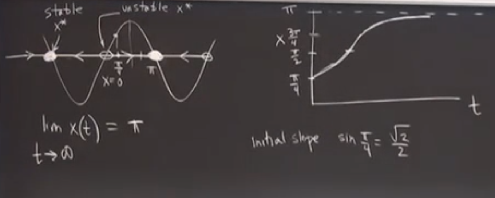
- Another example: population growth
  - $$\dot{x} = rx(1 - x/K)$$, where K is the carring capacity
  - per-capita growth rate $$\dot{x}/x$$ is linear to population (passing (0, r) and (K, 0)) rather than static (without competition, exponential growth)

- Perturbation around fixed points

  - Let $$x^*$$ be a fixed point and $$\eta(t)$$ is the perturbation

  - Using first order Taylor equation we can approximate the system as $$0 + \dot{\eta} = 0 + \eta f'(x^*)$$, which is called linearization

  - So if $$f'(x^*) > 0$$, $$x^*$$ is unstable (exponentially deviating), if it's negative then that's stable, if it equals to 0, then linearization provides no information about stability. For example, it can be half-stable:

    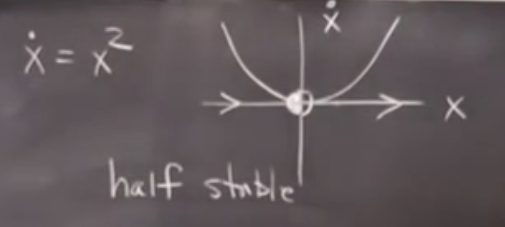

- Solution to 1D system:
  - Existence and uniqueness: if f(x) is continuously differentiable, then there exists a unique solution
  - Possible dynamics: x approximates infinity or a fixed point when time approximates infinity (most importantly, no oscillation)
    - x can only increase or decrease monotonously, since f(x) can only be positive or negative at each point

## Bifurcation (1D)

- Concept:
  - A heavy block on a thin stick may fall down from the left or right side with small perturbation
  - Bifurcation: As a parameter changes at a specific value (bifurcation point or value), the structure of the vector field changes dramatically - fixed points created or destroyed, or stability changed

- Saddle-point bifurcation (simplified version):

  - Creation of (a pair of stable and unstable) fixed points
  - $$\dot{x} = r + x^2$$, where r is the control parameter
  - When r < 0, there will be a pair of stable and unstable fixed points; when r=0, they merge into one half stable fixed point; when r > 0 it disappears

- Bifurcation diagram:

  - Plot of $$x^*$$ over r, e.g. for saddle-point bifurcation:

    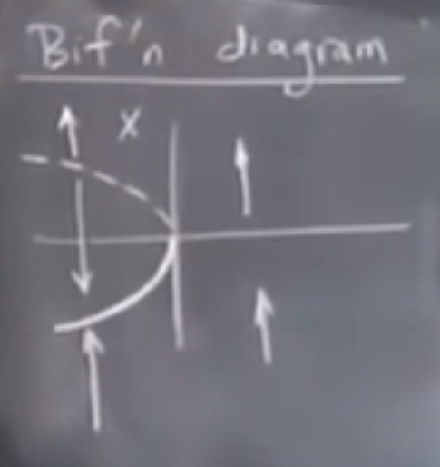

    (Vector represents moving direction, fixing r; dash line represents unstable fixed points)

  - Saddle-point bifurcation happens at the tangent point:

    - Consider $$\dot{x} = r + x - \ln(1 + x)$$, bifurcation happens at the point when $$y = r+x$$ is tangent to $$y = \ln(1 +x)$$, i.e. r = 0 & x = 0
    - Around the tangential point (x,r) = (0,0), Taylor euqation gives $$\dot{x} = r + \frac{x^2}{2} + o(x^2)$$ ("no information" situation)
    - This kind of bifurcation is called the normal form
  
- Transcritical bifurcation:

  - Consider $$\dot{x} = rx - x^2$$, which has a fixed point at 0 that is irrelevant with r
    - E.g. for population, n=0 is always a fixed point
    - But the stability can be changed
  - The bifurcation diagram is like an Relu function and its $$180^\circ$$ rotation ("exchange of stability")
    - When r = 0, half stable

- Pitchfork bifurcation:

  - Usually in system with symmetry, e.g. $$\dot{x} = rx - x^3$$

  - r < 0, one (exponentially) stable fixed point x = 0; r = 0, one stable fixed point x = 0; r > 0, one unstable fixed point x = 0 and a pair of stable fixed point

    - When the bifurcating solutions (here the new pair of fixed points) are stable, the bifurcating point is called supercritical point

  - Bifurcation diagram is like a pitchfork:

    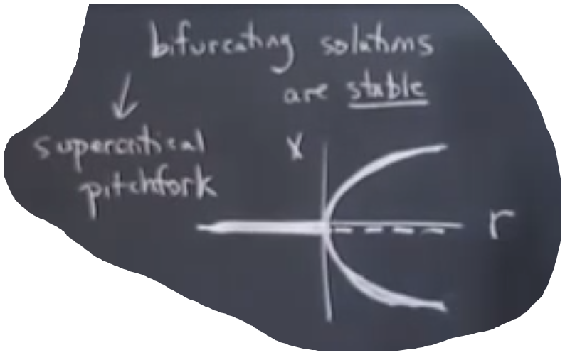

## Examples of 1D Bifurcation

- An insect outbreak model:

  - Based on the logistic model, converting the parameters into unitless variables
  - $$\dot{x} = r(1 - x/k) - \frac{x^2}{1 + x^2}$$
  - Increasing r with fixed (and relatively large) k, the fixed points (except 0) will be: a - a/bc - a/b/c - ab/c - c, where a and c are stable and b is unstable
  - As r increases and a,b merge up with each other, the smaller fixed point vanishes and only the larger one remains
    - In reality this means an insect outbreak

- Hysteresis: the system's dependence on its history

  - In the outbreak above, even if you reduce r to low level, the system will not go back to a, since b is unstable so x remains higher than b
  - If we plot the fixed point over r and k (see figure 3.7.6, note that there may be several fixed points for a single (r, k)), there will be a "jump" at the critical point, where the fixed point jumps on the plane above but cannot go back smoothly.

  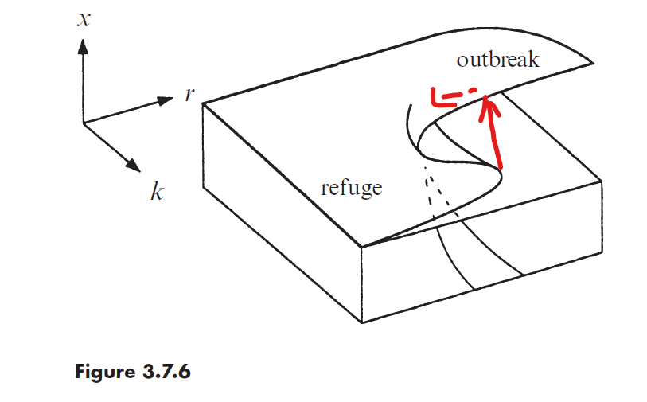

## Two-dimensional System

- $$\dot{X} = f(X)$$, where $$X \in \R^2$$ and f is continuously differentiable

  - A solution (tracjectory) exists for any initiation
  - Trajectories will never come across each other, and never merge too (consider time reversed)
    - Interesting property: a closed trajectory can seperate the plane into two parts
    - But in three dimensions, two trajectories can interwine (since a trajectory cannot seperate the space), leading to chaos

- Linear system

  - $$\dot{X} = AX$$

  - Eigenvectors of A give the straight-line solutions of the system

    - Denote $$\tau = tr(A), \Delta = det(A)$$, than eigenvalues suffice $$\lambda^2 - \tau\lambda + \Delta = 0$$

  - Fixed points:

    - $$\Delta < 0$$, saddle points

      - Solution $$X(t) = b_1e^{\lambda_1 t}v_1 + b_2e^{\lambda_2 t}v_2$$, where $$v_1, v_2$$ are the eigenvectors

      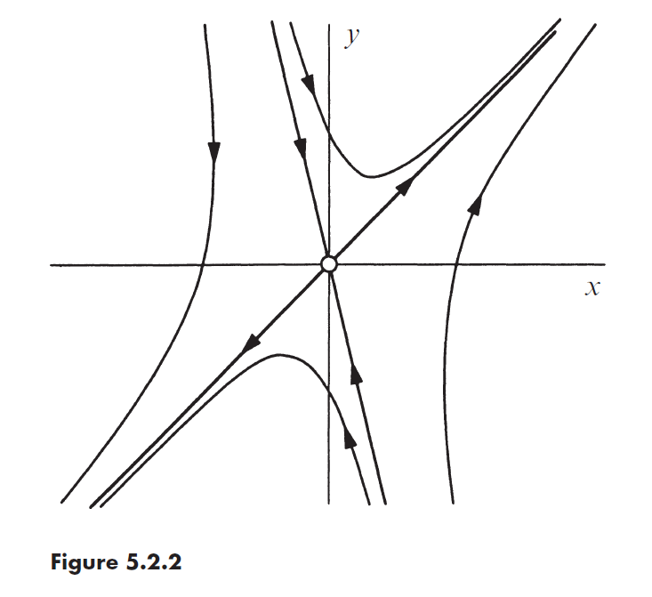

    - $$\Delta > 0$$, attracting or compelling fixed points

      - if $$\tau < 0, \tau^2 - 4\Delta > 0$$, then $$\lambda_1 < \lambda_2 < 0$$, nodes
        - $$v_1$$ correspondens to higher speed, which implies:
        - A point roughly moves on the direction of $$v_1$$ until it "turns" as it approaches $$v_2$$ and falls to the attractor (roughly) in the direction of $$v_2$$
        - In reverse time, a point will go to infinity (roughly) in the direction of $$v_1$$
      - if $$\tau < 0, \tau^2 - 4\Delta = 0$$, star node (straight to the origin) or degenerate node (close to spiral)
      - if $$\tau < 0, \tau^2 - 4\Delta < 0$$, then $$ \lambda = \mu \pm i\omega$$, spiral
        - Both component of X is linear combination of $$e^{\mu t}\sin \omega t, e^{\mu t}\cos \omega t$$
      - If $$\tau = 0$$, then $$\tau^2 - 4\Delta < 0, \lambda = \pm i\omega$$, closed orbit (with a stable fixed point at the origin)

    - $$\Delta = 0$$, line or plane fixed points

    - Summary:

    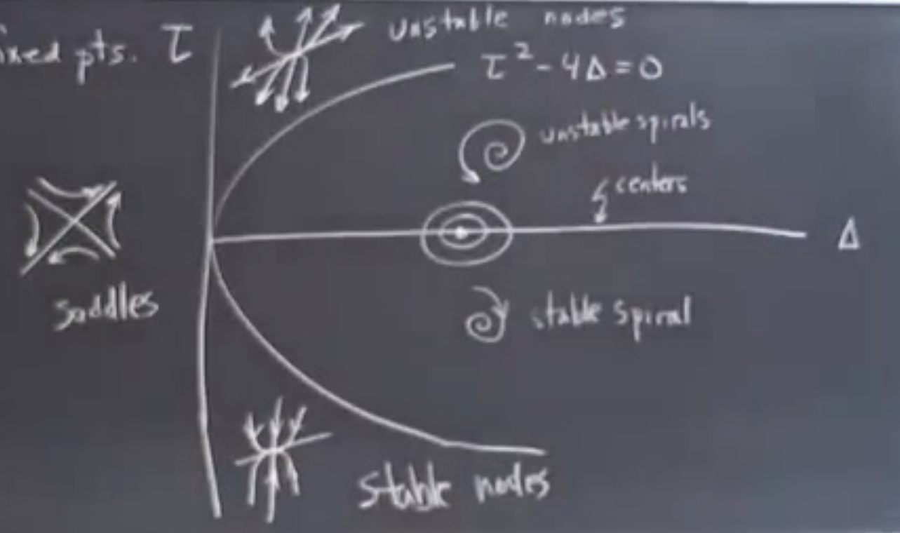

- Nonlinear system

  - Linearization around fixed points: Adding perturbation U = (u, v), then $$\dot{U} = JU$$, where J is the Jacobian matrix

  - When can the higher order term be neglected and when cannot:

    - If linearization indicates a saddle, nodes, or spiral: Qualitatively right
    - Degenerated node, star, center (orbit), non-isolated fixed points (line/plane): May not be true

  - "Rabbits and sheep" model by Lotka-Volterra for competition:

    - x(t): population of rabbit; y(t) for sheep

    - Model: $$\dot{x} = x(3 - x - 2y), \dot{y} = y(2 - x - y)$$, logistic model plus a competition term (rabbit is more than sheeps so also more influenced)

    - The vector field:

      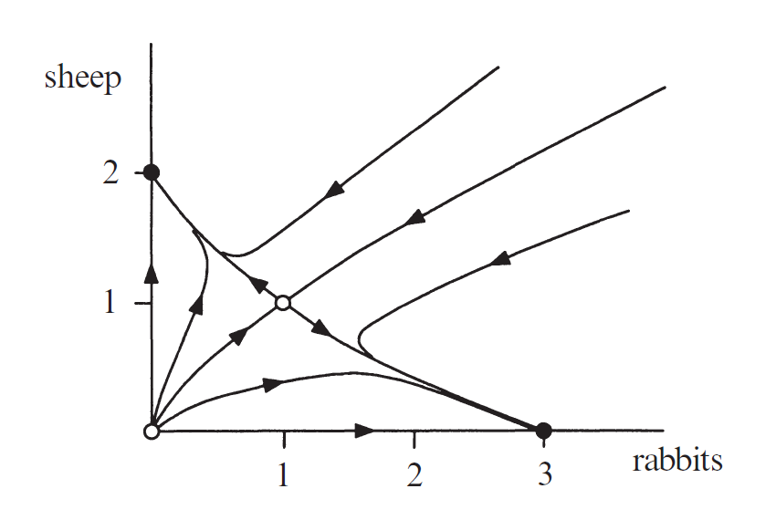

      - x and y axes are invariant lines (i.e. if the point is on a line than it never leaves)
      - There is one "stable manifold" for the unstable fixed point (1, 1), only points on this line can evolve to the fixed point
      - There are two "basins of attraction" for two stable fixed points

## Conservative Systems

- Definition:

  - Example: $$m\ddot{x} = F = \frac{dV}{dx}$$, then the energy $$\frac{1}{2}m\ddot{x}^2 + V(x)$$ is conserved (constant over the trajectory)
  - Definition: a system is conservative if it has a conserved property E(x) (real-valued function that is constant on the trajectory, but not on any open sets, e.g. E(x) = 0 is not qualified)

- Double-well potential example:

  - $$V(x) = -\frac{1}{2}x^2 + \frac{1}{4}x^4$$, Let $$\dot{x} = y = x - x^3$$

  - The portrait:

    

  - The inner $$\infin$$ trajectory at the origin is called homoclinic orbit

    - indicating that the trajectory (actually, a left one and a right one) will approach a same fixed point as time goes to positive and negative infinity)
    - Physically that's what happen when you started at the right or left side with zero velociy at the same height of the peak in the middle, where the particle will approach the peak in infinity time (no gravity!)
    - If a trajectory connects two different fixed point then that's a heteroclinc orbit

  - Each closed orbit represents one energy level (consider plotting E(x,y), see Fig 6.5.3, which looks like a tooth)

- There cannot be any stable nodes or stable spiral in conservative system

  - All roads lead to Rome indicates that all roads converge to a same E within an epsilon ball of the node
  - This contradicts with the requirement that E is not constant over any open set

- Centers:

  - If an isolated fixed point (two-dimensional) is the local minimum or maximum (not a saddle point like (0,0) in the case above!) of E, then it's a center
  - I.e. any trajectories close enough to this fixed point are closed

## Index Theory

- One of the few methods that can provide "global" information instead of only around the neighbourhood of the fixed points
- Definition:
  - Given a simple (no self-intersection) closed curve *C* and a vector field $$(\dot{x}, \dot{y})$$, the direction of the vector field $$\Phi$$ is changing along the curve
  - Define $$I_c = [\Phi]_c/2\pi$$, where the bracket represents the net increase of phi as a point traveling along C for a loop counterclockwise
- Properties:
  - If the curve is a trajectory in the vector field, then its index is +1
  - The index is additive if we divide a curve into two parts (by adding one boundary in between)
  - If C is deformed continuously into C' without passing through a fixed point (no definition of Phi), then the index preserves
    - Proof: a continuous function of integer value can only be constant
  - If C doesn't enclose a fixed point, I = 0
    - Proof: deform it to a very small area, then vectors will point to roughly the same direction
- Index of a point: the index of any curve enclosing this point but no more other fixed points
  - For regular point the index is 0
  - Saddle: -1
  - Node, spiral (either stable or unstable): +1
- Any 2D trajectory must enclose a set of fixed points whose indices sum up to +1
- On other 2D surface, the sum of the indices of all fixed points is 2-2g, where g is the genus (number of handles) of the surface

## Limit Cycles

- Isolated, closed trajectories
  - **Neighbouring trajectories are not closed!**
  - Stable (trajectories inside and outside it are both spiraling towards it)
  - Unstable (trajectories inside and outside it are both spiraling away from it)
  - Half-stable, half-unstable
  - Only exists in non-linear system (not in $$\dot{x} = Ax$$)
- Criteria to rule out the possibility of closed orbits:
  - Dulac's criterion:
    - R is a simply connected region in R^2, if there exists a continuous function g so that the sign of $$\nabla\cdot(g(X)X)$$ (divergence of X scaled by g(X), i.e. sum of each component of the gradient) does not change in R
    - But it's hard to guess g
- Criteria for the existence of closed orbits:
  - Poincare-Bendixson theorem (only in 2D):
    - R is a closed, bounded region in R^2 containing no fixed points
    - There exists a trapped trajectory T (in the region R at some time point and then stay in R forever)
    - Then T is either closed or spirals towards a closed orbit in R
    - Usually used with an annulus where the vector field points towards it on the boundary

- Averaging theory for non-linear oscillators
  - $$\dot{x} + x + \epsilon H(x, \dot{x}) = 0, 0 \le \epsilon \ll 1, y = \dot{x}$$
  - The trajectory is still nearly circular with a "period" of 2pi, where $$x(t) \approx r(t)\cos(t + \phi(t)), y(t) \approx -r(t)\sin(t + \phi(t))$$, r and phi are slowly drifting
  - View the equation above as the definition of r and phi, then $$\dot{r} = \epsilon h\sin(t + \phi), \dot{\phi} = \frac{\epsilon h}{r}\cos(t + \phi)$$, both are $$o(1)$$
  - Two time scale: slow evolution, and fast oscillations. The time-dependency make phase-plane analysis difficult.
  - The fast dynamics can be ironed out through runing average (integration over t-pi to t+pi). Considering the dynamics of $$\bar{r}$$ and $$\bar{\phi}$$:
    - Replacing all r and phi with corresponding moving average will only introduce and error of $$\Omega(\epsilon ^2)$$, so treat all r and phi in the averaging term as constant
    - For Van der Pol oscillator, we can get $$\dot{\bar{r}} = \epsilon\bar{r}/8(4-\bar{r}^2)$$, so $$\lim_{t \to \infin} \bar{r}\to 2$$; for the phase, the mean is still 0 (with a second order error), which means the period is still approximately 2pi
    - Therefore, the Van der Pol oscillator's dynamics is a gradually amplifying (to a limit) oscillator

## 2D Bifurcations

- All analysis can be reduced to "normal forms" about fixed points or limit cycles

- For fixed points:
  - Eigenvalue $$\lambda = 0$$: saddle node, transcritical bifurcation, pitch fork
  - $$\lambda = i\omega$$: Hopf bifurcation
  - When $$Re(\lambda) < 0$$, the fixed point is stable
  - Bifurcation happens when $$Re(\lambda )$$ comes across y axis 

- For limit cycles:
  - Coalescence of cycles
    - saddle-node bifucation for cycles
    - an unstable cycle and a stable cycle approach each other, merge and disappear
  - Saddle-node Infinite Period bifurcation (SNIPER), also called Saddle-node on Invariant Circle bifurcation (SNIC)
    - One point on the cycle changed into unstable node, then seperated into a pair of saddle nodes on the cycle
  - Homoclinic bifurcation

- Zero-eigenvalue bifurcations:
  - Saddle-node:
    - $$\dot{x} = \mu -  x^2, \dot{y} = -y$$
    - 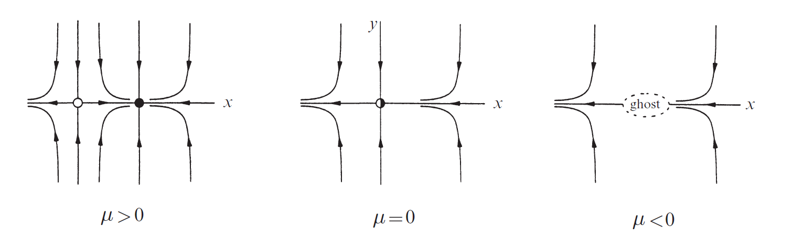
    - An unstable node was divided into a saddle point and a stable node when $$\mu >0$$
    - When $$\mu < 0$$, there will be a "ghost" area (sometimes called bottleneck) at the position of the node where the dynamics are very slow (and further decreased to 0 when the node appears)
  - Transcritical:
    - $$\dot{x} = \mu x -  x^2, \dot{y} = -y$$
    - Saddle (x = mu) and node (x = 0) - semistable node - node (x = mu) and saddle (x = 0)
  - Pitchfork:
    
    - Supercritical: $$\dot{x} = \mu x - x^3, \dot{y} = -y$$
    
      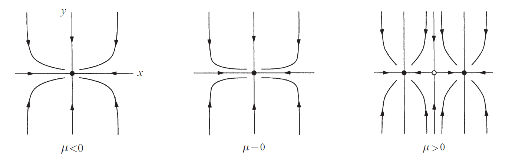
    
    - Subcritical: $$\dot{x} = \mu x + x^3, \dot{y} = -y$$
  
- Hopf bifurcation:

  - Occurs when $$\lambda = \pm i\omega, \Delta > 0 , \tau = 0$$

  - Supercritical ("Soft""Continuous""Safe"):

    - $$\dot{r} = \mu r - r^3, \dot{\theta} = \omega + br^2$$

    - stable spiral - unstable spiral surrounded by a small amplitude ($$r = \sqrt{\mu}$$), stable, nearly elliptical limit cycle

      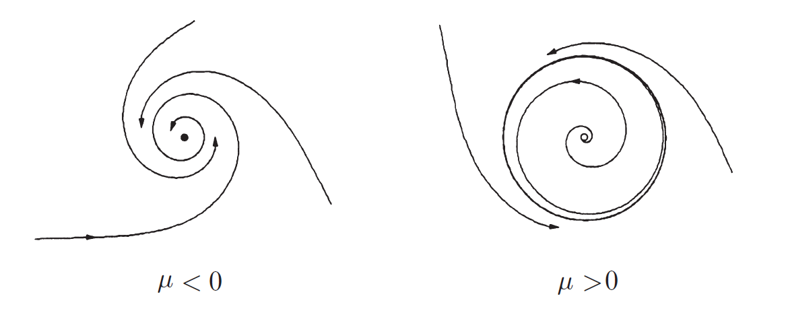

    - Example: Parkinson patients' movement control (cannot maintain a fixed point but oscillates)
    
  - Subcritical ("Hard""Discontinuous""Dangerous"):
  
    - $$\dot{r} = \mu r + r^3 - r^5, \dot{\theta} = \omega + br^2$$
  
    - stable cycle surrounding an unstable cycle surrounding a stable spiral - unstable spiral surrounded by stable cycle
  
      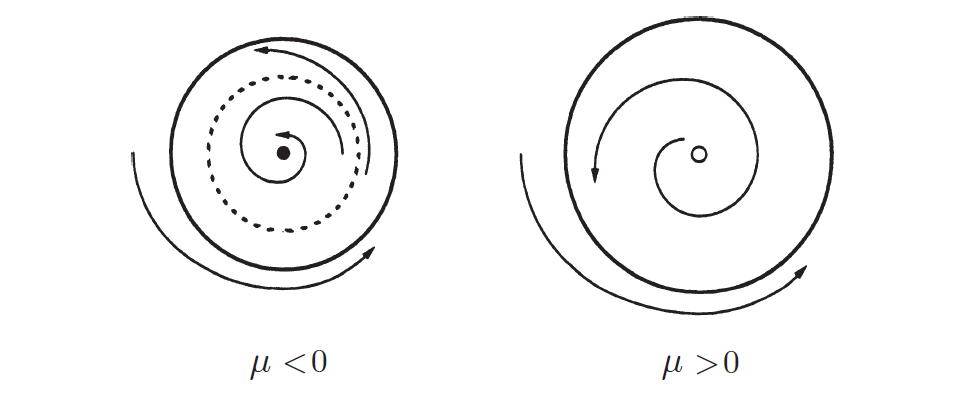
  
    - "Going out of control": fixed point - large oscillation
  
    - Hysteresis: after $$\mu $$ becomes 0, reducing $$\mu$$ will not bring you back to the fixed point immediately (oscillation persists)
  
- Other bifurcations of periodic orbits:

  - Saddle-node coalescence of limit cycles:

    - $$\dot{r} = \mu r + r^3 - r^5, \dot{\theta} = \omega + br^2$$ (same as above)

      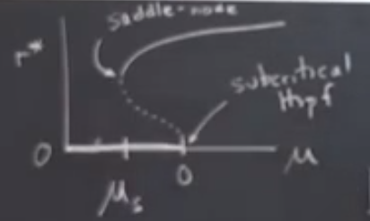

    - Reducing mu towards $$\mu_s = -\frac{1}{4}$$: the stable cycle and unstable cycle collide into a half-stable cycle (stable outside, unstable inside)

      - If increasing mu, it seems that a large limit cycle is generated out of nowhere

      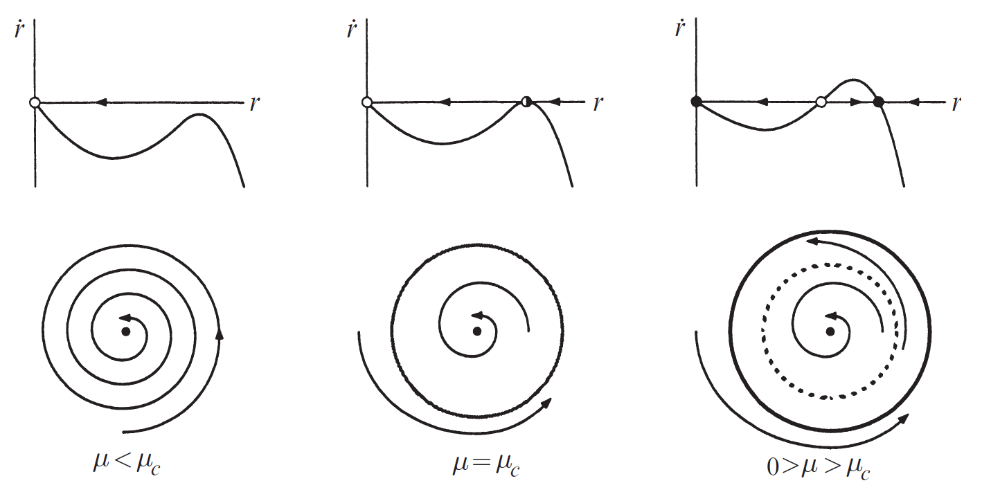

  - SNIPER:

    - $$\dot{r} = r(1 - r^2), \dot{\theta} = \omega - \sin\theta$$

    - Stable cycle (with changing speed) - half-stable node on the cycle (at the "slow" region) - two nodes on the cycle

      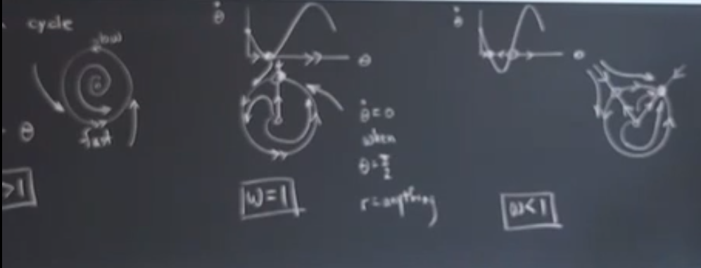

    - Consider the cartesian version of this dynamics (x over t):

      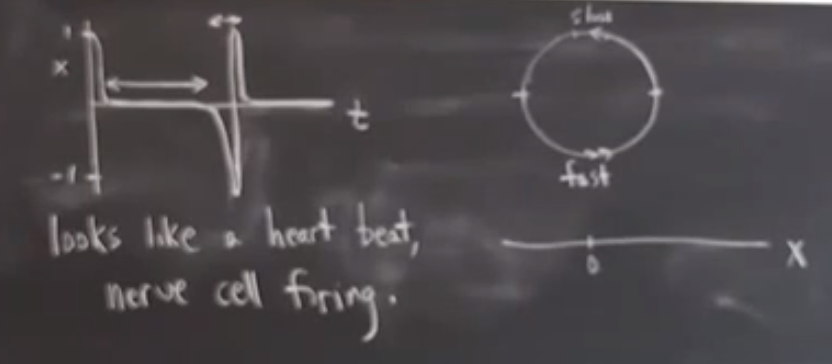

      - It can be shown the period of the pulse $$T \sim \frac{1}{\sqrt{\mu}}$$, where mu is the distance to the bifurcation value (e.g. $$|\omega - 1|$$)

  - Homoclinic: A limit cycle approaches and touches a fixed point (See P266)

- Summary:

  - We can guess the type of bifurcations by the amplitude and period of the limit cycle around the bifurcation:

    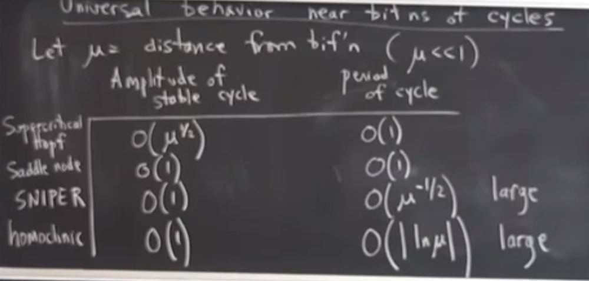

## Coupled Oscillators and Quasiperiodicity

- Dynamics on torus: two cyclic parameters, can also be represented on a pseudo-torus square (connecting the top and the bottom, the left and the right)

- Example: $$\dot{\theta_1} = \omega_1, \dot{\theta_2} = \omega_2$$

  - When $$\omega_1 / \omega_2 = p/q$$ is rational, the trajectories are closed; when p is not 1, the trajectories will form a torus knot, e.g. p = 2, q = 3:

    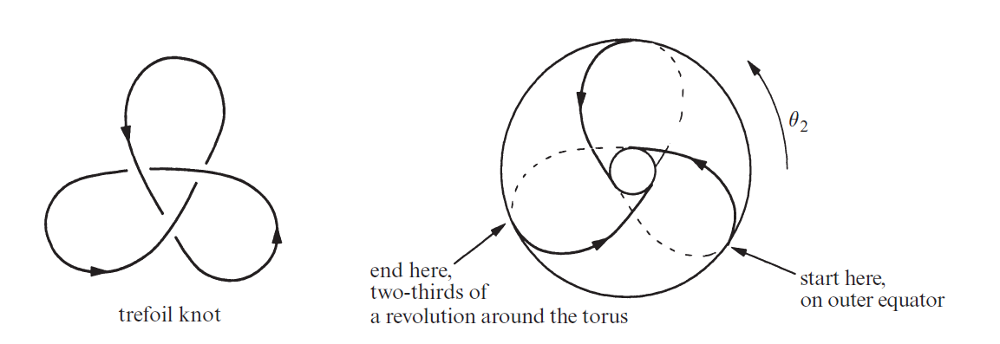

  - When irrational:

    - Quasiperiodicity: the trajectories are not closed but will be dense over the torus
    - Not chaotic: the distance between two (initially very close-by) points increases linearly with time, not exponentially

- Coupled oscillators:

  - $$\dot{\theta_1} = \omega_1 + K\sin(\theta_2 - \theta_1), \dot{\theta_2} = \omega_2 + K\sin(\theta_1 - \theta_2)$$, two synchronizing oscillators (faster one lowering the speed and vice versa)
  - Let $$\phi = \theta_1 - \theta_2$$, then $$\dot{\phi} = \omega_1 - \omega_2 - 2K\sin\phi$$
  - When K is large enough, there will be two fixed points (one stable one unstable) for phi, i.e. the two oscillators will be phase-locked

## Chaos and Lorentz Equations

- Consider the chaotic waterwheel (horizontal instead of vertical, but tilted)

  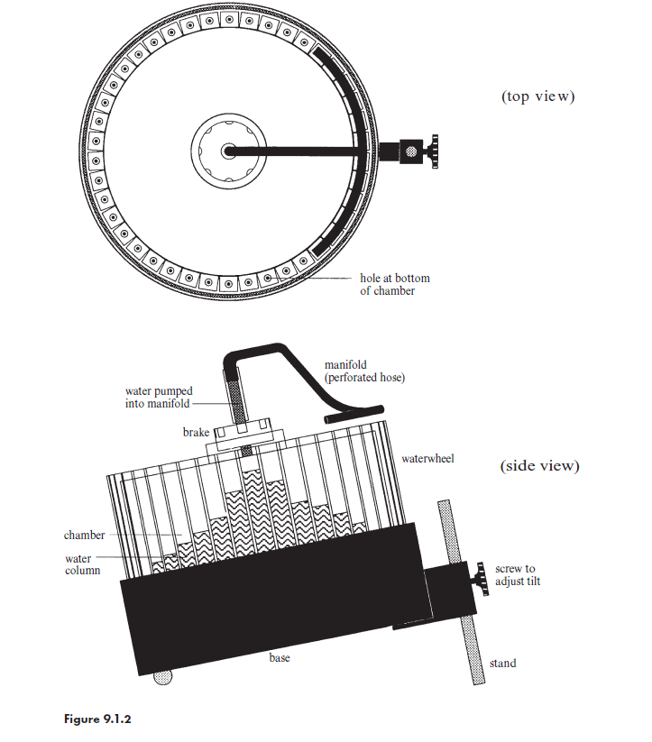

  - The brake at the center can change the friction of the wheel; the tilt can also be adjusted
  - Parameters:
    - r, radius of the wheel
    - $$\omega(t)$$, angular velocity of the wheel
    - $$\theta$$, angle in lab frame (top view of the wheel)
    - $$Q(\theta)$$, the inflow rate of water at a certain angle
    - $$m(\theta, t)$$, mass distribution of the water on the wheel
  - Dynamics:
    - Conservation of mass:
      - $$\frac{\partial m}{\partial t} = Q - Km + \omega\frac{\partial m}{\partial \theta}$$, K is a constant representing the speed of outflow
      - inflow, outflow proportional to the mass/pressure (note: all chambers are tilted with the same angle, so the tilting effect can be absorbed to K), and rotation-induced change
      - $$\dot{M} = \int_0^{2\pi} Q - Km + \omega\frac{\partial m}{\partial \theta} d\theta = Q_{total} - KM$$, so $$\lim_{t \to \infin} M \to Q_{tot}/K$$
    - Newton's low for torque balance: 
      - Define the moment of inertia (转动惯量) of the wheel as I(t), then the time derivative of angular momentum $$\dot{(\omega I)} = -\nu \omega + gr\int_0^{2\pi} m(\theta, t)\sin\theta\ d\theta$$
        - $$I = Mr^2 + I_{wheel}$$ will approach a constant as M becomes gradually static
        - $$I\dot{\omega} = -\nu \omega + gr\int_0^{2\pi} m(\theta, t)\sin\theta\ d\theta$$
      - F is the torque (扭矩）due to gravity
        - the torque in sector $$d\theta$$: $$d\tau = dM\ gr \sin \theta$$, where $$g = g_0\sin\alpha$$ represents the acceleration "leftward" (in the top view) caused by gravity
      - $$\nu$$ represents both:
        - the effect that water comes in without angular momentum but comes out with a certain one
        - the linear damping (somehow similar to friction) caused by the brake
    - Overall:
      - $$\frac{\partial m}{\partial t} = Q - Km + \omega\frac{\partial m}{\partial \theta}$$
      - $$I\dot{\omega} = -\nu \omega + gr\int_0^{2\pi} m(\theta, t)\sin\theta\ d\theta$$
    - Fourier transform:
      - As theta is cyclic and Q is even-symmetric (due to the shape of the manifold), we have (at some t):
        - $$m(\theta) = \sum_n a_n \cos n\theta + \sum_n b_n \sin n\theta$$
        - $$Q(\theta) = \sum_n q_n \cos n\theta$$
      - Compare the coefficients of sin and cos in both sides:
        - $$\dot{a_n} = n\omega b_n - K a_n$$
        - $$\dot{b_n} = -n\omega a_n + q_n - Kb_n$$
        - $$I\dot{\omega} = -\nu\omega + \pi gra_1$$
      - n = 1 is decoupled from everything else (higher n's are only 2D systems given the dynamics of omega):
        - $$\dot{a} = \omega b - K a$$
        - $$\dot{b} = -\omega a + q - Kb$$
        - $$\dot{\omega} = -\frac{\nu}{I}\omega + \frac{\pi gr}{I}a$$
      - An example of the Lorenz system
  - Fixed points:
    - $$\omega = 0$$: no rotation
    - $$b = K\nu/\pi gr$$: static rotation if $$\frac{\pi grq}{K^2\nu} $$, the "Rayleigh number" (in fluid dynamics), is larger than 1
  
- Lorenz equations:

  - Derived from simple model of convection (对流), but also exists in other fields
  - First system with a chaotic attractor (not the first one with chaotic behaviour - Poincare's three body system is the first one, where the chaos is transient rather than self-sustaining)
  - Dynamics:
    - $$\dot{x} = \sigma(y - x)$$
    - $$\dot{y} = rx - y - xz$$
    - $$\dot{z} = xy - bz$$
    - $$\sigma, r, b > 0$$ are tha parameters, where r is the Rayleigh number that can be adjusted (the other two are often fixed $$\sigma = 10, b = 8/3$$)
  - Simple properties:
    - Symmetric under (x,y) -> (-x,-y)
    - "Dissipative" in the sense that volumes in phase space contract under the flow (i.e. the volume of a set of phases will shrink as they evolve along the trajectories, unlike Liouville theorem in Hamilton systems)
      - $$\dot{V} = \iint_{\partial V} \vec{u}\cdot \vec{n}\ dA = \iiint_V \nabla\cdot\vec{u}\ dV$$ (for any dynamic system)
      - u is the phase velocity, n is the normal vector, A is a small patch
      - For Lorenz system, it turns out that $$\dot{V} = -(\sigma + b + 1) < 0$$, so the volumn is shrinking exponentially
      - Therefore, every trajectories converge to (theoretically possibly) a point, a cycle, a surface, or a strange attractor
  - Fixed points:
    - (0, 0, 0) regardless of r
      - r > 1: 2D in and 1D out
      - r < 1: stable
        - actually globally stable (i.e. every trajectory approaches origin)
        - proved by defining a function $$V = \frac{1}{\sigma^2}x^2 + y^2 + z^2$$, which turn out to approach 0 as time goes to infinity
        - Such function that keeps decreasing along the trajectory is called Lyapunov function
    - $$x,y = \pm\sqrt{b(r-1)}, z = r-1$$
      - supercritical pichfork bifurcation at r = 1
      - subcritical Hopf bifurcation at $$r = \sigma(\frac{\sigma + b + 3}{\sigma - b- 1})\approx 24.74$$ (note that origin is also unstable at this time)
        - but the trajectories jump to another attractor (actually a strange attractor), not a stable limit cycle
  
- Chaos:

  - Two points with very close initial position will diverge exponentially as time increases
    - Note: not a perfect exponential function
    - And not always increasing given enough time (e.g. for a strange attrator there will be a limit for the distance between two points)
  - $$\delta(t) \approx \delta_0e^{\lambda t}$$ (before saturation)
    - $$\lambda$$ is called the Lyapunov exponent, which is about 0.9 in Lorenz's default setting
      - In n dimensional system, there will be n Lyapunov exponents for each axes of the ellipsoid evolved from a small sphere around the initial condition, but in most cases we refer to the largest one
      - Besides, you should average over many points on the trajectory to estimate $$\lambda$$
    - A positive Lyapunov exponent is the signature of chaos
    - *Predictability horizon* (also called Lyapunov time horizon) represents how long we can reliably predict the system
      - Given tolerance a, $$t \sim O( \frac{1}{\lambda}\ln\frac{a}{||\delta_0||})$$

  - Some stories about chaos:
    - Lorenz made up such a system in order to simulate weather-like (deterministic but unpredictable) dynamics to compare two methods in weather forecasting
    - The predictability horizon of weather forecasting is about ten days
    - The solar system is also a chaotic system, with a time scale ($$\frac{1}{\lambda}$$) of millions of years
  - Semi-formal "definitions" of chaos:
    - Aperiodic long term behaviour
    - Deterministic system
    - Sensitive dependence of initial conditions (positive Lyapunov exponent)

## Strange Attractor

- Semi-formal "definitions":
  - Attractor:
    - A is an invariant set (start in A, stay in A)
    - The basin of attraction for A is an open set
    - No proper subset of A suffices the above requirements
    - (Some researchers suggest that) if a trajectory begins in a neighbourhood of A, it will stay in another heighbourhood of A from then on
  - Strange attrator:
    - One definition: an attrator that exhibits sensitive dependence of initial conditions
    - Another definition: an attractor with fractal local structure

- Dynamics on the strange attractor as an 1D map:

  - Main question: is Lorenz attrator only a super complex limit cycle?

  - The dot is "spiraling" around one fixed point and then goes to the other and begins spiraling again

  - The maximum distance during the first spiral influences where the next spiral begins

  - Therefore, we can explore the map from a local maximum of Z coordinate to the next local maximum (note: it will be ocillating during spiraling) 

    - Simulation shows that the scatter dot of (maximum_1, maximum_2) really looks like the figure of a function
    - In fact, it is not a single-value function, but we can assume that it is

  - $$z_n = f(z_{n-1})$$

    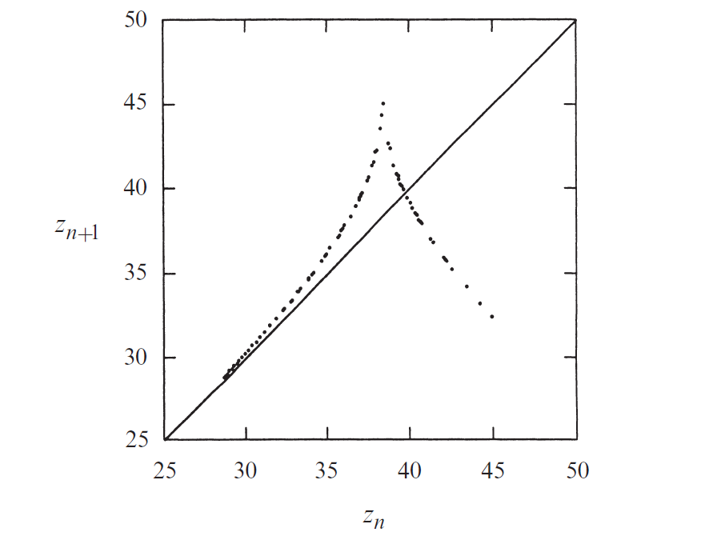

  - There is one "fixed point" in this "function", which correspondes to a $$\infin$$ shape limit cycle

    - Drawing a "Cobweb diagram" on the graph (iterating with a starting point close to the fixed point) will show that the limit cycle is not stable (since the slope is larger than 1)
    - Can there be periodic pattern in $$\{z_n\}$$?

  - *z* is a point of period *p* if *p* is the smallest possible integer so that $$f^p(z) = \underbrace{f(f(f(\dots f}_{p}(z)\dots))) = z$$

    - If there is a limit cycle, then there should be a periodic pattern in $$\{z_n\}$$
    - The stability of *z* is determined by the slope of $$[f^{p}]'(z)$$
    - $$|[f^2]'(z)| = |f'(f(z))||f'(z)| \ge 1$$, similarly for other value of *p*

  - Therefore, there is no stable limit cycle in Lorenz attrator

