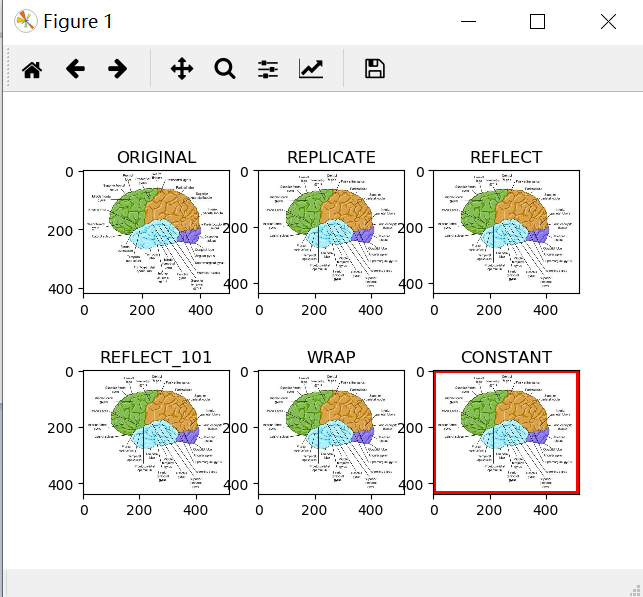

# Computer Vision and So

In this doc I will demonstrate how to develop python programs for computer vision based on the *NAO* Robot. In brief, we need python 2.7 (32bit), OpenCV 2.X and naoqi SDK.


## Python

First, I will demonstrate how to install python 2.7 (32 bit) and python 3.7 (64 bit) simultaneously on a 64 bit windows 10 machine.

1. Download and install [Anaconda 3](https://www.anaconda.com/distribution/) (using default settings).

   Anaconda helps maintain Python packages and enables switching between different python version through virtual environments. In my case, I create two environment other than the normal one (base): py27win32 for NAO Robot development and tensorflow2gpu for CNN training (python 3.7 (64 bit), tensorflow2, keras).

2. Add Anaconda directories to the system path:

   1. `C:\Users\YOURNAME\Anaconda3`
   2. `C:\Users\YOURNAME\Anaconda3\Scripts`
   3. `C:\Users\YOURNAME\Anaconda3\Library\bin`

3. Create a virtual environment for 32-bit python 2.7:

   Enter the command in cmd or Anaconda prompt (replace YOURENVNAME with the name your want, e.g. `py27Win32`):

   ```shell
   conda create -n YOURENVNAME
   conda activate YOURENVNAME
   conda config --env --set subdir win-32
   conda install python=2.7
   conda deactivate
   ```

   The `subdir` key enables us to force Anaconda to search only for win32 packages.

4. Register the new python:

   Enter `regedit`, go to `HKEY_CURRENT_USER\Software\Python\PythonCore`, create a new folder `2.7` in the style of the original one (`3.7`), changing all directory prefix to `ANACONDAPTH\envs\YOURENVNAME`.


## NaoQi

That's easy. Just go to [Softband's Website](https://community.ald.softbankrobotics.com/en/resources/software/language/en-gb), register, download, and install (remember to choose python 2.7 during installation).


## OpenCV

1. `conda install numpy matplotlib`

2. `conda install -c menpo opencv` (this is a 2.4.X version)

3. Launch [Visual Studio Code](https://code.visualstudio.com/) in the Anaconda Navigator GUI, after choosing the correct python version.

   **CAUTION: **

   **1. DON'T OPEN VSCODE DIRECTLY OUTSIDE ANACONDA, otherwise the virtual environment won't work. **

   **2. Besides, even if you do so, it sometimes won't work either.** For example, try to import matplotlib in a script and run it in VSCode.

   3. So the solution is: write your code in VSCode, and run it in Anaconda prompt!

4. Try the hello world code (replace SOMFIGURE.jpg with one of your picture in the path):

   ```python
   import cv2 as cv
   import numpy as np
from matplotlib import pyplot as plt
   BLUE = [255,0,0]
   img1 = cv.imread('SOMEFIGURE.jpg')
   replicate = cv.copyMakeBorder(img1,10,10,10,10,cv.BORDER_REPLICATE)
   reflect = cv.copyMakeBorder(img1,10,10,10,10,cv.BORDER_REFLECT)
   reflect101 = cv.copyMakeBorder(img1,10,10,10,10,cv.BORDER_REFLECT_101)
   wrap = cv.copyMakeBorder(img1,10,10,10,10,cv.BORDER_WRAP)
   constant= cv.copyMakeBorder(img1,10,10,10,10,cv.BORDER_CONSTANT,value=BLUE)
   plt.subplot(231),plt.imshow(img1,'gray'),plt.title('ORIGINAL')
   plt.subplot(232),plt.imshow(replicate,'gray'),plt.title('REPLICATE')
   plt.subplot(233),plt.imshow(reflect,'gray'),plt.title('REFLECT')
   plt.subplot(234),plt.imshow(reflect101,'gray'),plt.title('REFLECT_101')
   plt.subplot(235),plt.imshow(wrap,'gray'),plt.title('WRAP')
   plt.subplot(236),plt.imshow(constant,'gray'),plt.title('CONSTANT')
   plt.show()
   ```
   
   If you see something like this:
   
   
   
   Then congratulations!


## Something about OpenCV

- OpenCV's default color space is **BGR!!!** And the range will vary too (0 to 255 for CV_8U images, 0 to 65536 for CV_16U images, 0-1 for CV_32F images). See https://docs.opencv.org/master/d8/d01/group__imgproc__color__conversions.html.

- `cv2.imshow()` will only show image after execution of `cv2.waitKey()`, similarly `plt.imshow()` or other matplotlib functions will only show image after `plt.show()`.
- `cv2.HOUGH_GRADIENT` is called `cv2.cv.CV_HOUGH_GRADIENT` in the old version.


## Something about Numpy

- https://docs.scipy.org/doc/numpy/user/numpy-for-matlab-users.html
- Several most important differences between Numpy array and matlab matrix: 
  - **`dot()` doesn't mean dot product, it means matrix multiplication!!!**
  - **All parameters are passed by reference.** (So use `Y = X.copy()` to copy)
  - **All operators are element-wise (except @, which means matrix multiplication).**
  - Python indices of every odd elements in a vector of 10 elements: `0:9:2` while in matlab it's `1:2:9` (0 beginning, second parameter as the index after the end, third parameter as the step).
  - To assign value to a submatrix, you have to use the ix_ method, otherwise it's read-only: `a[ix_([1,3,4],[0,2])]`.


## Something about python2

- `/` is the same as the `/` in C, different from that in matlab or python 3.