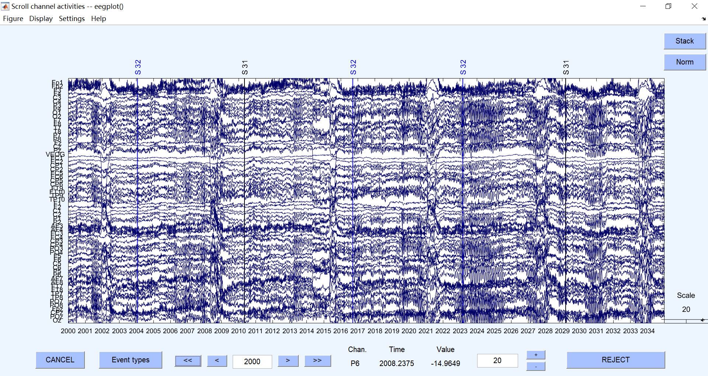
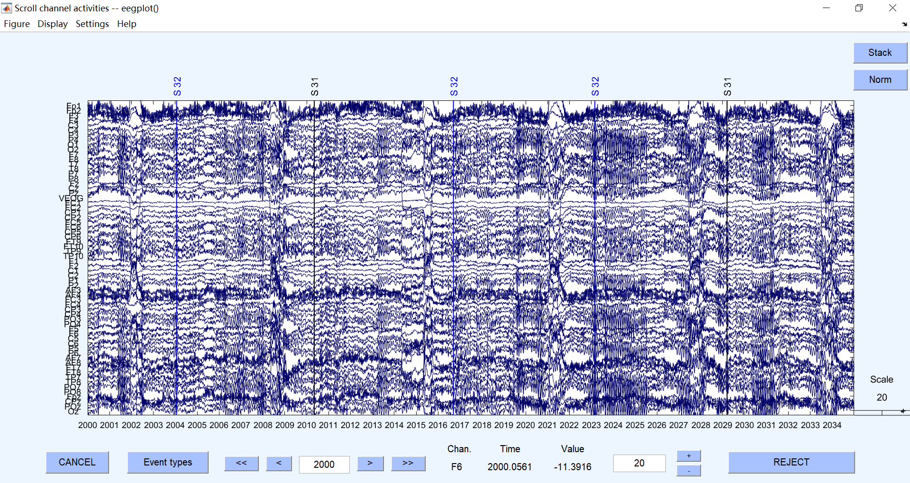
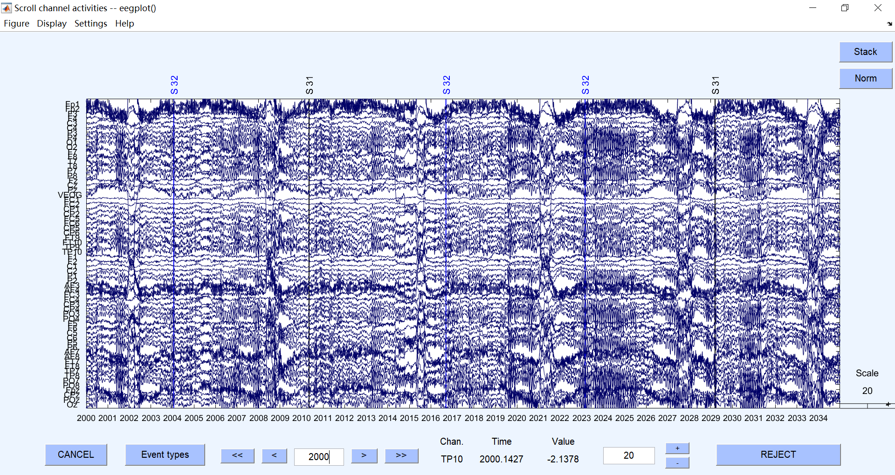

# EEG Signal Processing

## Basic EEG Processing Pipeline

Generally speaking, EEGLAB provides better preprocessing tools (e.g. automatic channel rejection, and GUI) but Fieldtrip is more suitable for data analysis. One solution is to use EEGLAB to preprocess the data into time-lock matices, then convert it to Fieldtrip FT_DATATYPE_TIMELOCK structure for further analysis.

1. The first script:

   1. Load data:

      ```matlab
      %% EEGLAB
      eeglab;
      EEG = pop_loadbv([DFPATH currSub '/'], vhdrName);
      
      %% Fieldtrip
      currDat = ft_preprocessing(struct('dataset', datasetName));
      ```

   2. Select channel location: remember to add the reference channel and remove EOG (since we will rereference to average of all channel later)

      ```matlab
      %% EEGLAB (for Brain Vision and Easycap M1)
      
      % set Ref as FCz
      EEG = pop_chanedit(EEG, 'lookup','Standard-10-5-Cap385.sfp',...
          'insert',65,'changefield',{65 'labels' 'FCz'},...
          'lookup','Standard-10-5-Cap385.sfp','setref',{'1:65' 'FCz'});
      EEG = eeg_checkset( EEG );
      
      % exclude VEOG
      EEG = pop_select(EEG, 'nochannel', {'VEOG'});
      
      
      %% Fieldtrip
      
      % set channel location
      sens = ft_read_sens('standard_1020.elc');
      currDat.elec = sens;
      ```

   3. Rereference and filter:

      1. Rereference to average: Remember to insert back the original reference channel.
      2. notch filter (50Hz in China, 60Hz in US) and band-pass filter (6db cutoff frequency for highpass: 0.1-0.2Hz; lowpass: 30-40Hz).
         1. Ft's default filter is Butterworth while EEGLAB uses FIR filter
         2. The latter was much sharper (highpass 6db cutoff frequency = 1/2 * 'locutoff')

      ```matlab
      %% EEGLAB
      
      % re-reference to average of all channels and bring back Ref (FCz)
      EEG = pop_reref( EEG, [] ,'refloc',struct('labels',{'FCz'},...
          'type',{''},'theta',{0},'radius',{0.12662},'X',{0.0387},'Y',{0},...
          'Z',{0.0921},'sph_theta',{0},'sph_phi',{67.2081},...
          'sph_radius',{0.0999},'urchan',{65},'ref',{'FCz'},...
          'datachan',{0},'sph_theta_besa',{22.7919},'sph_phi_besa',{90}));
      EEG = eeg_checkset( EEG );
      
      % notched, 50Hz
      EEG = pop_eegfiltnew(EEG, 'locutoff',49,'hicutoff',51,'revfilt',1);
      EEG = eeg_checkset( EEG );
      
      % filter, 0.15-30Hz
      EEG = pop_eegfiltnew(EEG, 'locutoff',0.15,'hicutoff',30);
      EEG = eeg_checkset( EEG );
      
      
      %% Fieldtrip
      
      cfgBase = struct();
      % Re-reference
      cfgBase.reref = 'yes';
      cfgBase.refchannel = 'all';
      % Filtering
      if ~isempty(BSFREQ)
          cfgBase.bsfilter = 'yes';
          cfgBase.bsfreq = [59 61];
      end
      if ~isempty(BPFREQ)
          cfgBase.bpfilter = 'yes';
          cfgBase.bpfreq = [0.1 40];
      end
      
      currDat = ft_preprocessing(cfg, currDat);
      ```

   4. Interpolate bad channels: this is important for better ICA decomposition. You may need to create an epoched dataset temporally to figure out the bad channels.

      1. Create an epoched dataset, containing baseline and TOI
      2. Automatic channel rejection by Kurtosis
      3. Reject channels which fluctuate wildly or become dead in a large proportion of trials
      4. Note down the indices and consider reject the subject if too many channels are marked
      5. Interpolate the bad channels in the **original** dataset
      6. Average re-reference

      ```matlab
      %% Fieldtrip and EEGLAB
      
      % Trial definition
      cfgTrial = struct();
      cfgTrial.trialfun = @trialfun_annotation;
      cfgTrial.trialdef = struct();
      cfgTrial.trialdef.eventtype  = 'annotation';
      cfgTrial.trialdef.eventvalue = ALLSTI;
      cfgTrial.trialdef.prestim = 1;  % baseline length
      cfgTrial.trialdef.poststim = 4;
      
      % Epoching
      cfg = cfgTrial;
      cfg.dataset = 'something';
      cfg = ft_definetrial(cfg);
      allNewDat = ft_redefinetrial(cfg, allDat);
      
      % Reject channel by Kurtosis
      EEG = myft2eeglab(allNewDat);
      [EEG, indelec] = pop_rejchan(EEG, 'threshold', 5,'norm','on',...
      	'measure', 'kurt');
      
      % Reject channel by threshold
      tmpDat = cat(3, allNewDat.trial{:});  % nChn * nTime * nTrial, similar to EEG.data
      tmpRange = squeeze(range(tmpDat, 2));
      tmpBad = mean(or(tmpRange < 3, tmpRange > 300), 2);  % Proportion of bad trials
      indelec = union(indelec, find(tmpBad > 0.3));
      
      % Skip the subjects with too many bad channels
      nBadChn(iSub) = length(indelec);
      if nBadChn(iSub) > 16
          warning('Skipping subject %03d with %d bad channels.\n', iSub, ...
          nBadChn(iSub));
      	continue
      end
      
      % Interpolate bad channels on the original dataset
      cfgChn = struct();
      cfgChn.method = 'spline';  % spherical spline interpolating
      cfgChn.badchannel = allDat.label(indelec);
      cfgChn.neighbours = ft_prepare_neighbours(struct('method', 'template',...
      	'template', 'eeg1010_neighb.mat'), allDat);
      
      % Interpolate the bad channels
      fprintf('\nRemoving channels %s from subject %03d ...\n\n', ...
      	num2str(indelec), iSub);
      allDat = ft_channelrepair(cfgChn, allDat);
      
      % Re-reference the data
      cfg = struct('reref', 'yes', 'refchannel', 'all');
      allDat = ft_preprocessing(cfg, allDat);
      ```

   5. Run ICA:

      1. You should exclude the between-session period or directly do the epoching in the step 6 (make sure you use long epoch!) before running ICA. Generally speaking it's better to run ICA on continuous data, but sometimes the quality will be influenced by the huge noise in ITI.
      2. Make sure to save the dataset with ICA weights. Besides, a way to save time during visual examination of ICs is to save the component feature plots in a folder with its index as the filename (see below and the second script).

      ```matlab
      %% EEGLAB
      
      % exclude the inter-block period
      tmpEv = EEG.event;
      rejPer = [];
      for epoc = 1:length(tmpEv) - 1
      	if tmpEv(epoc).type ~= tmpEv(epoc + 1).type
          	% end of this epoch
              tmp1 = EEG.times(tmpEv(epoc).latency) / 1000 + 0.1;
              % onset of the next
              tmp2 = EEG.times(tmpEv(epoc + 1).latency) / 1000 - 0.1;
              rejPer = [rejPer; tmp1, tmp2];
          end
      end
      EEG = pop_select(EEG, 'notime', rejPer);
      
      % run ICA
      if strcmp(DOICA, 'yes')
          EEG = pop_runica(EEG, 'icatype', 'binica', 'extended', 1);
          EEG = eeg_checkset( EEG );
          delete binica*.*
      end
      
      % save the property figures
      for k = 1:MAXICINDEX
          pop_prop(EEG, 0, tmp(k), NaN, {'freqrange' [2 60]});
      	saveas(gcf, [currSavePath num2str(tmp(k)) '.png']);
      	close gcf
      end
      
      
      %% Fieldtrip
      
      % ICA
      
      cfgICA = struct();
      cfgICA.method = 'binica';
      cfgICA.binica.extended = 1;
      if strcmp(MODE, 'debug')
          cfgICA.binica.pca = 32;
      end
      
      % ICA
      % binica CANNOT work with path containing spaces or Chinese characters!
      WD = cd('D:/');
      comp = ft_componentanalysis(cfgICA, newDat);
      if strcmp(ICACLEANUP, 'yes') && strcmp(cfgICA.method, 'binica')
      	delete binica*.sc binica*.wts binica*.fdt binica*.sph
      end
      cd(WD);
      
      % Plot components
      function plot_IC(comp, i, compAct)
      
          % comp: Output of FT_COMPONENTANALYSIS
          % i: an positive integer (component to plot)
          % compAct (optional): component time course, nComp*nTime*nTrials
      
          if nargin < 3
              compAct = cat(3, comp.trial{:});
          end
      
          % Topoplot
          subplot(1, 2, 1);
          cfg = [];
          cfg.colormap = jet;
          cfg.component = i;
          cfg.zlim = 'maxabs';
          cfg.layout = 'eeg1010';
          cfg.comment = 'no';
          ft_topoplotIC(cfg, comp);
          
          % Activation
          subplot(1, 2, 2);
          tmp = squeeze(compAct(i, :, :))';
          imagesc(tmp, [-1 1] * max(tmp, [], 'all'));
      end
      ```

   6. Epoch the data. Caution: you must use a **longer** epoch than your real baseline and TOI (at least 2s at each end) to prevent the edge effect in time-frequency analysis!

      ```matlab
      %% Fieldtrip
      
      % Epoching
      cfg = cfgTrial;
      cfg.dataset = sprintf('%sS%03d/S%03dR%02d.edf', ...
      	DFPATH, iSub, iSub, iRun);
      cfg = ft_definetrial(cfg);
      currDat = ft_redefinetrial(cfg, currDat);
              
      % Register trial types
      trialType = {currDat.cfg.event.value}';
      for i = 1:length(trialType)
          tmp = TASKS.(trialType{i});
          trialType{i} = tmp(iRun);
      end
      currDat.trialinfo = cell2mat(trialType);
      ```

2. Visually examine the ICs and delete all plots but those relevant to eye movement.

3. The second script: subtract selected ICs from data.

   ```matlab
   %% EEGLAB
   
   tmp = dir([currFold '*.png']);
   tmp = strrep({tmp.name}, '.png', '');
   cmpRej = str2double(tmp);
   
   % subtract the rejected components
   EEG = pop_loadset('filename', 'data.set', 'filepath', currFold);
   EEG = pop_subcomp(EEG, cmpRej);
   EEG = eeg_checkset(EEG);
   
   
   %% Fieldtrip
   
   % Get component indices to remove
   rejComp = dir([currPath 'Comp*.png']);
   if ~isempty(rejComp)
       rejComp = sscanf(strcat(rejComp.name), 'Comp%d.png')';
   else
       rejComp = [];
   end
   
   % Remove components
   fprintf('\nRemoving components %s from subject %03d ...\n\n', ...
       num2str(rejComp), iSub);
   allDat = ft_rejectcomponent(struct('component', rejComp), comp, newDat);
   ```

4. Visually check all remaining epochs. Save the final version of the dataset.

5. Extract data and group by conditions, and down sample it if necessary.

   ```matlab
   %% EEGLAB
   
   eeglab;
   for i = 1:50
   
   	# ...
   	
       % down-sample to 128Hz
       EEG = pop_resample(EEG, 128);
       
       % select eyes open & closed period
       openInd = find(strcmp({EEG.event.type}, '101'));
       closeInd = find(strcmp({EEG.event.type}, '201'));
       
       % extract and rearrange data
       openEEG = {};
       closeEEG = {};
       for j = 1:4
           IndRange = fix(EEG.event(openInd(1 + (j - 1) * NTRIALS)).latency) : ...
               fix(EEG.event(openInd(j * NTRIALS)).latency);
           openEEG = [openEEG; EEG.data(perm, IndRange)];
           IndRange = fix(EEG.event(closeInd(1 + (j - 1) * NTRIALS)).latency) : ...
               fix(EEG.event(closeInd(j * NTRIALS)).latency);
           closeEEG = [closeEEG; EEG.data(perm, IndRange)];        
       end
       mkdir([SVPATH currSub '/']);
       allEEG = [openEEG closeEEG];
       if ~strcmp(MODE, 'debug')
           save([SVPATH currSub '/Data.mat'], 'allEEG');
       end
   end
   
   eeglab redraw;
   ```

6. Convert the matlab data to Fieldtrip structure if necessary.

   ```matlab
   function [timelock] = mat2ft(data, varargin)
   %% mat2ft - organize matlab data into fieldtrip datatypes
   %
   % Currently only support ft_type_timelock.
   %
   % <strong>Input</strong>:
   %
   %       data: 2D or 3D double matrix, corresponding to label and time
   %
   % <strong>Key-value input</strong>:
   %
   %   You can specify eegfile for labels and time and optionally the chnInd.
   %       "eegfile": a .set file containing label & time info
   %       "chnInd":  nChan * 1 double vector, channel indices in EEG.chanlocs
   %       "EOG": "on" or "off" (default), denoting whether the data contains
   %           EOG channels. If specified as "on", channel label will be
   %           imported from hdr.label instead of hdr.elec.label
   %
   %   You can also specify label & time explicitly:
   %       "label": channel labels, nChan * 1 cell array of strings
   %       "time": timpoints in each trial, nTime * 1 double vector
   %
   % <strong>Output</strong>:
   %
   %       timelock: ft_datatype_timelock with these fields:
   %           dimord, label, time, trial/avg
   %       
   p = inputParser;
   addParameter(p, 'eegfile', '', @(s)ischar(s)||isstring(s));
   addParameter(p, 'chnInd', [], @isvector);
   addParameter(p, 'label', {}, @iscellstr);
   addParameter(p, 'time', [], @isvector);
   addParameter(p, 'EOG', 'off', ...
       @(s)(ischar(s)||isstring(s)) && (strcmp(s, 'on') || strcmp(s, 'off')));
   parse(p, varargin{:});
   
   if ~isempty(p.Results.eegfile)
       hdr = ft_read_header(p.Results.eegfile);
       if strcmp(p.Results.EOG, 'off')
           timelock.label = hdr.elec.label;
       else   % use hdr.label if you want EOG
           timelock.label = hdr.label;
       end
       if ~isempty(p.Results.chnInd)
           timelock.label = timelock.label(p.Results.chnInd);
       end
       timelock.time = hdr.orig.times / 1000;   % from millisecond to second
   else
       if isempty(p.Results.time) || isempty(p.Results.label)
           error('Label or time info missing.');
       end
       timelock.time = p.Results.time(:)';
       timelock.label = p.Results.label(:);
   end
   
   if ndims(data) == 3
       tmp1 = find(size(data) == length(timelock.label));
       tmp2 = find(size(data) == length(timelock.time));
       if isempty(tmp1) || isempty(tmp2)
           error('Input dimensions are incompatible.');
       end
       if length(tmp1) * length(tmp2) > 1
           warning("Dimensions with the same size! Assuming chn*time*trials!");
           tmp1 = 1;
           tmp2 = 2;
       end
       timelock.trial = permute(data, [6 - tmp1 - tmp2, tmp1, tmp2]);
       timelock.dimord = 'rpt_chan_time';
   elseif ismatrix(data)
       tmp1 = find(size(data) == length(timelock.label));
       if isempty(tmp1)
           error('Input dimensions are incompatible.');
       end
       if length(tmp1) > 1
           warning("Dimensions with the same size! Assuming chn*time");
           tmp1 = 1;
       end
       timelock.avg = permute(data, [tmp1, 3 - tmp1]);
       timelock.dimord = 'chan_time';
   end
   
   end
   ```


## EEGLAB Basics

### Loading Data

File > Import Data > ...plugins > BDF...

Then load event data through matlab variable: File > Import Event Data > ...Matlab...


### Select Channels

- Only Channel Label Provided (e.g. if imported from Neuroscan of Biosemi):

  Choose ***the second option*** in the list (MNI coordinate), then click OK.

- Channel location file provided:

  (Click cancel if the dialog appear) click Read locations > OK > OK.

After this process, view the locations using Plot > Channel locations > by name.

***Caution: Make sure you choose the MNI coordinate if you want better souce localization.***


### Re-reference

It is somewhat tricky to choose the location of the reference electrode, see Chapter 5 of Luck's book, or https://sccn.ucsd.edu/wiki/I.4:_Preprocessing_Tools for further reading.

***Be clear whether you need to add or remove the original reference electrode to / from the data after re-referencing.***


### Filter

Notch out the line noise: Tools > filter the data > basic... > 49 51 > check "Notch ..." > OK > save as new file (should be 59 61 for American datasets).

Basic filtering:

- High Pass: **IN MOST CASES, KEEP YOUR HALF AMPLITUDE (6DB, WHICH IS HALF OF THE LOWER-BOUND FREQUENCY IN EEGLAB) CUTOFF FREQUENCY SMALLER OR EQUAL TO 0.1HZ (at most 0.2Hz)!!!**

  Another hint: Luck suggests the filter should be 12-24db/octave (and shouldn't be higher for high-pass filter).

  Below is an illustration of how high-pass filter distorts the ERP, see the artificial oscillation in the frontal channels:

  | 6db Frequency |                                                       |
  | ------------- | ----------------------------------------------------- |
  | 0.05-30.05    |   |
  | 0.075-30.075  |  |
  | 0.15-30.15    |   |
  | 0.25-30.25    |   |
  | 0.5-30.5      |      |

- Low Pass: Luck suggests 30Hz.


### Artifact Removal or Correction

- ICA:

  - Generally speaking, if we downsample to 200Hz, the process will finish in a moderate time (several minutes, for a data of several minutes length). But if you want to find N components for N channel data, generally you need at least 30N^2 sample points for each channel.
  
  - `binica` will generate files in the current working folder and use it as input to the `binica.exe`. However, on Windows the **path containing spaces cannot be recognized** and you will get a message of `ica: help file missing` and an error from `floatread()`. Therefore you **must** do `cd('C:/')` or something like that. Besides, the path to the `binica.exe` should also contain no spaces (the official update checks for this), although you can solve it by commenting several lines in the `binica.m` (remove the files generated by `binica.exe` by hand after calling).
  
  - Fieldtrip also use `runica.m` and `binica.m` to compute ICA.


## the Event-related Potential Technique

### Basic principles of ERP recording

#### the Reference Problem

There is one *ground electrode*, one *reference electrode* and many *active electrodes* in the EEG recording system. Since we must connect the latter to the ground circuit to enable a working amplifier, there will inevitably be some noise in the ground electrode G. Therefore, we use a reference electrode R. Instead of outputing the voltage A - G, we output (A - G) - (R - G) to eliminate the noise in G.

The position of ground electrode can be arbitrary, but it's difficult to choose the reference electrode because it's assumed that there will be few neural activity there, so that the computed voltage will contain less distraction from the electrical activity around the reference electrode. Fortunately, the choice of reference electrode can be done offline.

One common practice is to reference the data by the average of all electrodes (which means subtracting it from the original signal A - R, where R can be arbitrarily placed).

Another method is to carefully choose the location of the reference electrode. First, it should make the participant feel comfortable. Second, it should not bias toward any hemisphere (so we can use Cz, or averaged mastoids / earlobes). Third, it should not be close to some big muscles. Forth, it should not be close to your region-of-interest. Fifth, it is good to choose a site that is commonly used before in the same area.

Generally speaking, averaged mastoids / earlobes is most commonly used (but it's not suitable for N170). If we want to use the average reference, there must be a large number of electrodes covering the most of the scalp in order to get a better average.

Another way to eliminate the reference problem is to transform the voltage distribution into current density estimation, which is intrinsically related to each point on the scalp.

#### Electrodes and sampling

The International 10/20 System for electrodes placement: Nz at the nadion, Lz at the inion, A1 and A2 at the pre-auricular points.

The impedance of the electrode-scalp connection will generate noise in the recording. Therefore, you need to use the electrode gel, and clean and abrade the skin under the electrodes (which may be risky for disease transmission). A high-impedance system can be more convenient and safe, but it may be not so competent in reducing the common mode noise and skin potential artifacts, so you should monitor the impedance at each electrode and keep it within a reasonable range (e.g. <20k$\Omega$) by abrading the skin.

According to the Nyquist Theorem, you can only capture the information that has a frequency that is lower than half of the sampling rate. It is often implemented by a hardware filter with a cut-off frequency. For example, we can set the cut-off frequency as 150Hz and sample at 600Hz.


### Artifact Rejection and Correction

#### Basic principles

Detecting the artifacts is like a signal detection problem, we should eliminate the artifacts while maintaining certain statistic power (i.e., the amount of trials). If an artifact is detected in a trial, data from all channels in this trial should be discarded.

If we use a pre-defined threshold (based on absolute voltage) of the EOG signal to eliminate artifacts and we're not using average reference, we must perform baseline correction first. The ERPLAB toolbox provides a better method to solve this problem other than absolute-threshold based algorithms. The threshold for rejection is usually modified on the basis of some empirical value, e.g. 50uV peak-to-peak difference. Visual inspection will help to determine the parameter for each subject.

#### Common artifacts

**Blinks:** We can control the number of blinks by using short trial blocks of 1-3 minutes or brief ITI when subjects are encouraged to make eyeblinks, asking subjects to wear glasses instead of contact lenses, or simply asking them to reduce their eye blinks.

**Eye movement:** The voltage deflection of HEOG and VEOG can reflect the direction of the eye movement. Most commonly, the subject makes saccade to some position and then back to the fixation point, generating the boxcar-shaped voltage deflection in EOG recording. Importantly, saccade will also <u>trigger a visual ERP</u>, which can hardly be corrected. In order to detect the eye moment, we can simply use a threshold, or compare the signal continuously with a step function, which will be much better.

**Muscle and heart activity:** The EMG features high frequency noise as the muscle contracts. The most common artifact is generated by the temporalis muscles under the electrodes T7 and T8. Therefore, we must ask the participants to relax their jaws. Besides, if the participant frowns, there will also be an artifact near the Fp1 and Fp2 electrode. The movement of the neck can also be a problem, especially when we're using the mastoid reference. Trials with EMG usually don't need to be eliminated given enough control. The EKG (about 1Hz) can also propagate to the head. The effect of heart activity cannot be simply rejected but only corrected.

#### Correction

First, we can model the eye movement as a dipole and compute its contribution to each channel. The second and more commonly used one is to statistically identify a set of components that have fixed scalp distributions, then subtract them from the signal, because these components usually reflects blink, eye movement, EKG or so. The most commonly used method is ICA, which is available in EEGLAB Toolbox.

Generally speaking, it is safe enough to use ICA-based blink and EKG correction. But there are still some pitfalls in using correction, so sometimes it's better to compare the results with that generated using rejection.


