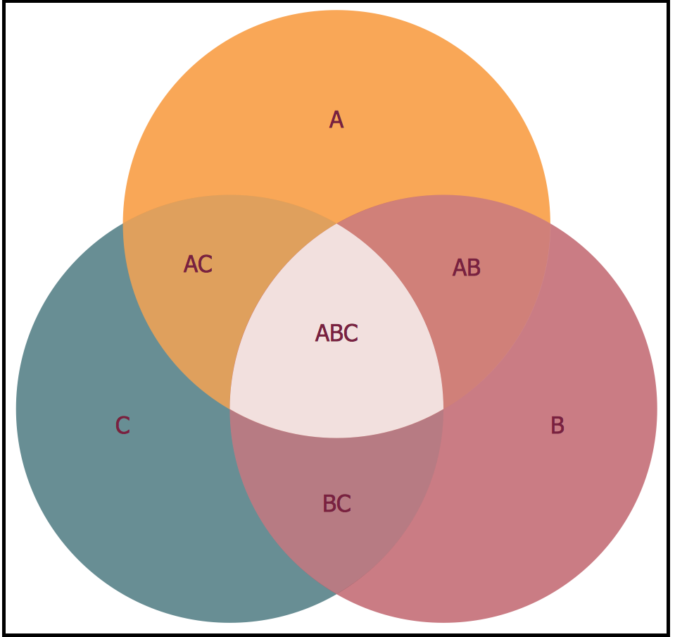
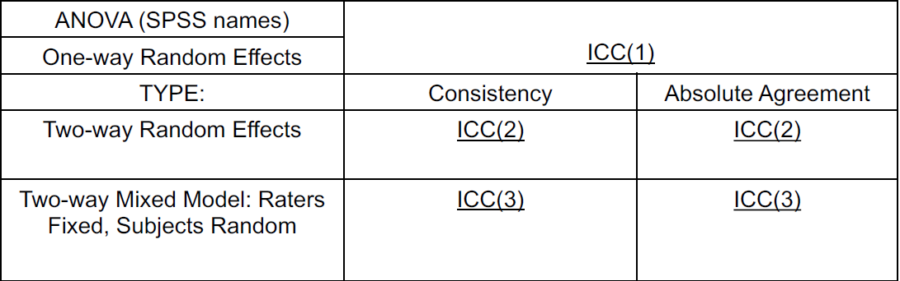

# Psychological Statistics (II)

朱珊珊：1601111504@pku.edu.cn

李卓扬：1700013723@pku.edu.cn

## Non-parametric tests

### Comparing data to a distribution

#### Chi-square test

- It can work as an non-parametric version of ANOVA where the data is nominal (so that you can only count the frequency in each block) rather than ratio (so that you can calculate a mean for each block).

- Mathematical definition:

  $$ \chi^2=\sum_{i = 1}^M \frac{(f_o^i - f_e^i)^2}{f_e^i} $$, where M is the number of bins, $$f_o^i$$ and $$f_e^i$$ are the obsevered and estimated (according to the hypothesis) frequency in bin i. Empirically, all $$f_e^i$$ must be **greater or equal to 5**, otherwise the bins should be merged (in an independence test, merge the adjacent **columns or rows**). The asymptotic distribution of this statistics under the null hypothesis is $$\chi^2(M - 1)$$.

  Take care: **SPSS won't merge cells for you!**

- Independence test: 

  - The degree of freedom should be $$(M_{row} - 1)(M_{col} - 1)$$.
  - Just to other tests, a highly significant $$\chi^2$$ value doesn't indicate strong effect size. In reality, it may indicate a weak effect with huge number of observations.
  - The effect-size version of $$\chi^2$$ (indicating the strength of independence, as like the correlation coefficient) is Cramer's $$\phi$$ (Cramer's V): $$\phi = \sqrt{\frac{\chi^2}{N*df_{min}}}$$, where $$df_{min} = \min(M_{row} - 1,M_{col} - 1)$$.

#### Binomial test

- Compare with a specific binomial distribution (there's also a multinomial test.) by directly compute the probability of the given sample with binomial expansion.

#### Run's test

- Test whether a binomial process is random, more precisely, to test whether the elements in the sequence are mutually independent. Its rationale is to assume that the positive and negative elements are independent and indentically distributed.

#### One sample K-S test

- Comparing the data with Normal, Uniform, Poisson or Exponential distributions by calculating the maximum difference in their cdf: $$ D = \sup{|S(x) - F_0(x)|}$$. 
- Can generalize to independent samples.

### Non-parametric correlation

#### Spearman correlation

- The ordinal version of Pearson correlation, using the rank of the data (for ties, calculate the mean of the summation, e.g. [1.5 1.5 3], or [2 2 2 4]) rather than the data itself to calculate *r*.
- When to use:
  - For **linear** correlation over ranks, Spearman is recommended.
  - For non-linear relationship, Kendall's tau is recommended.
- Revision:
  - Pearson correlation $$ r = \frac{COV(X, Y)}{\sqrt{SS_x SS_y}} = COS(X - \bar X, Y - \bar Y)$$. *r* **can** represent the effect size (small: < 0.3; medium: 0.3-0.5; large: > 0.5). Besides, the square of *r* is exactly the same as the $$R^2$$ of the least-mean-square linear regression of $$(x_i, y_i)$$, where $$R^2 = 1 - \frac{\sum y_i - \hat{y}_i}{\sum y_i - \bar{y}}$$.
  - Test thar r is significantly different from $$\rho$$ with *t* statistics: $$t = \frac{r - \rho}{\sqrt{\frac{1 - r^2}{n - 2}}}$$ follows a t-distribution with $$ df = n - 2$$ under the null hypothesis of $$\rho = 0$$. However, if $$\rho \ne 0$$, the statistic **does not** follow a t-distribution and we should transform it into Fisher's Zr instead.
  - Assumption: **both** variables follows a normal distribution (otherwise the statistics above doesn't follow a t-distribution).

#### Point-Biserial correlation

- The Pearson correlation when one or both of the variables are dichotomous (and the rest is normally distributed). Usually used with one variable being male/female or so. The method is to replace the categorical variable with 0 and 1.
- When both variables are dichotomous, the *r* is called $$\phi$$ coefficient.

#### Kendall's tau

- Definition: $$ \tau = \frac{(N_{concord} - N_{discord})}{n(n-1)/2} $$, where the concordant pairs are those that $$(x_1 - x_2)(y_1 - y_2) > 0$$ and the discordant pairs are the contrary.

### Equivalents of t-test

An important point: these test are all testing for the difference in **medians** rather than means.

Besides, if the statistics we get is exactly equal to the critical value in the appendix table of the Chinese textbook, we can reject the null hypothesis.

Furthermore, if computing by hand, we should look up the table rather than approximate by the asymptotic distribution.

#### Sign test

- An alternative to paired t-test (or one-sample t-test) for ordinal data without any assumptions.
- Compute the change in paired data (increase or decrease) and count the group with fewer data. If this number is small than the two group are significantly different.
- Actually it is a binomial test against the hypothesis that $$P_+ = P_- = 0.5$$, which is the case when the two samples have the same medians. It is two-tailed since the p can only be in range of 0-0.5, so critical value is actually $$Z_{\alpha/2}$$
- When the sample size is large, the binomial distribution can be estimated by a normal distribution and we can transform to a z-test.
- How to deal with ties: discard all, or **divide into two groups equally** (discard one if needed)

#### Wilcoxon signed rank test

- More powerful than sign test since it takes the difference into consideration, but assumes the symmetry of difference (i.e. it should be somthing like 1-3, 7-5, rather than 1-30, 7-5) under the null hypothesis and not suitable for ordinal data. (**somehow "default"**)
- Compute the change in paired data, rank the absolute value of these changes (in ascendence) and sum up the ranks from each group (+/-). If the smaller one (denoted as T) is small enough than the two group are significantly different.
- Null hypothesis is T = n(n+1)/4, whose distribution can be approximated by a normal distribution (as assumed in SPSS).
- How to deal with ties: either **retain** (recommended) or discard them (need to change df).

#### McNemar test

- Paired test for binomial data (**also "default"**), can also be viewed as comparing the sum of one column and one row in a 2*2 table.
- Test by a $$ \chi^2 $$ with df = 1 if both b & c is large, otherwise (b+c <25) use a binomial test for P(b)/P(b+c) = 0.5 instead (summation of the probability of b+c choose 1, 2, .. b) or **correct it by** $$\chi^2 = \frac{(|b - c|  - 1) ^ 2}{b + c}$$.
- In SPSS it's two-sided test by default, but actually it should be one-sided and you can compute the exact probability to get one-sided output.
- Can be generalized to Marginal Homogeneity test for several categories.

#### Mann-Whitney U

- **Widely-used** equivalent of independent t-test for ordinal data, assuming that the two independent samples follow **the same shape** (not necessarily Gaussian)
- Score of an item: the number of items from the other sample that is smaller than this item
- U is the smaller sum of scores. The smaller it is, the more seperable the data was.
- If the sample is large, U can be approximated by a normal distribution
- The effect size can be characterized by several statistics

#### Moses extreme reaction test

- Test whether extreme values are equally likely to appear in both sample by computing the range of ranks (after merging the data)

#### W-W runs test

- Runs test on the sorted data over the categories

### Equivalents of ANOVA

For repeated measure ANOVA: **Friedman** (Kendall's W), **Cochran's Q**.

For independent ANOVA: **Kruskal-Wallis**, **Jonckheere-Terpstra (Trend) test**, median test.

Post-hoc test: Nemenyi method.

#### Friedman test

- Use the rank within each block (among different treatments) to calculate a statistics that characterized the difference in the distribution among treatments.
- $$F_r = \frac{12}{nk(k + 1)} \sum_{i = 1}^k R_i^2 - 3n(k + 1) \sim \chi^2(k - 1)$$, where *n* is the number of UOs and *k* is the number of treatments (if no ties within each subject). If *n* and *k* are **small**, you should **look up the** Friedman critical value **table** instead of directly use a $$\chi^2$$ table.
- SPSS divide this equation by a correction term for ties.
- Assumption: either *n* or *k* must be **larger than 5**.

#### Kendall's W

- For *n* groups (raters) and *k* treatments (objects) (note: different notation with that in slides 1):

$$
W = \frac{\text{Variance over mean ranks}}{\text{Maximum possible variance over mean ranks}} = \frac{\sum_{i = 1}^k \bar{r}_i^2 - k(\frac{k + 1}{2})^2}{\sum_{i = 1}^k i^2 - k(\frac{k + 1}{2})^2}\\
= \frac{\sum_{i = 1}^k \bar{r}_i^2 - k(\frac{k + 1}{2})^2}{\frac{k(k+1)(2k+1)}{6} - \frac{k(k+1)^2}{4}} = \frac{\sigma^2_{r}}{(k+1)(k-1)/12}\\
= \frac{\sigma^2_R}{\frac{1}{12}n^2 (k+1)(k - 1)} = \frac{\sum_{i = 1}^k R_i^2 - \frac{(\sum_{i = 1}^k R_i)^2}{k}}{\frac{1}{12}n^2 k(k+1)(k - 1)} = \frac{\sum_{i = 1}^k R_i^2 - \frac{(\sum_{i = 1}^k R_i)^2}{k}}{\frac{1}{12}n^2(k^3 - k)}
$$

- It is the normalized statistic of the Friedman test (corrected for ties in SPSS):
  $$
  W = \frac{\sum_{i = 1}^k R_i^2 - k\frac{n^2(k + 1)^2}{4}}{\frac{1}{12}n^2 k(k+1)(k - 1)} = \frac{\frac{12}{nk(k + 1)}\sum{_{i = 1}^k{R_i^2}}\ - 3n(k+1)}{n(k - 1)} = \frac{F_r}{n(k-1)}
  $$

- It is linear to the mean Spearman *r* for every subject pairs:
  $$
  \bar{r} = \frac{nW - 1}{n - 1}
  $$

- It measures the concordance among different criteria or subjects over a sample of objects or treatments. Its value **can** represent the effect size, ranging from 0 (no concordance between groups, which also means no difference in the objects/treatments) to 1 (complete concordance, which also means absolute difference in the objects/treatments).

- It can be regarded as the extension of point-biserial correlation that the latter tests the concordance of two criteria (variable) while the former tests multiple ones.

- Remember: if you want to test the **concordance among raters**, you should use **raters as observations** (rows) and ratee as treatments (column)!

#### Cochran's Q

- Binomial data, extension of McNemal test

#### Kruskal-Wallis

- Merge all data and rank them, then calculate a *H* statistics and convert it to a $$\chi^2$$ (uncorrected for ties):
  $$
  H = \frac{12}{n(n+1)}\sum_{i = 1}^k \frac{R_i^2}{n_i} - 3(n+1) = \frac{\sum_{i = 1}^k \frac{R_i^2}{n_i} - n(\frac{n+1}{2})^2}{n(n+1)/12} = \frac{\sum_{i = 1}^k n_i\bar{r}_i^2 - n\bar{r}^2}{n(n+1)/12}\\
  = (n-1)\frac{\sum_{i = 1}^k n_i(\bar{r}_i^2 -2\bar{r}_i\bar{r} + \bar{r}^2)}{SS_{total}} = \frac{(k - 1)MS_{bet}}{MS_{total}} \sim \chi^2(k - 1)
  $$

- Assumption: Data from each group follow a same shape; $$n_i \ge 5$$

#### Median test

- **Deprecated**
- A chi-square test of thress binomail distribution of whether the data is larger or smaller than the median of all data.

#### Jonckheere-Terpstra (Trend) test

- Required that the groups are ordered
- A generalization of Mann-Whitney U test
- In SPSS, must use **exact test**.

#### Nemenyi method for MCP

- post-hoc test

## ANCOVA

### Usage

Similar to ANOVA, but partialing out a confounding factor, which is an interval-scale variable that covaries with the treatment effect.

A shortage of ANCOVA is that the confounding factors' effect must be linear (see the model below) although the treatment effect can still be non-linear.

### Revision

- Contrast test and post-hoc test:
  - Contrast test is defined *a priori* and is therefore confirmatory, while post-hoc test is done *a posteriori* and is therefore exploratory.
  - Contrast test can be non-linear and very complex in principle, but post-hoc test is usually only pairwise.
  - ANCOVA only has post-hoc test (through "Estimated marginal means") and simple pairwise contrast.
  
- Interaction and simple main effect:
  
  - When the interaction term is significant, you **cannot** use the F statistics to determine whether the **main effects** are significant. Instead, you should fix one factor then see whether the variation of the other generates a significant effect. In SPSS, you must **write codes** to do it.
  
- SS type explanation:

  The SS types different from how they slice the total SS (i.e., **how they incorporate variables in the regression** - e.g. simultaneously (type III, standard multiple regression, "enter") or sequentially (type I, hierarchical regression, "forward")). In practice, the SS that can be explained by A/B/AB overlaps with each other like a Venn Diagram (here C represents the interaction between AB, and the blank area outside represents the error):

  

  - Type I: Suitable for hierachical ANOVA
    - For factor A: $$SS_A$$ (A, AC, AB, ABC)
    - For factor B: $$SS_{B|A}$$ (B, BC)
    - For interaction: $$SS_{AB|A,B}$$ (C)
  - Type II
    - For factor A: $$SS_{A | B}$$ (A, AC)
    - For factor B: $$SS_{B | A}$$ (B, BC)
    - For interaction: $$SS_{AB|A,B}$$ (C)
  - Type III (Standard)
    - For factor A: $$SS_{A|B, AB}$$ (A)
    - For factor B: $$SS_{B|A, AB}$$ (B)
    - For interaction: $$SS_{AB|A,B}$$ (C)
  - Type IV is similar to type III but can deal with missing cells.

  Notice that only the type I SS sums up to the whole SS explained by A & B & AB together. However, when used in ANOVA, they are **exactly the same in a balanced design**.

  Type **III is the default** option, type I is suitable for hierarchical or nested structure, and type IV is suitable for missing cells. The others are rarely used.
  
- Difference between the main effect comparison in `Estimated Marginal Means` and `Post-hoc comparison` in SPSS: the former is based on the means **estimated by the model** while the latter is based on the observed means, and they are different if the model includes interaction.

### Assumption

For one way-ANCOVA:
$$
Y_{ij} = \mu + \tau_i + b_2(X_{Cov} - \bar{X}) + \epsilon_{ij}
$$

Here $$\tau_i = b_{1i}\bar{X_i}$$ is the treatment effect for the i-th group (note: different group can have different $$b_{1i}$$ so that the effect can be non-linear) and $$\epsilon_{ij}$$ is the error of the j-th subject in the i-th group

- The covariant variable is independent of the treatment variable.
  - This assumption is sometimes unnecessary, if their correlation is intrinsic rather than manipulated.
  - But in this case, the $$\eta_2$$ will be overestimated.
  - This can be **checked by an ANOVA** of $$X$$ to $$X_{cov}$$. In SPSS, use the "full factorial" model as default
- The slope $$b_2$$ between the $$X_{cov}$$ and $$Y$$ is the same for different treatment $$X$$. 
  - This can be checked by the interaction effect of the **ANCOVA including all interactions**, even those between covariates (while in the formal ANCOVA no interaction between covariates and experiment variables is requried, namely full factorial)
- And the homogeneity requirement for ANOVA.
  - Also checked during **ANCOVA including the covariates**

### SPSS

- Effect size:
  - Cohen's $$\eta^2 = \frac{SS_{explianed}}{SS_{total}}$$
  - Partial $$\eta^2 = \frac{SS_{explianed}}{SS_{total} - SS_{otherExplained}}$$

- Lack of fit test: Significant if the model is out of fit for the data.
  
- Residual plot:
  - Better if the residual is in a gaussian shape and has nothing to do with the predictors
  - Better if the predicted value is roughly the same as the observed

## Experiment Design and ANOVA

### Experiment designs

**Independent sample design**

- T test

**Completely randomized design (CR)**

- Independent ANOVA (subjects are **nested** within one condition)

  $$y_{i} = \mu + \alpha_{j(i)} + \epsilon_{i}$$
  
  $$\alpha_{j(i)}$$ is the treatment effect of the level *j*, which is a function of i (namely subject i is nested in this condition). $$\epsilon_{i}$$ is the i-th subject's error

**Block randomized design (BR)**

- Each UO within one block is assigned randomly to 1 treatment level, so when taken together each block participate in **all levels** of treatment.

- A block can be only one subject and UO becomes a session, or a block can also be a group and UO is one subject.

- repeated measures ANOVA

  $$Y_{ij} = \mu + \alpha_j + \beta _i + \epsilon_{ij}$$
  
  $$\alpha_{j}$$ is the treatment effect for level *j*, $$\beta_{i}$$ is the deviation of block *i* while $$\epsilon_{ij}$$ is the error for block *i* with treatment level *j*.

**Completely randomized factorial design (CRF-pq)**

- *Factorial* means that there are more than one experimental variable, and p, q are the numbers of levels for each factor

- two-way indepedent ANOVA

  $$Y_{i} = \mu + \alpha_{j(i)} + \beta_{k(i)} + \alpha\beta_{j(i)k(i)} + \epsilon_{i}$$

**Mixed Design**

- Some factors are within-block (BR) while some are between-block (CR)

**Latin square design (LS)**

- Balance the effect of two nuisance variables by assigning treatments in the style of a magic square (to each level of each variable).

  $$Y_{i} = \mu + \alpha_{j(i)} + \beta_{k(i)} + \gamma_{l(i)} + \epsilon_{i}$$, where *i* denotes the subject index (**nested** in one treatment), *j* denotes the treatment, and k, l denotes the levels of nuisance variables.

- Note that this is not a three-way ANOVA since there is only one (or few) level(s) of treatment in each (j, k) block.

- In SPSS, test it in the same way as three-way ANOVA but exclude the interaction terms.

**Random and fixed effect**

- Fixed effect: that you test for (in **all** of its possible level), e.g. experimental groups

  $$\sum_j \alpha_j = 0$$ (see the equation above that every group mean was subtracted with the overall mean)

- Random effect: that you only test for **part** of its possible level (but want to generalize to all levels), e.g. subjects, and the "location" in the example below

  $$\alpha_j \sim N(0, \sigma_j^2)$$

**Nested ANOVA**

- One **random** factor is nested in another fixed factor, e.g. factor 2 has levels α1 α2 α3 α4 in factor 1's level A

- Here factor 1 is what we want to test while factor 2 doesn't matter (so choosen as a random factor)

- Used when you have few subjects so that a two-way ANOVA is impossible

  $$Y_{i} = \mu + \alpha_{j(i)} + \beta_{j(i)k(i)} + \epsilon_{i}$$ (here $$\beta_{jk}$$ means the k-th subgroup in the j-th condition)

- $$F_{cond} = \frac{MS_{cond}}{MS_{subgroup}}$$, $$F_{subgroup} = \frac{MS_{subgroup}}{MS_{within}}$$, somehow hierarchical.

- In SPSS, the operation is similar to two-way ANOVA but must change the SS into **type-I** and incorporate the **interaction term** rather than factor 2 (since the dof for $$MS_{subgroup}$$ is a(b - 1) rather than b-1).

## MANOVA

- Multiple response variable rather than one, and these variables are correlated.
  - If they are independent, use several ANOVA instead.
- Assumptions:
  - Multivariate normality
  - Homogeneity (for covariance matrix): Can be tolerated to some degree if we have equal cell size and large N: must do **Box'M test** and **Levene test** together since the first one only tests covariances **excluding** the variances.
- Rationale:
  - Calculate **one** new variable with the **linear combination** of the response variables that **differs most significantly** among different levels of **each variable** (main effect or interaction), then test it with ANOVA.
    - The test statistics are all based on a generalization of $$SS_{interest}/SS_{error}$$ in ANOVA: $$\Sigma_{interest} \Sigma_{error}^{-1}$$, in SPSS this seems to be done by a multiple regression of all independent variable to all depedent variable.
  - After you reject the multivariate null hypothesis, you should do a post-hoc test to see which part of the response is really modulated by the grouping.
    - Theorectically, you should use **Discriminate Analysis** to evaluate several dicriminant functions, which are all linear combinations of the response variables but are independent to each other. That's because your response variables are indeed correlated and you should preserve the multivariate feature in all following analysis, since they indicate different aspects of one underlying response together.
    - However, practically you can simply examine the **ANOVA for each response variable**.
  - After you determine the functions or variables that are indeed modulated by grouping, use multiple comparison (as in ANOVA) to determine difference between different treatment levels.
- SPSS:
  - SSCP matrix: covariance matrix

## Logistic Regression

- The dependent variable of logistic regression is **categorical**, although the y is of ratio scale.

- Odds（比例）: p / (1 - p)

  Logistic regression essentially assumes that $$ odds = e^{w^{\top}x} $$, so $$ y = \frac{e^{w^{\top}x}}{1 + e^{w^{\top}x}}$$

- Estimate the parameters by inverse logistic function: $$Logic(p_i) = \ln\frac{p_i}{1 - p_i} = \alpha + \beta x$$, *i* denotes the subject. Use MLE to estimate.

- How to quantify the effect size: odds ratio $$OR_j = \frac{odds(x_j + 1)}{odds(x_j)} = e^{\beta_j}$$

- The confidence interval of $$\beta$$ can be estimated by a z-distribution, or test its significance with z-test.
  
  - The default test is Wald test with $$\chi^2$$ statistics, but if the betas are large it will be more difficult to generate significant output.
  
- Model fitting method:
  - Enter
  - Forward
  - Backward
  
- Nested-hypothesis test: See in notes for 计算建模在心理学和神经科学中的应用.

- SPSS:
  
  - Dummy variables: you have to encode the categorical variables with multiple binary variables (unless they are binary).
- Test of model significance (against a simpler model in the previous step): Omnibus test of model coefficients (a likelihood ratio test).
  

## Multiple Regression

- Uncorrelated (after standardization):
  
  - $$Z_y = r_{1y}Z_1 + r_{2y}Z_2$$
- Correlated:
  
  - Enter (standard, MSE):  $$Z_y = \beta_1Z_1 + \beta_2Z_2$$, where $$\beta$$ was modified by the correlation between two predictors: $$\beta_1 = \frac{r_{1y} - r_{2y}r_{12}}{1 - r_{12}^2},\ \beta_2 = \frac{r_{2y} - r_{1y}r_{12}}{1 - r_{12}^2}$$
- These betas are called standardized partial correlation coefficients (but its not numerically equal to the partial correlation coefficient below).
- R square and statistics (standardized):
  - R square: $$\frac{r_{1y}^2 + r_{2y}^2 - 2r_{1y}r_{2y}r_{12}}{1 - r_{12}^2}$$, representing the total SS explained.
    - F test (model MS relative to error MS)
    - R is called multiple correlation
  - Adjusted R square: penalty for the complexity of the model
  - semi-partial correlation (sr^2, also called part correlation, 部分相关): the SS explained **uniquely** by one predictor
    - $$sr_1 = \frac{r_{1y} - r_{2y}r_{12}}{\sqrt{1 - r_{12}^2}}$$
    - t-test, very similar to that in simple regression (except for the df)
  - partial correlation (pr, 偏相关): similar to the idea of partial eta square (the denominator is all - explained by others). The partial correlation of A and B exluding the influence of C can be computed as the correlation of $$Res_{AC}$$ and $$Res_{BC}$$, since both of them excludes the influence of C.
  - $$pr = \sqrt{\frac{sr^2}{1-SS_{other}}}, pr_1 = \sqrt{\frac{sr^2}{1-r_{2y}^2}}$$
    - another t-test
- Multicollinearity: the variables were approximately linearly independent (which means $$X^{\top}X$$ is singular and thus no unique solution can be found)
  - Estimated by VIF, if VIF > 2 then problematic
  
  - VIF is the inverse of $$tolerance = 1 - R^2_c$$, where $$R^2_c$$ is the R square of regressing the variable-to-be-examined by other variables.
  
  - Another clue is the eigenvalues and eigenvectors of the covariance matrix. If:
  
    - several eigenvalues are all close to 0; or
    - a single eigenvector explains a larger proportion of variance in more than one variable
  
    Then the data may suffer from multi-colinearity
- Assumptions:
  - Linear correlation
  - multivariate normality
  - random sampling
- Minimum sample size:
  - Generally, the number of samples should be at least 10 times of the number of predictors
  - And the degree of freedom for SS (N - P - 1) should be at least 40
  - For forward regression, the sample size should be larger than 30*P
- Criteria:
  - Adjusted R square: 0.25, 0.5, 0.75 (P23)
  - F test
  - t-test
- SPSS:
  - Test for outliers:
    - Mahalanobis distances: the Mahalanobis distance between one case and the mean.
    - Cook's D: Difference in predicted y **value vector** before and after excluding one case. $$D_i = \frac{||\hat{Y} - \hat{Y}_{exclude(i)}||^2}{(P-1)\hat\sigma^2}$$
    - Leverage: the partial derivative $$\frac{\partial \hat{y_i}}{\partial y_i}$$, indicating the influence of one case on the estimated slope.
    - DFBeta: difference in beta (for each predictor) before and after excluding one case
    - DFFit: difference in predicted value of **one case** before and after excluding itself
  - Dubin-Watson test: test whether the residuals were correlated (that whether the sampling error is random or serial-dependent)
  - Distance: similarity/dissimilarity between observations and variables
    - Pearson correlation
    - Euclidean distance
    - Chebychev distance (maximum of the difference in all dimensions)
    - Cosine

## Factor Analysis

- Factor analysis demonstrates the validity of scale (量表) that whether different questions reflect the same set of features of interest.
- Presumption:
  - There are some correlation between several variables ( >.3 is acceptable), i.e. the correlation matrix is not an identity matrix. 
    - Must **examine with eyes** first
    - Tested by Barlett's test of sphericity
  - And this correlation should be "authentic" (after excluding the effect of other variables). Therefore the zero-order and partial correlation should be similar.
    - Tested by KMO measure of sampling adequacy ( >.8 is great, <.5 is unacceptable, see P9)
  - Enough data ( >5*nVar)
- Method:
  - PCA (eigenvalue decomposition of correlation matrix or singular value decomposition of data matrix)
  - Each experimental variable *x* is decomposited into the summation of several common factors *f* with weights *l* (called loadings, actually the correlation coefficient between f and x) and several unique factors *e* (unique to this experimental variable, actually the weighted sum of the discarded factors)
  - x is z-scored before decomposition, so that the eigenvalue can directly represent the variance (note: not the square root, but variance itself) explained by this factor. (Therefore, only those with eigenvalue >1 is meaningful)
- SPSS:
  - Select "Correlation matrix" (similar to normalize all variables as described above) rather than "Covariance matrix" if the variables are in different scales
  - Communality: the variance explained by all selected factors for each *x* ( >1 means problematic)
  - Factor scores: the weights to represent components by normalized variables (somehow a reversed process comparing to the factor decomposition)
  - You can select the "suppress small coefficients" in the options for factor analysis, so that the table will only show large coefficients
- Factor rotation:
  - VariMax method: orthogonal rotation to maximize the variance explained by a single component for an *x* (more precisely, maximize $$V = \frac{1}{n}\sum\limits_{j=1}^{m}\left\{\sum\limits_{i=1}^{n}(\tilde{l}^*_{ij})^4 - \frac{1}{n}\left(\sum\limits_{i=1}^{n}(\tilde{l}^*_{ij})^2 \right)^2 \right\}$$, the SS of (the variance of each variable that is explained by a specific factor), summed over all factors), so that each factor is associative with few variables.
  - QuartiMax: Orthogonal, each varable accounted by minimal number of factors
  - Promax: components don't need to be orthogonal, sometimes closer to the reality

## Reliability Analysis

- Validity and reliability:
  - Validity is about the bias (效度)
  - Reliability is about the variance (信度): $$r_{xx} = \frac{S^2_{real}}{S^2_x}$$

- Presumptions:
  
  - the questions-to-analyze test the same construct (i.e. they are in the same factor)
  - the scores for each question are addititive (no significant subject * item interaction, F test with df = 1 and df_res-1)
  
- Internal reliability: 
  
  - Cronbach's α:
    - $$\alpha = \frac{k}{k-1}(1 - \frac{\sum_{i = 1}^{k} S_i^2}{S_x^2})$$, which measures how large is the covariance ($$S_x = \sum_{i = 1}^k S_i$$)
    - Biased towards larger k (more items)
    - alpha < 0.7 is unacceptable (see P5)
    - You should report the standardized one (standardize *x* before computing)
    - Use Guttman formula $$\alpha = \frac{k}{k-1}(1 - \frac{\sum_{i = 1}^{k} p_iq_i}{S_x^2})$$ if the questions are yes/no.
  - Split-half:
    - $$r_{xx} = \frac{2r_{ab}}{1 + r_{ab}} $$ if assuming equal mean and variance
    - Spearman-Brown coefficient $$r = 2(1 - \frac{S_a^2 + S_b^2}{S_x^2})$$ if the two halves have different mean and variance (Cronbach's alpha with k = 2)
  
- Inter-method reliability
  - Parallel forms: equal variance
  - Strict parallel forms: equal mean and variance

- Interclass correlation coefficient (ICC):

  - Model: $$Y_{ij} = \mu + \alpha_i + \epsilon_{ij}$$, where $$\alpha_i$$ is the effect of the i-th subject, $$\epsilon_{ij}$$ is the error of the j-th rater on the i-th subject. Namely, subjects

  - $$ICC = \frac{\sigma^2_{\alpha}}{\sigma^2_{\alpha} + \sigma^2_{\epsilon}} = \frac{\sigma^2_{\alpha}}{\sigma^2_{all}}$$

  - Different types:

    

    The first one means that the effect of raters and subjects are mixed (e.g. because not all the same raters rate on all subjects). Therefore this type of ICC can only estimate absolute agreement rather than consistency (since there's no way to exclude the systematic difference among raters (i.e. difference between the mean rating of each rater)).
    
    Note: To test the reliability of a **scale** (among the items), you should use **ICC(2)** instead of ICC(3), because the difference between mean score of each item is not fixed (e.g. by experimental condition) but random.
    
  - ICC(#, 1) and ICC(#, k) where k is the number of raters: the former implies that you will use a single rater's score as criterion in the latter analysis while the latter implies that you always use the mean of k raters as criterion. The latter is more widely used.
  
  - Effect size: ICC > 0.6 is good, see P29

## Cluster Analysis

- Different types of classification:
  - Discriminate analysis: supervised.
  - Cluster analysis: unsupervised
    - Hierarchical: discision tree
      - stop when inter-node similarity is high enough
      - the distance between two nodes (clusters) is the level (at which division, bottom-up) of their first common ancester
    - k-means
    - two-step: use hierarchical clustering to find the number and centriods of clusters, then use non-hierarchical clustering to fine-tune
- Different distance measure:
  - Euclidean
  - Chebychev
  - Mahalanobis
  - Besides, you may z-score the data before clustering
- Number of clusters:
  - Can be determined with the help of distance measures generated in hierarchical clustering
  - And the intra-to-inter variance ratio in non-hierarchical clustering

