# 红楼梦刷剧有感

这个学期刷完了87红楼，也大致看了看其他版本，分享一下感受。

内地、香港和台湾已经翻拍了无数部《红楼梦》电影、电视剧、越剧、昆曲等等，但影响最大的是以下三部：87央视版36集电视剧，89北影版6集电影，和17小戏骨9集网剧[^1]，下面我主要安利的也是这三部。除此之外，其实62年王文娟的越剧也是经典中的经典，黛玉葬花的身段和唱腔都极美，只是音画质太有年代感了。郑国凤王志萍的《越剧红楼梦经典版》（网易云有专辑）聊可弥补，推荐黛玉葬花（“随花飞到天尽头”最后那一缕游丝太美了）和“每日里送往迎来把客陪”（其实是安利唐晓羚的晴雯，太俏了！）两个唱段。

## 87版

豆瓣国产电视剧评分top 5，老版四大名著之冠，“中国电视史上的绝妙篇章”……等等等等，不再赘述。如果用一句话概括，应该称它为“标准版”红楼梦——最用心、最完整、最符合原著。任何一个希望通过电视剧加深对红楼梦了解的人，都应该从87版开始。

**最用心：**随便一搜就可以找到关于87版的许多神话般的故事，这里只简单提几句：

- 36集的电视剧，筹备了两年，拍了三年
- 开拍之前，所有演员拉去圆明园封闭培训了几个月
- 投资680万（80年代），全部花在了电视剧上——宝黛钗凤的片酬只有两千块
- 按书中描写1:1建造了北京大观园，在河北正定建了荣国府和宁荣街
  - 彩蛋：当时正定县县委副书记力排众议建造了宁荣街，如今已成旅游景点。请问这位书记是谁呢:smile:？
- 顾问团队：周汝昌、沈从文、启功、曹禺等
- 史延芹单为王熙凤就设计了74套服装，全剧2700多套
- 杨树云单为王熙凤就设计了10种妆容：大妆、盛装、宴妆、艳妆、正妆、家居妆、残妆、病妆、囚妆和死妆
- 王立平用四年时间写了13首歌曲，《葬花吟》写了21个月
- ……

**最完整：**在上述三个版本中，87版是唯一一个基本按原著节奏拍摄了绝大部分情节的，36\*45的时长也远远超过6\*120的89版和9\*25的小戏骨版。当然，87版也有很多遗憾，比如木石前盟、太虚幻境、秦钟等等都没拍或者被删（有一部分时代原因），89版对此是很好的补充。

**最符合原著：**这才是最重要的。服化道太专业，网上也有很多分析，这里我就只从情节和表演两方面谈谈。

### 87版的情节改编

红楼梦本来就已经是一个非常详尽的剧本，很多描写非常有镜头感（比如“老刘，老刘，食量大如牛”之后的哄堂大笑），情节部分有什么难的呢？其实不然。~~比如贾琏“将小厮内清俊的选来出火”，有人就是能给你拍出拔火罐来。~~

第一个问题就是，红楼梦没写完。然而，所有红楼梦的影视作品都是按照程高本来拍的。87版是唯一一个按照脂批和红学主流观点对后四十回进行大改的版本。这样做当然风险极大，搞不好就狗尾续貂。但是，87版完成得非常好，后6集与前30集浑然一体。它既保留了程高本中最受认可的黛玉焚稿等情节，又删掉了比较狗血的宝钗掉包计、宝玉讲列女传、金桂自焚身（以下省略一万字）等等，并且加入了脂批反复提到的贾芸小红狱神庙一节，对所有人物的结局也按照判词修正（比如巧姐、香菱和湘云，当然湘云争议比较大）。

这里也简单写一下（虽然结局大家都知道，但不想剧透的还是跳过下面两段吧）：

- 司棋自杀，香菱被夏金桂整死，薛蟠打死人下狱
- 迎春被孙绍祖整死，探春和番做王妃，宝玉送嫁
- 元春下旨令宝钗嫁宝玉，同时宝玉在外出事（被柳湘莲救回），黛玉在双重打击下泪尽而逝，紫鹃扶灵南归
- 金玉联姻，元春暴薨，惜春出家
- 凤姐被休，但还没执行贾家就被全抄，贾母去世，鸳鸯殉主
- 贾芸救出小红，小红在狱神庙照顾凤姐，贾芸向北静王求情
- 刘姥姥探望凤姐，得知巧姐被卖，倾尽全力将其赎出
- 凤姐在狱中去世，老爷太太们或斩或流放充军，宝玉因北静王说情被赦免
- 史家被抄，湘云成为官妓，与宝玉在水上相遇
- 袭人嫁蒋玉菡，宝玉悬崖撒手，宝钗守空闺

后6集基本上是在不停地回应脂批，但也不止于此。宝玉送嫁前与黛玉在大观园见了最后一面，两人没有一句台词但拍得极美，大约世人也都希望二人的感情能有一个最后的仪式罢。（注：其实剧本里二人大概发生了点什么，导致袭人牺牲自己为黛玉顶包被逐。这当然升华了袭人的形象，但实在是破坏了宝黛爱情的纯粹感和整部戏的美感，我很高兴最后没拍。）探春远嫁是87版公认最经典的改编，配合王立平那首悲天动地的《分骨肉》，情感极其强烈。很多人都表示黛玉去世的时候没哭，探春远嫁哭得稀里糊涂，其实我想大约是骨肉分离更能让人共情吧。其中最精彩的是探春和赵姨娘的告别，前八十回天天闹得不可开交的两个人哭成一团，探春终于喊了一声娘。这一段把赵姨娘从“反派”形象变成了有血有肉的人，又写出了母女二人被礼法和各种鸡飞狗跳的破事纠缠的情感，我相信曹雪芹泉下有知也一定会满意。陈晓旭的焚稿断痴情是所有版本中最完美的，那种骨子里的愁没有任何人演得出来，宝玉回来后满院子找林妹妹那段也很感人。家破人亡，凤姐被一张草席拖去乱葬岗，湘云绝望的“爱哥哥赎我”，宝黛的信物玻璃绣球灯被打碎，一步步走向万念俱灰。最后一段宝玉不等宝钗回来就独自离开，宝钗含泪让琪官不要去找（“他不会回来了……”），令人心碎。结尾悠长的《好了歌解》配上蒙太奇的剪辑，宝玉披着大红猩猩毡渐行渐远，最后落了一片白茫茫大地真干净。这个结局，担得起《红楼梦》之名。

除此以外最大的改动是秦可卿。从脂批以及正文的字里行间都能看出来，秦可卿是与贾珍偷情（主流观点是自愿）后上吊自杀的，只是后来“淫丧天香楼”这段被脂砚斋命令删去，87版把它补了出来，顺便解释了宝珠瑞珠的反常举动。当然这里要吐槽一下，所有版本的红楼梦里贾珍都又老又丑，难以想象秦可卿怎么能从了他——实际上贾珍也就三十五岁左右。

红楼梦里的日常琐事常常在影视剧中被忽略，蒋勋说红楼的时候深以为憾。因为红楼梦之经典并不在于离奇的情节，而是丰富的细节。在我看来，红楼梦并非想要讲述一个什么故事，而是呈现一个世界——故事有故事的主题，而世界则有无数种解读。因此，大部分的影视作品都只能抓住“三角恋爱”这个最接地气的主题，然而我认为最精要的是鲁迅的评语：“一部《红楼梦》，单是命意，就因读者的眼光而有种种：经学家看见《易》，道学家看见淫，才子看见缠绵，革命家看见排满，流言家看见宫闱秘事……”而87版是唯一一个把所有角度都完整呈现的版本（比如，蒋勋每次遗憾地表示“没有任何一部红楼梦影视作品会拍摄这段”的时候，87版都拍了……）。

### 87版的表演

#### “无法逾越”级

**王熙凤-邓婕**

<figure>
	

	<figcaption>
粉面含春威不露
</figcaption>
    
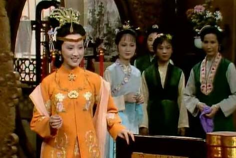

	<figcaption>
丹唇未启笑先闻
</figcaption>
    
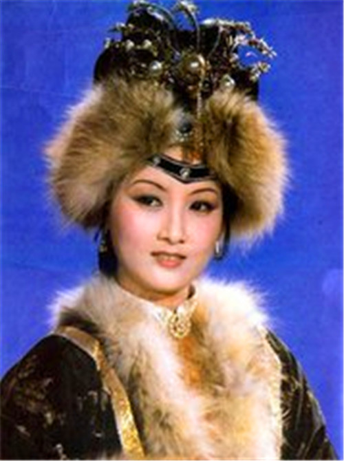

	<figcaption>
极盛
</figcaption> 
    
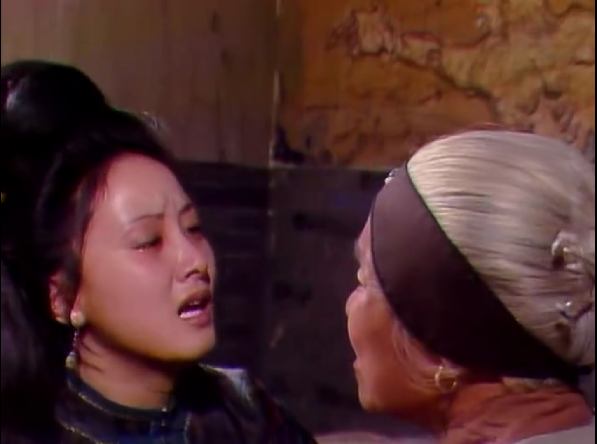

	<figcaption>
极衰
</figcaption>     
</figure>

其实87红楼刚上映时的评价远远没有如今一边倒式的赞美，但例外有二：邓婕的王熙凤和王立平的音乐。关于邓婕的表演我不想再说什么，大家自己去看就知道了。她就是王熙凤，没有任何人可能超越。

**晴雯-安雯（张静林）**

<figure>
	

	<figcaption>
俏丫鬟
</figcaption>    
	

	<figcaption>
“立起两个眼睛来骂人”
</figcaption>  
	
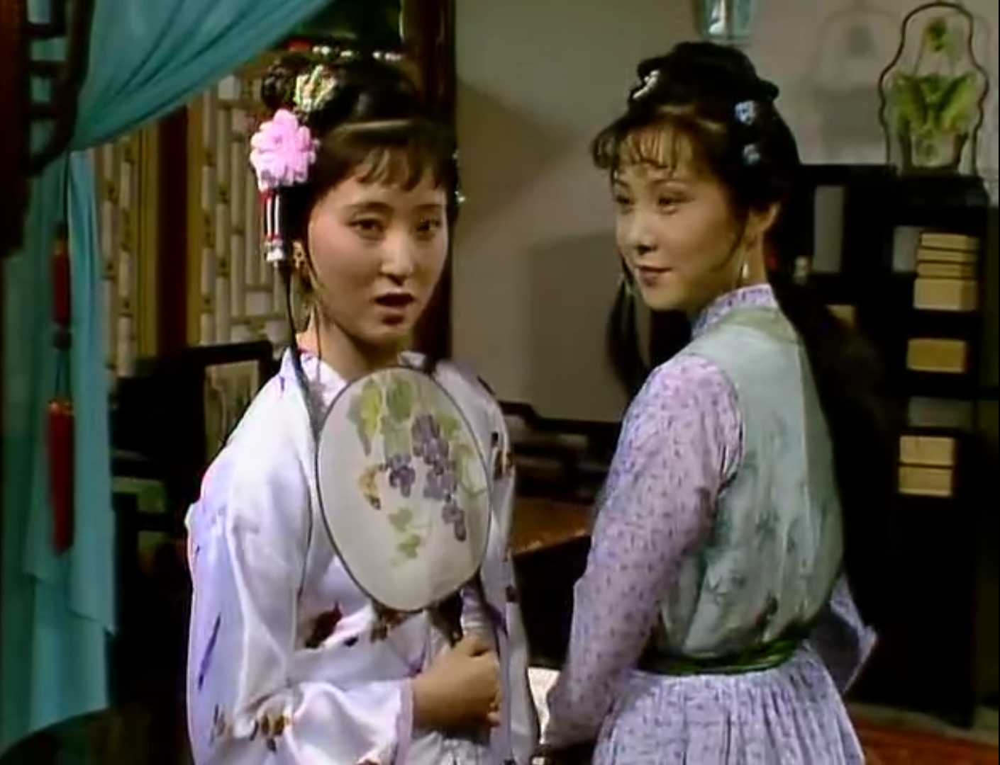

	<figcaption>
晴为黛影
</figcaption>    
    
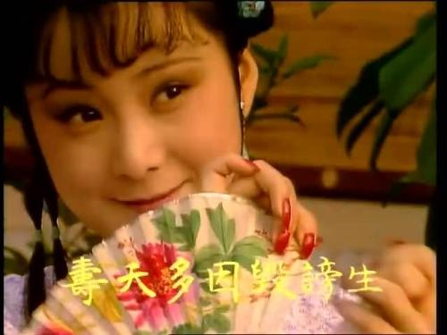

	<figcaption>
撕扇
</figcaption>
    
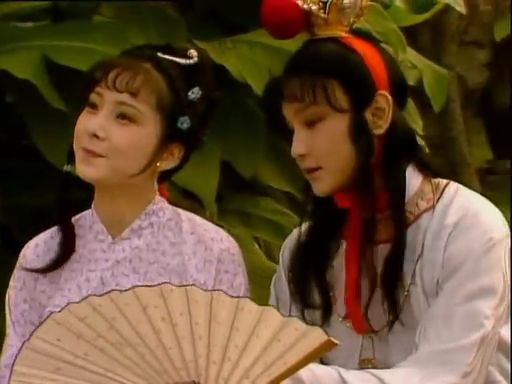

	<figcaption>
这一段太美忍不住多放一张
</figcaption>    
	

	<figcaption>
送帕
</figcaption>
	
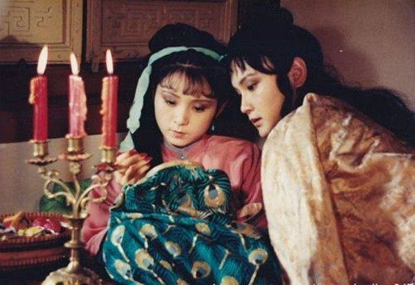

	<figcaption>
补裘
</figcaption>    
	
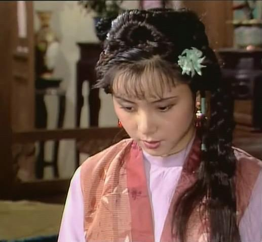

	<figcaption>
被逐
</figcaption>
	

	<figcaption>
梦别
</figcaption>    
</figure>

（没错我就是这么偏心）

张静林是张君秋大师的关门弟子，外形和演技都无可挑剔，当时是黛玉组的头号热门，但最后却被安排演了晴雯。实际上，我认为张静林的病态演的确实不完美（晴雯补裘和宝玉探病两段），而陈晓旭的风露清愁是与生俱来的；但反过来，张静林的风流灵巧（招人怨也演出来了）又人无可以代替，不得不佩服导演的眼光。

如前所述，补裘一段我觉得89版更好（虽然有些动作也过于夸张），其实晴雯说“小祖宗你快去睡罢”的时候是挺着急的（我们的爆炭小蹄子即使病了也是热炭啊），但是87版太过温柔，不仅不像晴雯，而且有点爱意了（包括后面几集一个超长的对视镜头），伤害了两人感情的那种纯粹感。探病一段也不够自然，但可惜尚无人超越。

除了病中这几段以外，张静林的表演称得上完美。“风流灵巧招人怨”真的太难演了，一方面要如实呈现晴雯的爆炭脾气、得理不饶人、治下严苛，一方面又不能演成年轻版赵姨娘（对比某版就知道这有多难）。但张静林完成得非常好，比如和袭人宝玉吵架，小嘴呱呱呱的惹人生气，但一掉眼泪又让人心疼。最经典的当然是撕扇一段（尤其是麝月那把扇子），也许用经典二字都无法形容尽，应该称之为不朽。除了张静林，没有任何一个人能演出那种溢出屏外的灵动娇俏，美得令人疯狂，甚至想把全天下的扇子都买来给她撕。

最后扯一点八卦。张静林演完这部戏后改名安雯，后来很快结婚，过了二十年和晴雯一样的公主生活，然后也像晴雯一样遭遇了巨大变故。但和晴雯不同的是，她很坚强的挺了过来，并且复出帮助家庭。一直有一种说法是87版的演员命运都与角色神似，其实有些牵强附会，不过也算一种奇缘吧。

#### 经典级

**林黛玉-陈晓旭**

<figure>
	

	<figcaption>
两弯似蹙非蹙罥烟眉，一双似喜非喜含情目
</figcaption>
	
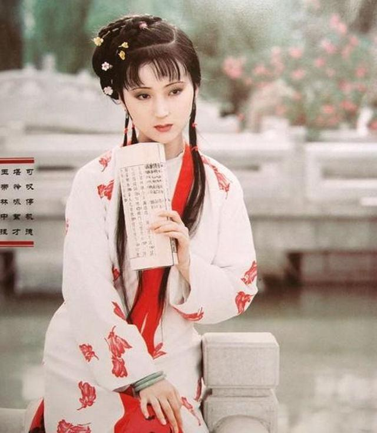

	<figcaption>
态生两靥之愁，娇袭一身之病
</figcaption>
	
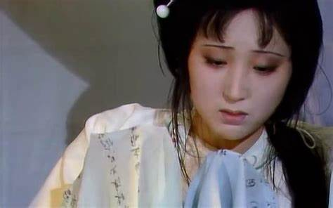

	<figcaption>
焚稿断痴情
</figcaption>
	
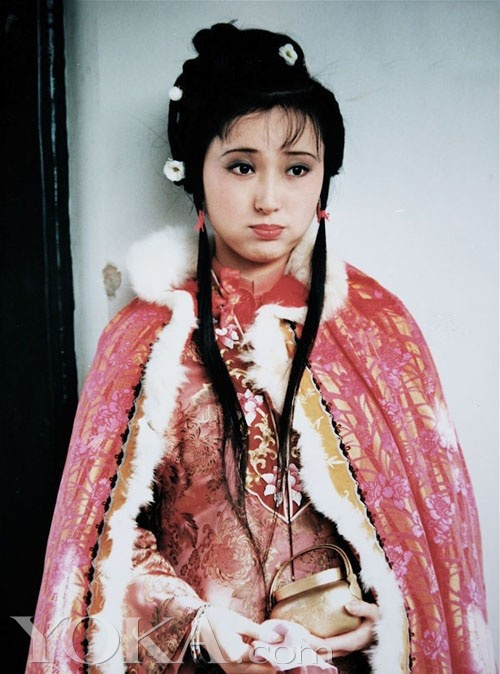

	<figcaption>
你的小可爱已上线
</figcaption>
	

	<figcaption>
"哟，我来得不巧了"
</figcaption>
	

	<figcaption>
你的小可爱再次上线
</figcaption>    
</figure>

其实87版刚出时，对陈晓旭的争议是非常大的，认为她演得过于小性儿，没有诗人气质。但经过时间的检验，其他版本的衬托，以及传奇人生的加持，陈晓旭渐渐成为了黛玉的化身。其实从上面几张图就已经能看出来，那种风露清愁的气质，似蹙非蹙的眉眼，真的不是颜值和演技能够代替的。

但陈晓旭当然也不完美（我觉得大概不可能存在完美的林黛玉）。黛玉确实是来还泪的，她孤独高洁自伤自叹；但她在人间也经历了很精彩的人生，她可以“魁夺菊花诗”，可以“雅谑补余音”，可以“互剖金兰语”，而且还要时不时跟宝玉闹情绪——这部分的表演大概是当年被批评的重点。其实在我看来，就算抛掉时光滤镜和他人衬托，陈晓旭这部分也演得很不错，之所以被指责小性儿，还是在两点上吃亏：颜值和年龄。她当然很美，但她并不十分漂亮；她虽然只有18岁，但也没法完全符合原著里十三四岁的小女孩。这两点也是王扶林导演一直的遗憾。有趣的是，89和17两版红楼梦刚好分别从这两个方面弥补了这一遗憾。

顺便提一下，陈晓旭后来还拍了一部《家春秋》，饰演梅表姐，仍然是林黛玉的影子。再后来她下海经商，成为了非常成功的企业家，曾获评“中国30位杰出女性广告人”。2007年患乳腺癌后出家去世，享年41岁。

**贾宝玉-欧阳奋强**

<figure>
	

	<figcaption>
风流公子
</figcaption>
	

	<figcaption>
被紫鹃吓傻的风流公子
</figcaption>     
</figure>

其实欧阳奋强的宝玉也可以算进神品了，唯一的遗憾是年龄还是大了一点。不过，就像前面我们提到的那样，这个账要算在整个87版的头上。因为所有演员的年龄都上调了好几岁（符合我们对红楼梦“爱情故事”的常规认识，但不符合曹雪芹“青春王国”的本意——我同意蒋勋的说法），才造成了前面所说的黛玉小性儿等等问题。后文就不再赘述这点了（除非特别离谱）。

关于表演我没啥可说的，反正就是跟你想象的贾宝玉一模一样。不过，我仍然盼望着有一天能有一个14岁的贾宝玉达到同样的高度。

**薛宝钗-张莉**

<figure>
	
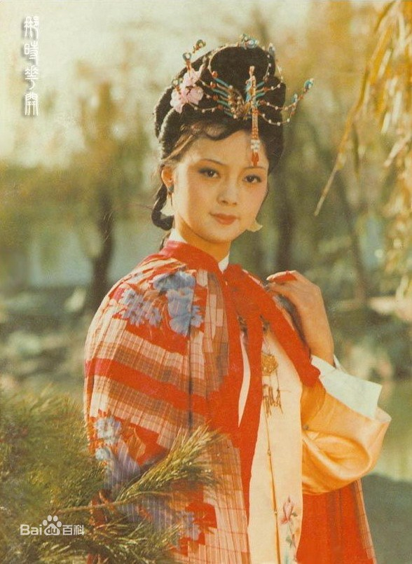

	<figcaption>
艳冠群芳
</figcaption>
	

	<figcaption>
脸若银盘，眼若水杏
</figcaption>
	

	<figcaption>
扑蝶
</figcaption>    
</figure>

同样没有什么评论。脸若银盘，眼若水杏，艳冠群芳，任是无情也动人，总之就是所有人心目中的宝姐姐了。

张莉后来出国经营房地产，身家过亿，至今未婚，也有一丝丝宝钗的影子。

**贾探春-东方闻樱**

<figure>
	

	<figcaption>
文采精华，见之忘俗
</figcaption>
	

	<figcaption>
抄检大观园横刀立马
</figcaption>
	

	<figcaption>
远嫁
</figcaption>    
</figure>

这名字就透着一股英雄气息，很配探春！

东方闻樱的演绎特殊在她是神似而非形似。探春“削肩细腰，长挑身材”，东方闻樱大概不太符合；但是“文采精华，见之忘俗”，则表现得淋漓尽致。出场的时候确实太胖了点，但是后面越来越好看，最后王妃妆绝美。

值得一提的是这一版中探春和赵姨娘的战斗力都被加高了，不完全符合原著。不过，这样也让后来二人作别的场景更加动人。

**史湘云-郭霄珍**

<figure>
	

	<figcaption>
“大笑大说”
</figcaption>
	
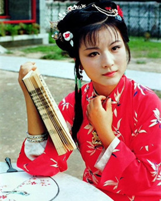

	<figcaption>
枕霞旧友
</figcaption>
	
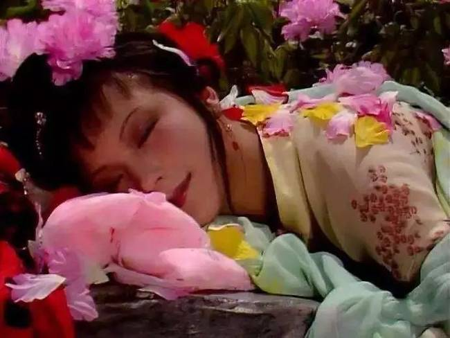

	<figcaption>
醉卧
</figcaption>    
</figure>

郭霄珍很好地演绎出了湘云“英豪阔大”的性格，最后花船上与宝玉重逢那段也很感人。要鸡蛋里头挑骨头的话，87版少拍了一些诗社，没有把湘云诗意的那一面凸显出来，史延芹也很遗憾当年为湘云设计的服装没有重视这个角度。不过总的来说，这仍然是最经典的湘云。

**秦可卿-张蕾**

<figure>
	
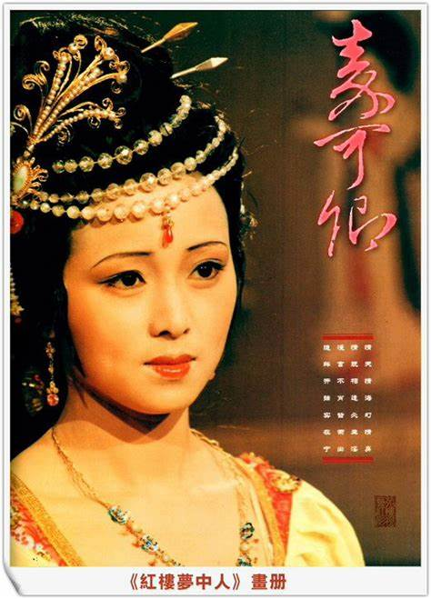

	<figcaption>
鲜艳妩媚，袅娜风流
</figcaption>
</figure>

乳名兼美，表字可卿，张蕾担得起！

**平儿-沈琳**

<figure>
	
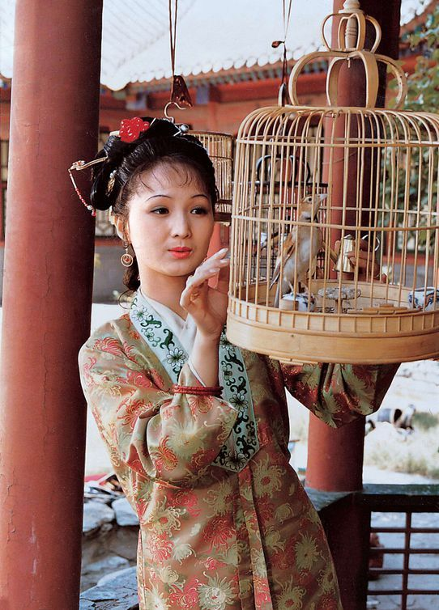

	<figcaption>
俏平儿
</figcaption>
	

	<figcaption>
柔中带刚
</figcaption>   
</figure>

平儿也不好演，聪敏善良但是又要镇得住下人，沈琳的版本是最完美的。然而87版放着这么美的平儿居然不拍怡红院理妆一段，真是暴殄天物啊！

**花袭人-袁玫**

<figure>
	

	<figcaption>
温柔和顺
</figcaption>
</figure>

袁玫有一点点显老，但是也比较符合袭人姐姐的身份，温柔持重。

彩蛋：猜猜袭人是谁配音的？

**其他**

其实称得上经典的角色还有很多，但他们相对来说形象没那么复杂，或者戏比较少，后人还有比较大的可能追赶甚至超越。这里就只列几个大概尚未有能与之匹敌者的：贾母，元春，尤二姐，夏金桂，香菱，龄官，茗烟，柳湘莲，贾雨村。可以负责任地说，书里有名有姓的上百个角色，除了下面这几个，都称得上成功演绎：

#### “再接再厉”级

**李纨**

<figure>
	

	<figcaption>
竹篱茅舍自甘心
</figcaption>
</figure>

李纨的演技没有问题，但她真的太！老！了！也许这样比较符合我们心目中的寡妇形象，但李纨恰恰不应该如此。元春省亲时贾兰尚幼“未谙诸事”，因此李纨最多也就是二十五。只有这个年龄才能凸显青春守寡的悲哀，只有这个年龄才能跟宝黛迎探等打成一片。在这一点上，89版和小戏骨版都远远好于87版。

另外前面提到，贾珍也有这个问题。

**花袭人**

啥？前面不是把她放在经典级别了吗？怎么又进这个名单了？

没错，袁玫的表演是经典级别的，但她被导演坑了。87版里给袭人加了几个莫名其妙的镜头，活生生地打造出了一个心机婊。比如宝玉生气要赶晴雯，袭人原本是忍着耻辱帮晴雯说情的，结果电视剧里居然插了一个志得意满的笑容？！晴雯被逐之后宝玉疑心袭人，原著里只说袭人不好再劝，以及后面吃了点醋，然而电视里那个做贼心虚的样子就差没把“是我告的密”写脸上了（实际上芳官四儿的确有可能是王夫人问袭人问出来的，但晴雯被逐绝对跟袭人没有关系——王善保家的告状的时候王夫人连晴雯脸和名字都对不上）。还有后来鬼鬼祟祟地找王夫人商量让元春下旨二宝联姻——袭人这么做当然非常合理，但是有必要这么偷鸡摸狗的吗？

所以虽然袁玫绝大多数的表演都很贴合原著，但这几个镜头严重影响了袭人的形象，罪过极大。我想这可能跟时代背景也有关系。寿夭多因毁谤生的晴雯大概也让主创想起了十年浩劫中的自己（注意，《芙蓉女儿诔》是骚体，对它的解读显然不仅仅限于晴雯），而心思缜密又甘做奴才而且还与晴雯屡屡冲突的袭人就倒了霉，有的没的都安了上去，实在悲哀。

**薛宝琴**

<figure>
	

	<figcaption>
洋娃娃
</figcaption>
</figure>

宝琴很漂亮，演技也没有问题，并且动作配音也极其可爱，剧情也没有魔改。但她还是不够美——在原著里宝琴的颜值要压过宝钗，然而在所有版本的影视中都没能做到（当然了，真能找到这样的人，导演的第一反应大概是换掉宝钗而不是让她演宝琴……）。但如果不这么吹毛求疵的话，宝琴当然演得很好。

**贾环**

<figure>
	

	<figcaption>
手足眈眈
</figcaption>
</figure>

贾环很猥琐，所以他长得丑，这一推理并不成立。看看他的亲姐姐探春，贾环怎么可能长成这样？贾环的猥琐是从气质里来的，而不是容貌里来的，所以我对89版的贾环更加认可。薛蟠其实也有一点这个问题，不过还好87版的薛蟠还不算太丑。

最后，B站刚买了87版的版权，但貌似画质比爱奇艺的差（都好不到哪儿去，毕竟是三十年前的）。似乎B站上有大佬上传了高清片源，还有人把所有歌曲MV做了4k重制，可以看看。但建议还是别开弹幕，不然黛玉宝钗晴雯和袭人中间至少得毁两个，也可能是四个。

最后的最后，87版跟我同一天生日:smile:。

## 89版

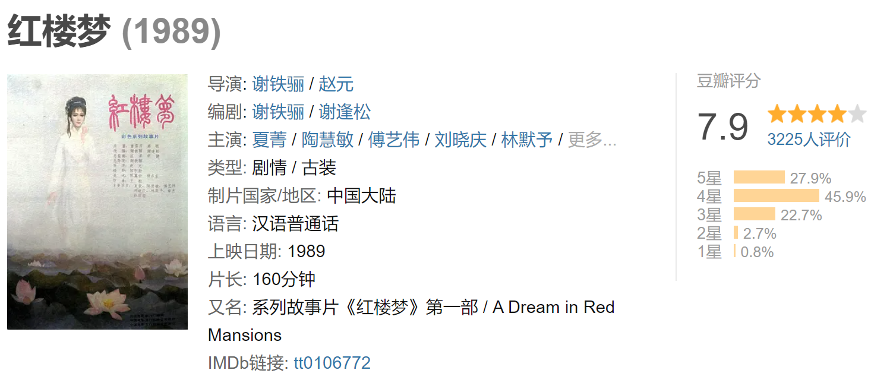

其实，89版才是真正举国体制的产物，比87版还要夸张：

- 谢铁骊，当年极负盛名的导演（而王扶林此前就只拍过一部电视剧而已）
- 逆天阵容，全部都是著名演员（87版全都不是）
  - 但这点其实后来发现并不成功，化用一下87编剧周岭的话：“你怎么告诉观众这是王熙凤，不是刘晓庆？”
- 逆天颜值，陶慧敏的黛玉，傅艺伟的宝钗，何晴的秦可卿，连紫鹃（陈红）都美得不像话（那可是老三国里的貂蝉啊……）
  - 但这点其实也有问题，后面会提到。有些角色美但不像（比如宝钗），有些本来应该普普通通的太美（比如麝月袭人），有些应该美的反而又普普通通（比如香菱平儿）
- 投资2200万（还是80年代），是87版的三倍，而且时长只有后者的一半
  - 实际上89版立项之后87版就很难继续筹款了（直接导致后6集剧本没有拍全，不过现在看来好坏各半），并且被拐跑了不少顾问，剧组从上到下也情绪低落，制片人任大惠30年后说起这段故事还会落泪（B站有采访视频）
- 服饰穿戴园林器物等等方面跟87版一样经过严格考证，并且更阔气
  - 房子超大，比87版更有贾府的气势（有人考证说比原著里夸张了，我觉得还行，不离谱）
  - 哪怕根本看不出来，房间里的古董也全部是从博物馆借来的真货……
- 技术条件比87好得多
  - 87剧组只有1台摄影机，所以镜头语言远远没有89版丰富（比如共读西厢一段）
  - 能拍出太虚幻境
  - 但令人迷惑的是，为什么89的色调总是有点乌漆墨黑的？而且竟然找不到至少跟87一样清晰的片源

下面还是按情节和表演介绍。

### 89版的情节

89版的特点主要有二，即采用程本和压缩时长。先说第一点。导演当然知道续书的问题，所以把后四十回压到全作的1/6，删掉了太过离谱的情节（比如黛玉听说宝玉订婚后“有意糟蹋身子”、宝玉把五儿当晴雯调戏、贾家复兴兰桂齐芳之类的），但是保留了金桂自焚身、宝玉丢玉发痴病、凤姐使掉包计、宝玉中举等等内容。这当然就涉及作品本身的问题了，我也不废话太多。但我觉得，程高本的大方向还是对的，人物结局也基本符合判词（香菱巧姐除外），它真正的问题是细节。比如，作者很努力地描写宝玉的痴，然而跟前八十回一比，你就会发现后四十回的宝玉不是痴，他就是傻：

> **庚辰本第十九回**
>
> 宝玉见一个人没有，因想：“这里素日有个小书房，内曾挂着一轴美人，极画的得神。今日这般热闹，想那里那美人自然也是寂寞的，得我去望慰他一回。”
>
> **程甲本第八十一回**
>
> 宝玉道：“我是要做姜太公的。”便走下石矶，坐在池边钓起来。岂知那水里的鱼，看见人影儿，都躲到别处去了，宝玉抡著钓竿等了半天，那钓丝儿动也不动。刚有一个鱼儿在水边吐沫，宝玉把竿子一幌，又吓走了，急的宝玉道：“我最是个性儿急的人，他偏性儿慢，这可怎么样好呢？好鱼儿，快来罢！你也成全成全我呢。”

又比如宝黛的交流，前八十回里所有人都不懂宝玉黛玉能懂，后四十回里所有人都能懂宝玉黛玉还不懂：

> **庚辰本第四十四回**（凤姐生日，宝玉逃出去祭奠跳井的金钏儿，众人都不知道他干嘛去了）
>
> 林黛玉因看到《男祭》这出上，便和宝钗说道：“这王十朋也不通的狠，不管在那里祭一祭罢了，必定跑到江边子上来做什么？俗语说：‘睹物思人’，天下的水总归一源，不拘那里的水，舀一碗看著哭，也就尽情了。”
>
> **程甲本第八十一回**（迎春回孙家，众姊妹皆悲伤不舍，宝玉也到潇湘馆大哭）
>
> 黛玉正在梳洗才毕，见宝玉这个光景，倒吓了一跳，问：“是怎么了？合谁怄了气了？”连问几声。宝玉低著头，伏在桌子上，呜呜咽咽，哭的说不出话来。黛玉便在椅子上怔怔的瞅著他，一会子问道：“到底是别人合你怄了气了，还是我得罪了你呢？”宝玉摇手道：“都不是，都不是！”黛玉道：“那么著，为什么这么伤心起来？”

这还只是第八十一回而已。所以为啥后四十回看起来那么难受，就是因为黛玉说话不像黛玉，行动不像黛玉，性格不像黛玉，就只有命运还像黛玉。然而89版作为一部压缩时长的影视剧，恰好可以避免细节上的问题（既然不会说，少说两句不就得了？至于不合适的表情动作，电影也可以重新演绎），因此虽然程高本让人不忍卒读，89版却是可以看下去的。

先说优点。续书里也并不是完全没有精彩的情节，比如焚稿断痴情的构思就极妙，难为作者竟然能想起几十回之前的那块帕子。这块帕子一定要烧，因为黛玉是来还泪的，而这块帕子就是还给宝玉的泪的象征——它来自宝玉，它满是黛玉的泪痕，它题有三首咏泪诗，烧掉这块帕子意味着黛玉生命的完成。（但作者其实是歪打正着，他以为黛玉烧帕子是恨宝玉（黛玉什么时候恨过人？她再被侮辱也只是自怨自艾），甚至还让她先撕了两下，最后来一句“宝玉宝玉你好”……）我相信真本（如果有的话）黛玉的结局大概也就是泪尽烧帕，只是细节会更精彩。

另外元妃暴薨那一段拍得极好（这个完全是剧组的功劳，原著写得平平），贾政通知王夫人的时候极力保持严肃又忍不住盈满泪水，非常动人；贾母王夫人出来之后正要哭泣突然被命令“不得啼哭”，只得捂嘴掩盖，但脸上已完全无法控制，比放声大哭还要摧人心肝。这一段真是精彩，强烈推荐。

宝玉失玉这一段89版拍得也比87好，因为后者没头没尾，就是丫鬟乱了一阵然后凤姐捡到了完事，既没按程高本让宝玉生病道士除邪，也没按脂批跟甄宝玉扯上关系，整集都让人莫名其妙。但89版里丢玉这段作用可就大了，这个玉不丢连婚都结不了。

所以接下来就要讲缺点了。掉包计当然是头一宗罪。也许有人喜欢，但在我看来，掉包计就是对王熙凤智商、薛宝钗人格和曹雪芹笔力的侮辱。首先，贾母喜欢谁还两说，但王熙凤自始至终毫无疑问是黛玉一边的。抄检大观园她尚且知道避祸，直接关系着管家大权的事情她反而大公无私帮着出主意？而且，这出的是个什么主意？明媒正娶是要宝玉的命，难道调包娶过来就不要命了？（难道凤姐是要借机整死宝玉从而永久管家？天啊我可真是个小机灵鬼）这个犹可，更加罪孽深重的是抹黑宝钗。“可叹停机德”的宝钗，“山中高士晶莹雪”的宝钗，写“皮里春秋空黑黄”的宝钗，竟然愿意顶替别人结婚，这:tm:是什么奇耻大辱？包括前面贾家提亲，薛姨妈问宝钗的意见，后者竟然“正色”说了一通大话，好像完全不知道宝黛怎么回事一样，就算长辈跟前是礼教，私下也得难过一下吧？续书里也没有（89版好歹让宝钗说这段话的时候委屈了）。世人对宝钗的歪曲，起码有80%来自这个狗屁续书带来的第一印象。第三是侮辱曹雪芹。红楼梦不是一个以离奇情节传世的小说（但作者并不是没这个能力，比如梦游甄府一段），所有的故事都是命中注定自然而然又无法阻挡；更何况掉包计连离奇都算不上，完全就是穿凿加烂俗，放八卦小报里还挺合适，放红楼梦里就是搞笑。宝黛钗最合理的安排就是黛玉先去世，然后宝钗光明正大嫁过来。我甚至觉得87版也不应该保留薛蟠出事这一段，因为薛家要是连打死个平民的事都摆不平，肯定是宫里失了势，已经快要gg了，贾家应该做的是马上切割而不是在这个节骨眼上联姻。如果真的舍不得“林黛玉焚稿断痴情，薛宝钗出闺成大礼”的对比的话，也完全可以随便找个理由让元春下旨啊——既不用扭曲贾母王熙凤薛宝钗形象，又可以让宝玉非得娶宝钗不可，同时还能保留这个戏剧冲突。为什么好好的路不走，非要整这个旁门左道呢？

除了这段以外，89版的后四十回倒没有太多致命伤（毕竟删了很多）。香菱判词无论怎么看都是被夏金桂整死，然而89版还是非得让夏金桂毒死自己；巧姐在原著里嫁了大地主跟判词不符，89版隐去了这个结局只留下刘姥姥一段；宝玉中举很多人不能接受，我倒觉得无所谓，也可以算是了结尘缘（特别是跟父母的缘分）。总而言之这些都不是大问题，唯一比较奇怪的是贾母丧事下人因为没钱没米不听指挥，虽然挺唏嘘的，可是就在上一幕贾母还给凤姐拨了三千两银子，凤姐之前哪怕典当嫁妆也要撑起贾府的面子，难道现在就不能先拿六百两出来每人发二两（袭人一个月工资才二两，普通下人怕是一年也没这么多）？

但致命的是，89版为了迎合后四十回，对前八十回的许多细节也进行了妄改，极大地扭曲了袭人、宝钗、薛姨妈甚至贾母的形象（后面还会细说）。或者说，89版就是按照三角恋爱的思路拍的，并且划分好了势力范围（上面gg的这几个当然都是“封建礼教”一边的）。用这个思路对待红楼梦，并且还努力地把人脸谱化，当然不可能达到很高的艺术成就。

另外一个特点是压缩时长。前面提到过，红楼梦是一个世界而不是一个故事，要压缩只有两种可能：删减这个世界的细节，或者选一个角度把它变成故事。89版是前者，17版是后者。前者当然风险更大，因为红楼梦本来已经批阅十载，字字珠玑，删减任何一处都会影响这个世界的完整性和真实性。可以看出89版很努力地追求情节的完整，前面提到87版没拍的太虚幻境89版都拍了（拍得不错，但为什么袭人是从副册翻出来的，而且宝玉认！出！了！晴雯判词？红楼梦其中一个主题就是早已注定但无法认识的空幻命运，都认出来了还有什么需要修行的？）。但是，在很多地方也能明显感觉到节奏过快，导致感情出不来。比如最经典的“你放心”那段，删掉黛玉“做什么动手动脚的”和帮宝玉擦汗一节，导致看不出这次两人的“忘情”，气氛烘托也不够，即使“你放心”也看起来像稀松平常的聊天了。

不过总的来说，89版还是完成度相当高的。更加重要的是，89版许多角色的表演是对87版的重要补充，甚至超越后者，对于全面理解人物很有帮助。因此，下面我们就与87版对照进行介绍。

### 89版的表演

#### “超越经典”级

**李纨**

<figure>
	

	<figcaption>
青春丧偶，槁木死灰
</figcaption>
</figure>

（89版除了主角以外几乎找不到高清剧照，只好截图了）

前面已经提过，李纨主要是年龄问题。89版其实也没有好多少……但可能也是颜值影响，至少这个李纨跟弟弟妹妹们一起玩的时候不会太扎眼了。

**妙玉**

<figure>
	

	<figcaption>
气质美如兰，才华馥比仙
</figcaption>
</figure>

89版的妙玉要比87版好看很多，而且有更多流露感情的细节（比如上面赏雪的镜头，以及回去前的表情变化），更能反映出那种“青灯古殿人将老，孤负了红粉朱楼春色阑”的感觉，同时又表现得十分微妙，不失妙玉的身份。但我不喜欢的是把这种感觉跟爱情联系起来，从判词来看，我也不敢说妙玉对宝玉就一定没有爱。但我认为，栊翠庵的红梅象征着情，更象征着一种可以蓬勃发展的生命形态，那正是妙玉努力斩断却又不愿斩断的尘缘，绝不仅仅是对一个人的爱而已。然而无奈所有版本的影视剧都要让妙玉对宝玉动情，89版更是给二人加了不少戏，不过，倒也还前后连贯。

**赵姨娘**

<figure>
	

	<figcaption>
愚妾争闲气
</figcaption>
</figure>

87版的探春和赵姨娘都是强化版，而89都是弱化版，其实都不完全贴合原著。但是相比之下，我觉得89的赵姨娘更引人思考。87赵姨娘只有撒泼和撒泼失败之后生闷气两种状态，但89版演出了赵姨娘的委屈和尴尬。比如打完芳官被探春教训那一段，87版的赵姨娘还来了一句“你敢说你亲妈？”并在探春面前做了个360度回旋——书里并没有这段，而且赵姨娘恐怕没胆这么跟主子小姐说话。但是89版的赵姨娘被训完之后一言不发，表情大概就是上面这样：心里还有气，但更多的是委屈。看87版你只会觉得赵姨娘真讨厌，但89版会让你思考她在贾府到底受到什么待遇，她为什么三天两头争闲气，等等等等，这其实更接近曹雪芹的笔法。

另外前面也提到89版的贾环更好，就不截图了。

89迎春也特别美，更加“温柔沉默”（87版只有沉默），但想给二木头截张图恐怕比贾环还难……

#### “难分高下”级

**探春（曾丹）**

<figure>
	
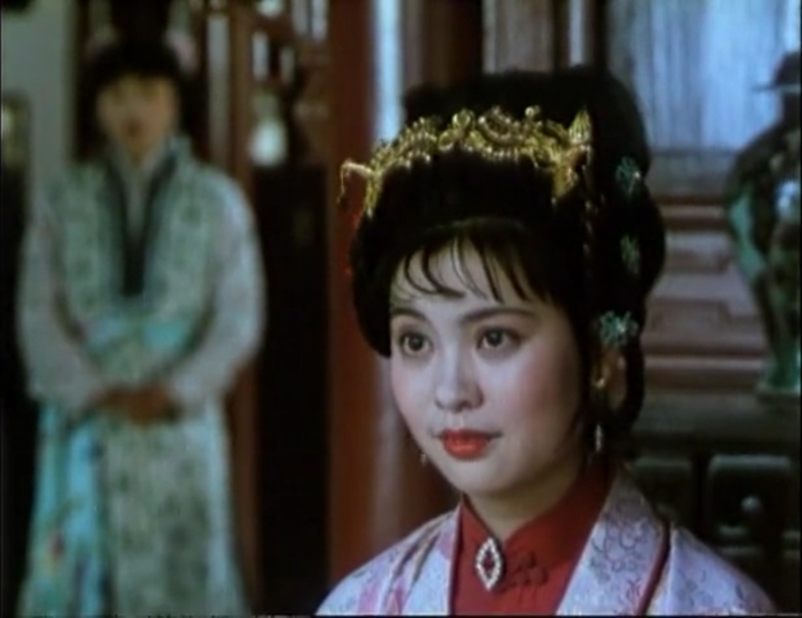

	<figcaption>
质问吴新登家的
</figcaption>
	

	<figcaption>
责备赵姨娘后自己委屈
</figcaption>
	

	<figcaption>
把守秋爽斋
</figcaption>    
</figure>

89探春有两位，后四部是曾丹出演（其实前两部也没探春什么镜头）。相比东方闻樱，曾丹更加符合“削肩细腰，长挑身材”的描述，“文采精华，见之忘俗”也不输前者。如果说三姑娘是“玫瑰花”，那么东方闻樱的版本更有英气，而曾丹的版本则更贴合“言语沉静、性情和顺”的小姐身份，其实二者都有偏颇，真正的探春大概应该介乎两者之间。

最能体现两版探春区别的还是赵姨娘大战芳官，探春劝“小丫头子们原是些玩意儿”那一段。从书里看，探春原本是叹了口气要耐下性子劝的，只是说到“何苦自己不尊重”的时候大概又想起赵姨娘的前科来了，后半段才动了气。然而在剧中，87版探春是从头到尾都在生气，89版则是从头到尾都没生气，只是难过。我们比较容易接受87探春的刚烈，但实际上，探春的刚烈背后是羞愧和委屈，如果不是亲妈一天到晚让她连带受辱，她也不会养出一身的刺。89版表现出了这种难堪，尽管对原著内容改动较大，但对探春的形象是一个很好的补充。

**黛玉**

<figure>
	

	<figcaption>
初见
</figcaption>
	

	<figcaption>
葬花
</figcaption>
	
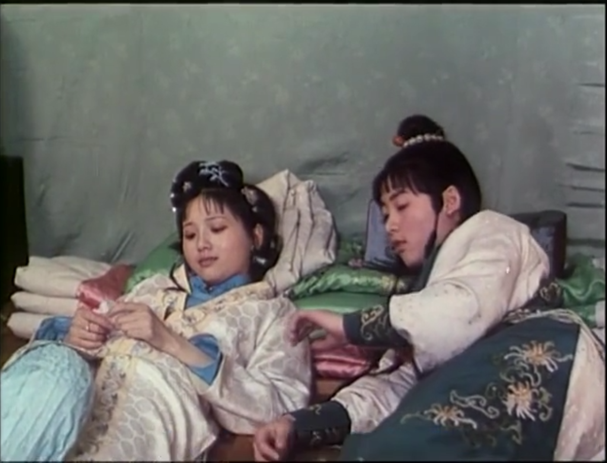

	<figcaption>
打闹
</figcaption>  
	

	<figcaption>
吃醋
</figcaption>        
	
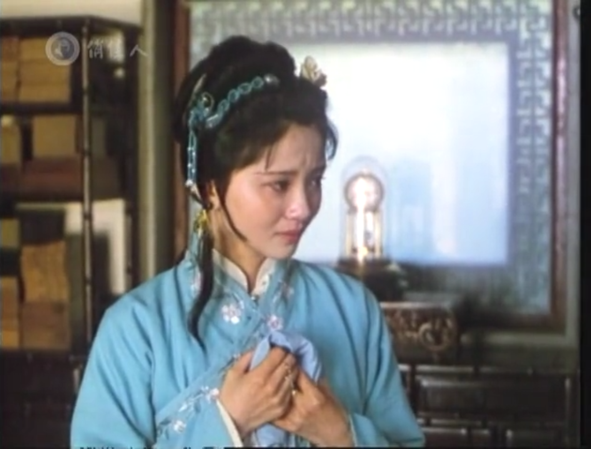

	<figcaption>
委屈
</figcaption>        
	

	<figcaption>
焚稿
</figcaption>        
</figure>

陈晓旭是所有人对林黛玉的第一印象，而陶慧敏是公认的“最美林黛玉”。三十年来，关于“陈晓旭还是陶慧敏”的争论就从来没有停止过。我同样给不出答案，因为在我看来她们各自演出了黛玉的一个侧面。一方面，黛玉是下凡还泪的仙子；另一方面，黛玉又是豆蔻年华的女孩。一方面，她自怜自伤，夜夜垂泪，为自己写下《葬花词》，为宝玉写下《题帕三绝》；另一方面，她又与大观园的姐妹嬉游笑闹，与宝钗契若金兰，是朋友圈的毒舌小能手，学校里的中文系系花。陈晓旭胜在前者，陶慧敏胜在后者。陈晓旭骨子里的清冷气质无法替代，甚至当38岁的她坐在台下，你仍然会一眼发现，因为她似乎总是那么出尘。陶慧敏的脸颊似乎太丰满了点，眉眼也无法做到像陈晓旭那般清愁，但她婉转中带着俏皮的江南气质又是陈晓旭不能比的。下面放两组对比图（左87，右89，下同），大概可以看出来：

<table>
    <tr>
        <td>

</td>
        <td>
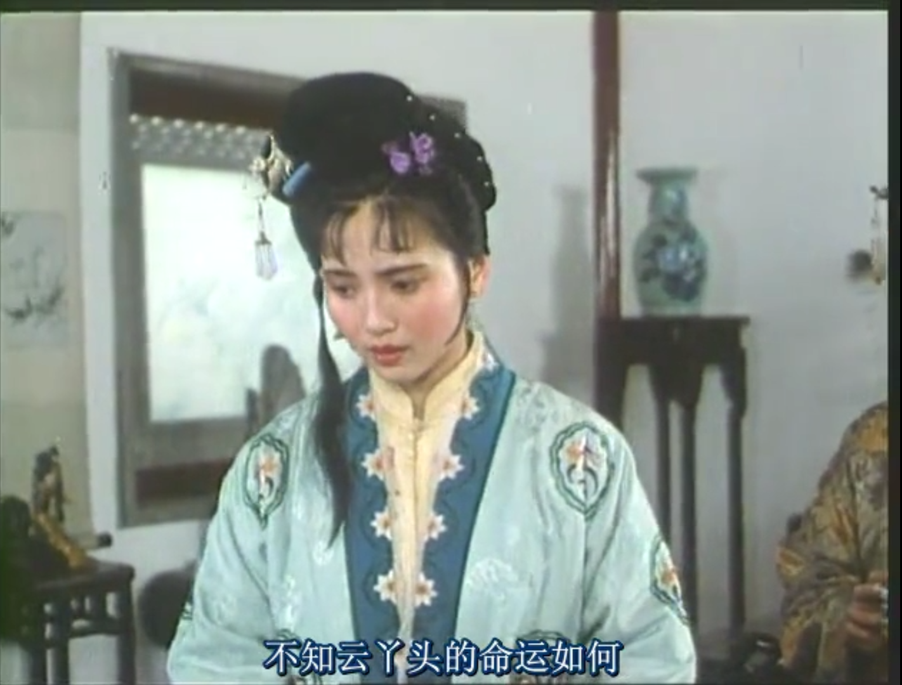
</td>
    </tr>
    <tr>
        <td colspan = "2">
愁
</td>
    </tr>
    <tr>
        <td>
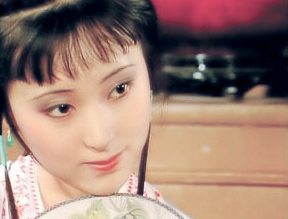
</td>
        <td>

</td>
    </tr>
    <tr>
        <td colspan = "2">
酸
</td>
    </tr>    
</table>

**刘姥姥**

<table>
    <tr>
        <td>
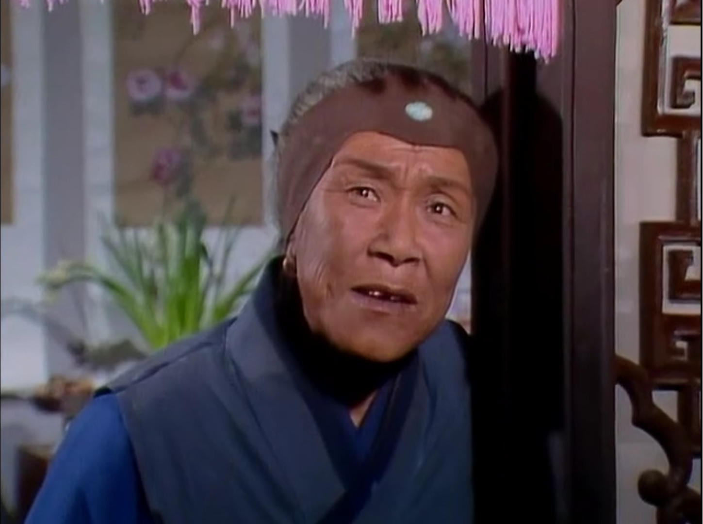
</td>
        <td>
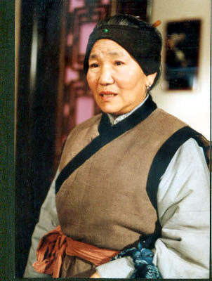
</td>
    </tr>
    <tr>
        <td>

</td>
        <td>
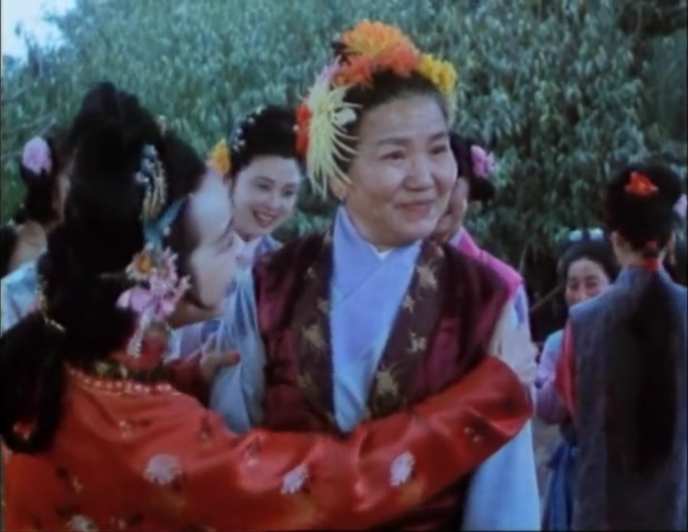
</td>
    </tr>
    <tr>
        <td colspan = "2">
左为87沙玉华，右为89赵丽蓉
</td>
    </tr>    
</table>

赵丽蓉老师的演技当然没得说。比较起来，87版的刘姥姥更有土气，而89版则在土气中带着一点精明，两版都非常好。

**秦可卿（警幻仙姑）**

<table>
    <tr>
        <td>
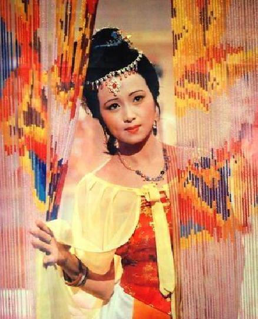
</td>
        <td>
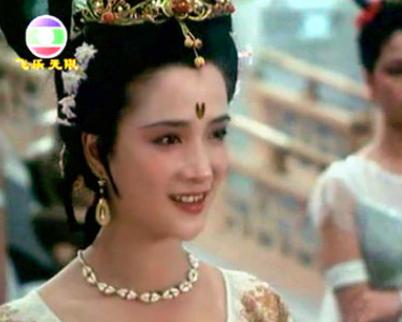
</td>
    </tr>
    <tr>
        <td colspan = "2">
左为87张蕾（貌似是油画），右为89何晴
</td>
    </tr>    
</table>

何晴是著名的古典美人，唯一一个演遍四大名著的演员（秦可卿，小乔，怜怜，李师师）。在许多人心中何晴才是最完美的秦可卿，不过对我来说，要对这两个天仙作比较实在已经超出能力范围了:joy:。

**其他**

89版的贾政也是不错的，几场与元春有关的戏里细微的感情流露很动人。贾珍比87版年轻，模样端正（但收拾得不太干净），也还不错。惜春、紫鹃和麝月都演得很好，而且全都美出天际，但是原著并没有特别强调这几个人的颜值，麝月更是应该普普通通，所以也不能说超越87。鸳鸯跟87版一模一样。金钏儿真可爱。李玲玉的尤三姐又美又有侠气，但87版也很好。

#### “差强人意”级

**宝玉**

<figure>
	
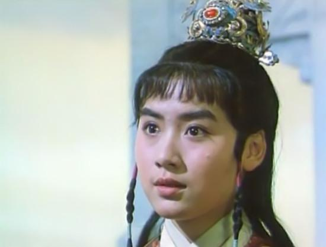

	<figcaption>
风流公子
</figcaption>
	

	<figcaption>
被紫鹃吓傻的风流公子
</figcaption>     
</figure>

89版的宝玉由夏菁反串，引起了很大争议。但总体上来说，我觉得这个宝玉并没有显得娘娘的，反而因为反串的优势比较显小，有些语言动作就更加自然。当然，若论痴，还是不及欧阳奋强。

**晴雯**

<figure>
	

	<figcaption>
俏丫鬟
</figcaption>
	

	<figcaption>
补裘
</figcaption>   
	
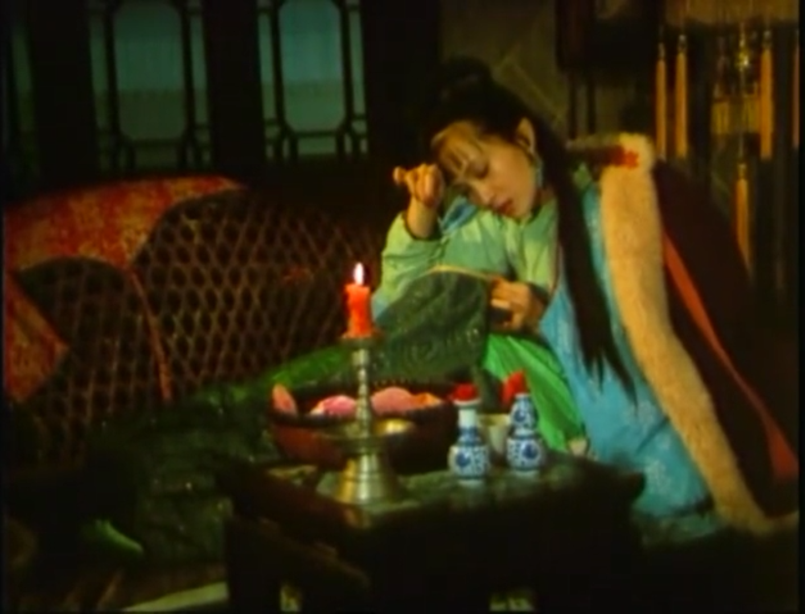

	<figcaption>
还是补裘
</figcaption>  
	
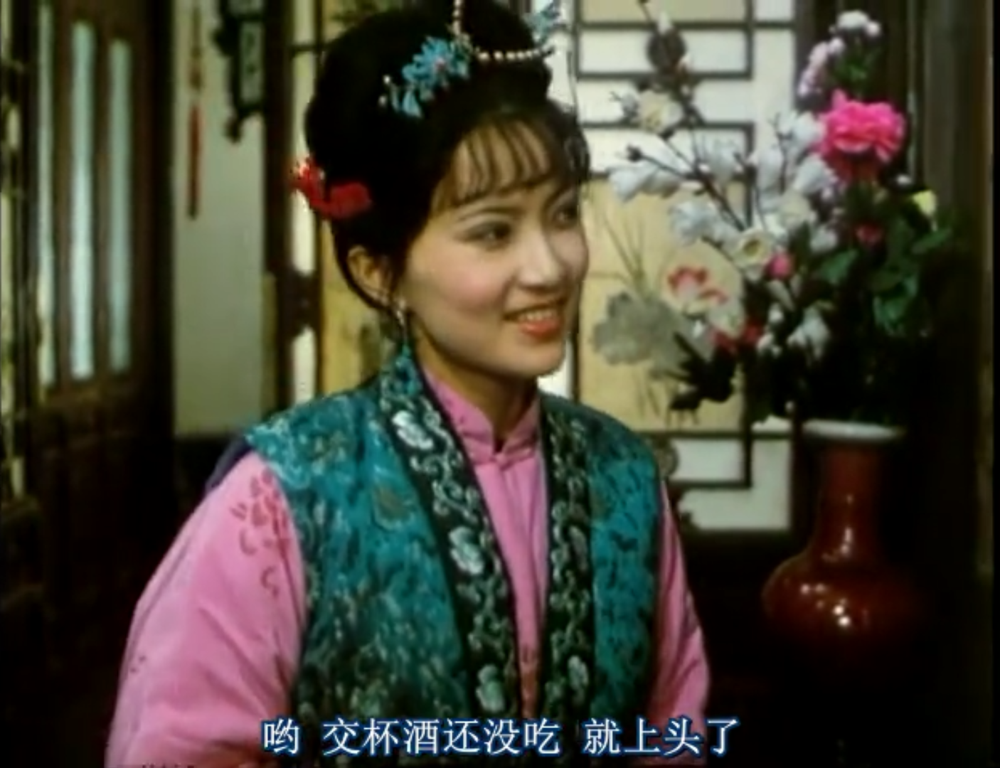

	<figcaption>
酸了！
</figcaption>  
	

	<figcaption>
难得娴静
</figcaption>    
</figure>

晴雯由李勇勇饰演，颜值当然也过关。但是无奈89版的麝月实在太美，袭人也很漂亮，导致晴雯一点也不出众。实际上三人的颜值应该晴雯>袭人>麝月才是（袭人还被夸过一次模样性格没得说）。而且李勇勇的下巴比较瘦，使起性子来就更讨人嫌一点（这倒也不一定是缺点）。另外，配音的嗓门太粗了，跟87版的王雪纯（就是你知道的那个王雪纯）不能比。

不过总的来说，这个晴雯还是可以接受的。前面也特别提到，补裘这一段89版比87版好很多。89版看起来更像是在生病，并且语言动作更干脆，没有卿卿我我的（另外这个三寸长的指甲真美啊，87版没拍出来）。但是其他的戏，李勇勇还是不及安雯远矣。放几张图对比：

<table>
    <tr>
        <td>

</td>
        <td>
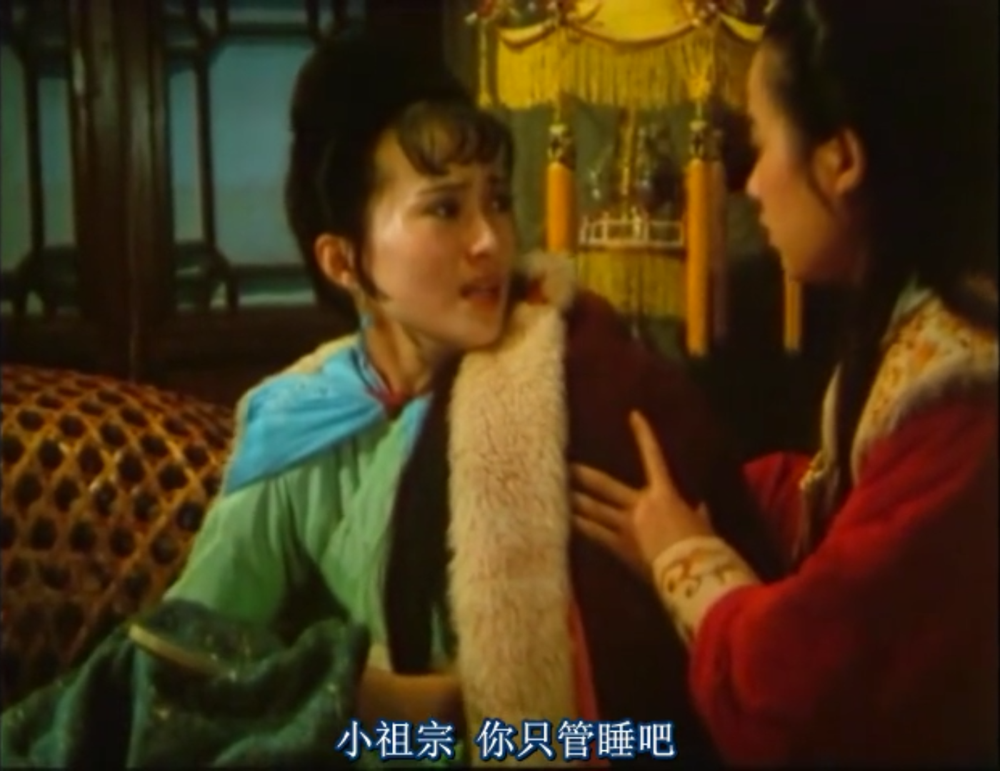
</td>
    </tr>
    <tr>
        <td colspan="2"><figcaption>
“小祖宗，你只管睡罢”
</figcaption></td>
    </tr>
    <tr>
        <td>

</td>
        <td>
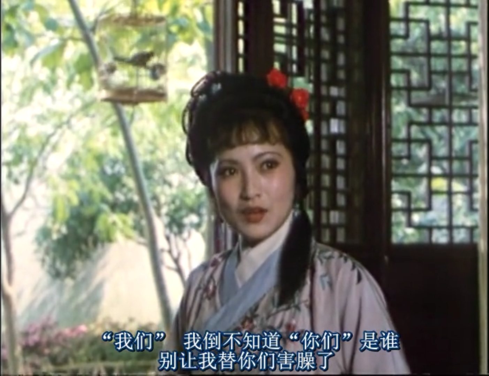
</td>
    </tr>
    <tr>
        <td colspan="2"><figcaption>
“‘我们’？我不知道你们是谁”
</figcaption></td>
    </tr>    
</table>

**湘云**

<figure>
	

	<figcaption>
云丫头
</figcaption>
	

	<figcaption>
可可爱爱
</figcaption>        
</figure>

这个湘云吧，可爱是真可爱，配音也很好，但也真的太胖了……毕竟是史侯家的千金小姐，怎么着也会控制着点的吧……我甚至怀疑89版没拍湘云醉卧就是因为效果实在糟糕:joy:。

#### “再接再厉”级

**贾母**

<figure>
	

	<figcaption>
笑
</figcaption>
	

	<figcaption>
哭
</figcaption>        
	
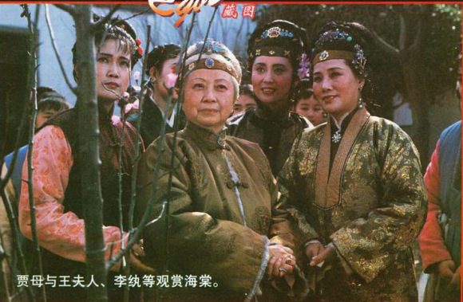

	<figcaption>
平时
</figcaption>      
</figure>

贾母只看剧照没什么问题，但她在电影里总给人一种凶凶的感觉，始终不像我们心中那个慈爱的老太太。当然这也有可能是因为87版李婷扮演的贾母形象太过深入人心。下面放两张87版的图，一看便知：

<figure>
	

	<figcaption>
笑
</figcaption>
	
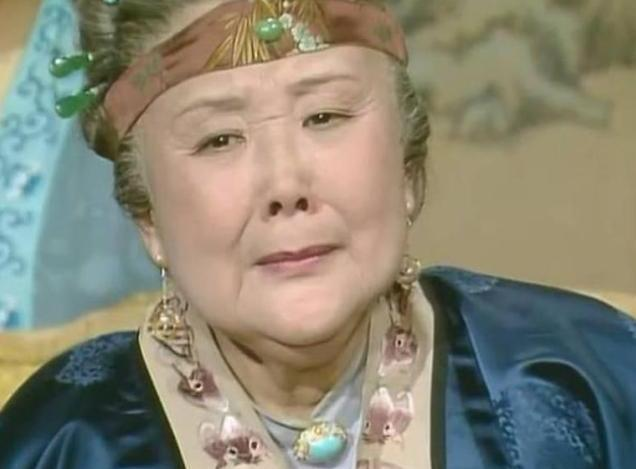

	<figcaption>
哭
</figcaption>      
	
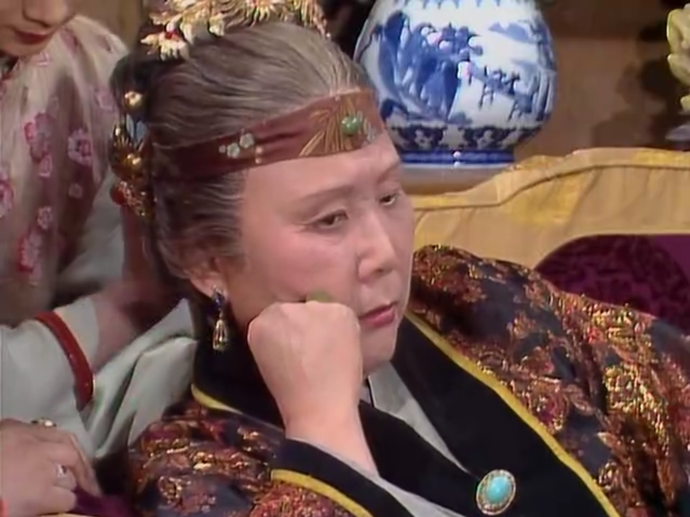

	<figcaption>
怒
</figcaption>      
</figure>

除此以外就是情节问题了。89版为了符合续书，不得不直接把贾母划到宝钗一边，然而实际上主流观点认为贾母一直是坚定的宝黛党，证据有“不是冤家不聚头”、批评宝钗的雪洞房让外人误会、元宵夜宴没让宝钗坐上桌、紫鹃试玉后的反应，以及兴儿（“将来准是林姑娘定了的”）和凤姐（“他两个一娶一嫁”）对宝黛婚事的判断等等。其实我觉得这个并无定论，毕竟金玉党也有“我们家四个女孩全不及宝钗”等等证据，只不过没那么有力。但不论如何，在前八十回中，贾母就算不是站定二玉（像87版一样），也绝不是坚定的金玉党。89版为了前后统一，不得不给贾母加戏。紫鹃试玉之后，贾母原本是流下泪来，但在89版里却先来了一个“竟然好到这步田地了这可怎么办”的忧心忡忡的表情，然后尴尬地笑着说了那段“呆根子”，完全改成了另外一个方向。另外在元宵夜宴黛玉让宝玉代饮、凤姐“不要吃冷酒”和贾母掰谎记那段，89版直接演成了长辈对二玉的亲密举动不满，并且拿掰谎记来刺黛玉。当然一直以来确实也有这种观点，但毕竟书中完全没有描写其他人对二玉以及凤姐举动的反应，掰谎记大家也都听得很开心，而且后来看烟花贾母还把黛玉抱在怀里，因此在改编时大概还是谨慎一些为妙。

**凤姐**

<figure>
	
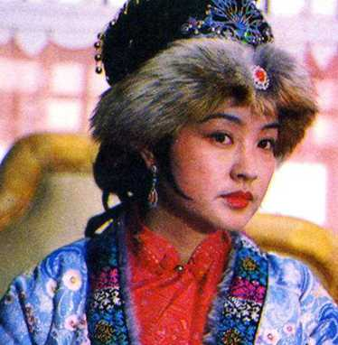

	<figcaption>
威
</figcaption>
	
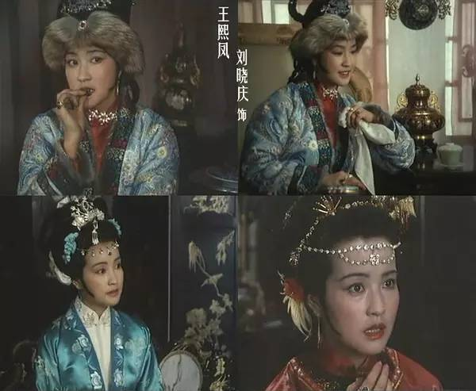
      
	

	<figcaption>
笑
</figcaption>      
</figure>

刘晓庆还是更适合武则天一点。凤姐当然要有威风，但她有时也极可爱，会撒娇，这需要年龄和外形的支撑。只要稍微老一点（凤姐不到二十岁）、胖一点，这部分形象就出不来。刘晓庆恰恰吃了这两方面的亏，所以讲起笑话来总没有邓婕可爱。当然，让邓婕演武则天，恐怕也比不过刘晓庆。

**平儿**

<table>
    <tr>
        <td>

</td>
        <td>

</td>
    </tr>
    <tr>
        <td colspan = "2">
受夹板气的平儿
</td>
    </tr>    
</table>

89版拍了平儿理妆（虽然有点草率），但可惜这个平儿不够俏，或者说不够年轻不够漂亮不够苗条不够伶俐，演袭人应该更合适。

**香菱**

<table>
    <tr>
        <td>

</td>
        <td>

</td>
    </tr>
    <tr>
        <td colspan = "2">
根并荷花一茎香，平生遭际实堪伤
</td>
    </tr>    
</table>

香菱的气质很复杂。她很美（像秦可卿），但又有几分呆气，几分书卷气，以及一种“应怜”之愁。其实两版的香菱都不特别漂亮，但87香菱演出了诗意和愁绪，而89版大概以上四点都没做到。

**王夫人，薛姨妈**

<table>
    <tr>
        <td>

</td>
        <td>
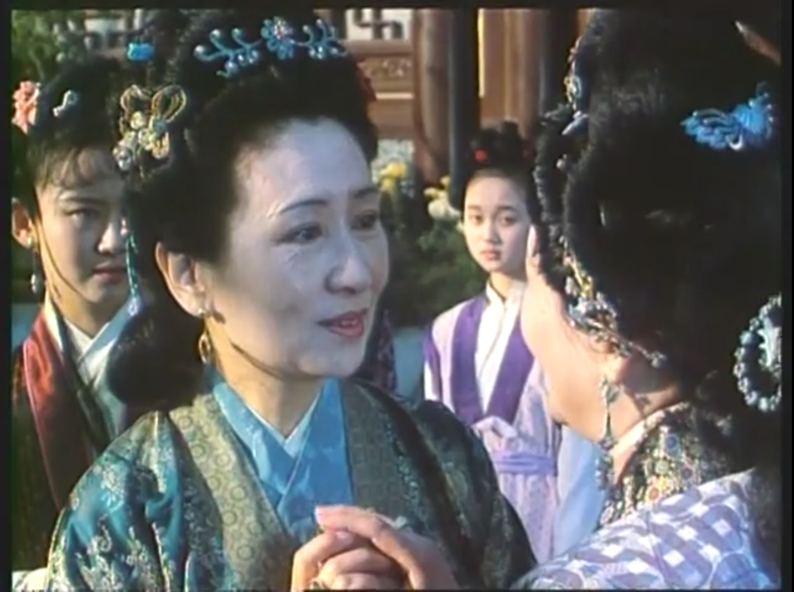
</td>
    </tr>
    <tr>
        <td colspan = "2">
左为王夫人，右为薛姨妈
</td>
    </tr>    
</table>

把她们放一起的原因是我觉得这两人反了。如果不加图注，我相信大家应该觉得左边是薛姨妈，右边才是王夫人。薛姨妈是纯粹的慈母形象，她看见薛蟠就宠薛蟠，看见宝钗宠宝钗，看见宝玉宠宝玉，看见黛玉宠黛玉。但王夫人是柔中带刚，当年也是个“响快人”，如今虽然天天念佛，关键时刻杀伐决断不在凤姐之下（所以百度百科里叫“佛口蛇心”……）。87版的选角显然比89版好得多：

<table>
    <tr>
        <td>

</td>
        <td>
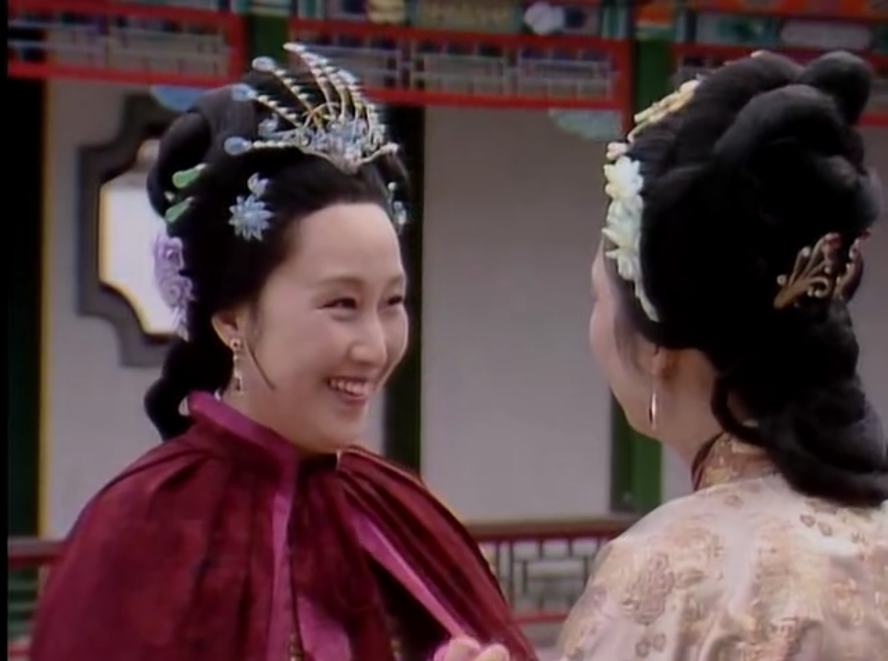
</td>
    </tr>
    <tr>
        <td colspan = "2">
左为王夫人，右为薛姨妈
</td>
    </tr>    
</table>

另外为了迎合续书，89版的王夫人和薛姨妈直接从头到尾跟黛玉没有半点感情。比如紫鹃试玉之后给王夫人加戏说二玉情深是她的心病，然后薛姨妈才鬼鬼祟祟走过去跟贾母说哎呀也不是什么大事啦巴拉巴拉，结果剧里薛姨妈和宝钗疼黛玉全变成演戏了，哪里还有慈姨妈的样子？

**宝钗**

<figure>
	

	
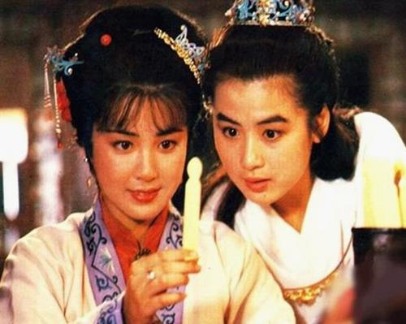
      
	

     
</figure>

傅艺伟当然很美，可她更偏俏丽而不是端庄，并非宝姐姐的类型（实际上，傅艺伟最成功的角色是妲己……）。这倒还是其次，主要的过错还是要安在导演头上。为了符合三角恋爱的设定，89版给宝钗加了各种得意的微笑（比如元春发礼物那段）。然而在书里，几乎每次宝钗的反应都是避嫌。不管你相信她心里有鬼也好，没鬼也罢，至少宝钗都绝对不会傻乎乎地这么喜形于色。

最罪大恶极的当属滴翠亭事件。书中宝钗是无处可躲，情急之下条件反射地拉了黛玉当挡箭牌。你当然可以说这反映了宝钗内心深处的争强好胜，但至少她平时是有意压制这个潜意识的。然而89版居然改成了小红坠儿拉开N扇窗还没见到人，宝钗大概足够溜得一干二净了，却想了想又回去喊颦儿，这完全就是在陷害了。有趣的是，由于上一段提到的原因，这一版的宝钗看起来一点也没有城府，却要做这么有城府的事，真是啼笑皆非。

**元春**

<table>
    <tr>
        <td>

</td>
        <td>
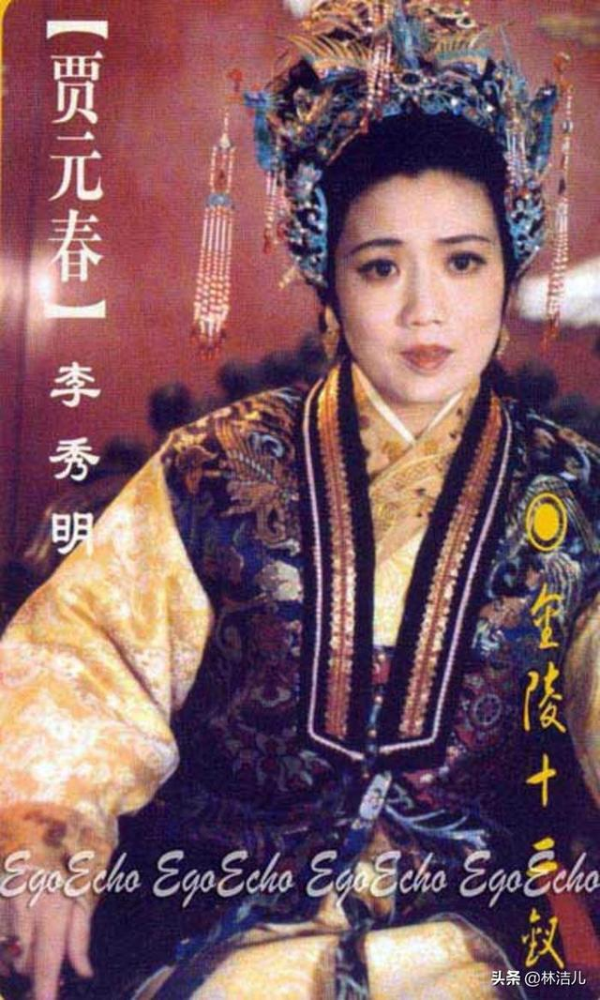
</td>
    </tr>
    <tr>
        <td colspan = "2">
左87，右89
</td>
    </tr>    
</table>

89元春的演技没问题，可是形象完全不符合我们对一个正在受宠的皇妃的期待，没有皇家气派，而且太老了，难以想象还能加封贤德妃。相比之下，87元春一站在那儿就是娘娘的气势。在哭戏上，两版其实都不错。

**袭人**

<table>
    <tr>
        <td>

</td>
        <td>

</td>
    </tr>
    <tr>
        <td colspan = "2">
89版的两个袭人
</td>
    </tr>    
</table>

没错，袭人，又是袭人。这（两）个袭人当然也漂亮，可是你哪只眼睛看出她粗粗笨笨了？几乎就差把“精明”俩字写脸上了。而且我不明白的是，袭人明明应该对任何人都挂着和善的笑容，但为什么这个袭人永！远！不！笑！？（尤其是第二个）虽然我没有每分每秒看过，但袭人在90%的时间里都摆着上面这张臭脸，剩下10%大概是：偷试云雨情、宝玉说“八抬大轿”、王夫人给名分、和鸳鸯谈将来婚事，等等等等。我甚至怀疑导演给袭人下了命令：“当且仅当谈及你嫁给宝玉的事情时，笑！”除此以外还有程高本的各种加戏，当然就更歪了。

#### “无法忍受”级

**茗烟**

<table>
    <tr>
        <td>

</td>
        <td>

</td>
    </tr>
    <tr>
        <td colspan = "2">
左87，右89
</td>
    </tr>    
</table>

哦我的上帝啊，你怎么把我的小机灵鬼茗烟变成了这个憨憨？这像是能在水仙庵说出一番古灵精怪话的人么？

## 小戏骨版

这版的特点用一张图就可以说明。来，倒数三个数：

3

2

1

<figure>
    

        
    

    <figcaption>
宝钗扑蝶
</figcaption>
</figure>

**“青春”。**

蒋勋说红楼的时候反反复复强调，大观园是一个青春王国，红楼梦是一本青春小说。不细读的人总会觉得，红楼梦不过就是些风花雪月情情爱爱，怎么能让一帮小孩子来演呢？然而书里写得明明白白，进大观园的时候宝钗还没过十五岁生日，宝琴来了之后“李纨为首，馀者迎春、探春、惜春、宝钗、黛玉、湘云、李纹、李绮、宝琴、邢岫烟，再添上凤姐儿和宝玉，一共十三人。叙起年庚，除李纨与凤姐儿年纪最长，馀者皆不过十五六七岁”（李纨顶多二十五，凤姐二十），后来群芳祝寿时又说香菱袭人晴雯宝钗同庚，等等。当然红楼梦的时间线是有一点矛盾的，特别是进大观园之前，比如黛玉是六岁还是十一岁进贾府（我倾向于六岁）。但有一天偶然看到一篇曹金钟的《<红楼梦>中人物年龄“矛盾”考论》，十分有理：“《红楼梦》中少女的年龄，是被作者有意限定在‘十五六七岁’以内的……所以，她们有的突然长大，但有的又长不大；有的在长大，有的又不长。”同样的，书中的奶妈婆子们也被有意改得老态龙钟作为对比（比如宝玉的奶妈李嬷嬷，哪里就老成那样了）。而且我们也知道，曹雪芹被抄家的时候本来就是十三四岁，大观园的美好回忆当然比这还要早。所以，大观园之为“青春王国”，是无可辩驳的。

于是有一些人就说，年龄虽然是这个年龄，但作者给他们赋予了超过年龄的思想。可是你让他举个例子说明书里有什么思想是中学生一定想不出来的，他又举不出例子。更何况，宝玉一天到晚发痴病，满嘴里什么化灰化烟的，安在成年人头上不奇怪吗？黛玉和宝玉在床上挠痒痒，安在成年人头上不奇怪吗？香菱跟豆官打闹滚进泥里，安在成年人头上不奇怪吗？晴雯跑进宝玉被子里暖和，安在成年人头上不奇怪吗？就算是宝钗，人家管着那么大的家业，早熟点也太正常了，何况她还偶尔扑个蝴蝶呢，大学女生也未必有这个淘气。

更重要的是，红楼梦要歌颂的本来就是这个青春。或者严格一点来说，它要歌颂的是真情（“其中大旨谈情”），但主要的切入点有二，一个是女性，一个就是青春，而二者又统一于大观园。作者一点点地搭建起这个性灵与美的王国，然后亲手将它毁掉。所有版本的红楼梦都着力于这种巨大的幻灭感，但只有小戏骨将这个王国的美演绎到了极致。实际上，小戏骨甚至将后四十回压到只有半个小时，用一首葬花吟就把黛玉湘云四春妙玉的结局全交代了，但这丝毫不影响它是一部优秀的红楼梦影视作品。

这又涉及我前面提及的观点：红楼梦是一个世界，它有无数种切入角度。小戏骨完全按照87版翻拍，但只突出了刘姥姥受恩报恩这条线，并且完全删除了三角恋爱部分，这大概会让那些觉得红楼梦就是情情爱爱的人大吃一惊。当然导演也过于谨慎了，很多非常纯真的情节（比如“意绵绵静日玉生香”，以及晴雯宝玉的所有戏）若让小戏骨们拍绝对可以成为无法超越的经典，然而因为世俗眼光还是被删去。但不论如何，小戏骨第一次让我们真切地感受到了青春王国那种惊心动魄的美（“所有的古言女主从此有了模板”），感受到了那种没有一丝污染的真情（特别是钗黛的金兰之交），感受到红楼梦除了情情爱爱浮浮沉沉之外竟然还有如此丰富的解读，对于红楼梦的传播和理解起到了巨大的作用。

因为情节都是从87版抽取的，连服化道、镜头和音乐等等都一模一样，这里就只对表（yan）演（zhi）进行分（xin）析（shang）。

**宝钗-钟熠璠（钟宝儿）**

<figure>
    

        
    

    <figcaption>
完全不需要加备注
</figcaption>
    

        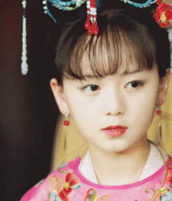
    

    <figcaption>
稳重周全
</figcaption> 
    

        
    

    <figcaption>
苦口婆心的宝姐姐
</figcaption>  
    

        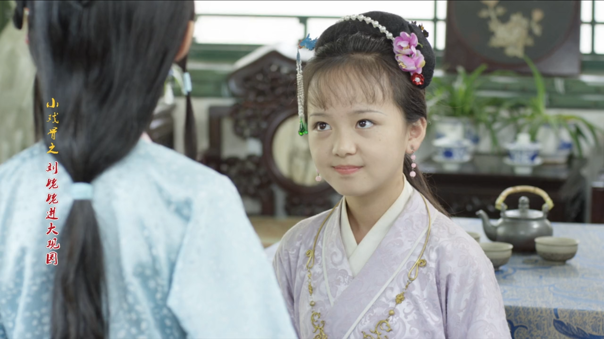
    

    <figcaption>
“你跪下，我要审你”
</figcaption>   
    

        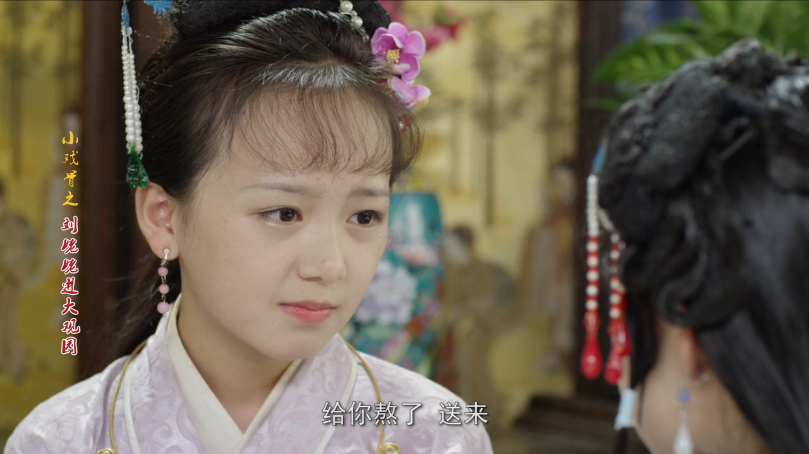
    

    <figcaption>
金兰契互剖金兰语
</figcaption>      
</figure>

没啥好说的了。什么叫艳冠群芳啊（战术后仰）！

宝儿真的是不需要任何备注，站在那里就是宝姐姐。不仅是因为和张莉长得像，其实她在组里也真的是姐姐（是的她12岁）。看了小戏骨才能理解为什么所有人都爱宝钗，因为她真的懂事、体贴、周全，是所有弟弟妹妹们崇拜的对象。然而其他版本的宝钗年龄一上去，“姐姐感”消失之后，这种懂事就变成心机感了。当然小戏骨确实也对宝钗做了一些回护（删了滴翠亭），而且因为没有爱情戏，宝钗本来也不需要有什么心机。但我相信，这个宝钗是比89版更加接近真实的。

另外，就像前面强调的，小戏骨演出了其他任何版本都没有的青春之美。上面第二张图里那套嫩红色的衣服张莉也穿过，但完全不能有宝儿这种掐得出水的青春感。

关于演技，因为87版珠玉在前，小戏骨们其实主要是在模仿，并且也都完成得很成功，大概十分钟过后你就会忘掉这是一帮十岁左右的小演员，而真的进入那个青春的世界。不过，仍然可以明显看出有几位功力过人，宝儿就是其中一个。总而言之，这可能是最接近书中宝钗的版本了，我认为不亚于张莉。

**黛玉-周漾玥**

<figure>
    

        
    

    <figcaption>
泪光点点，娇喘微微
</figcaption>
    

        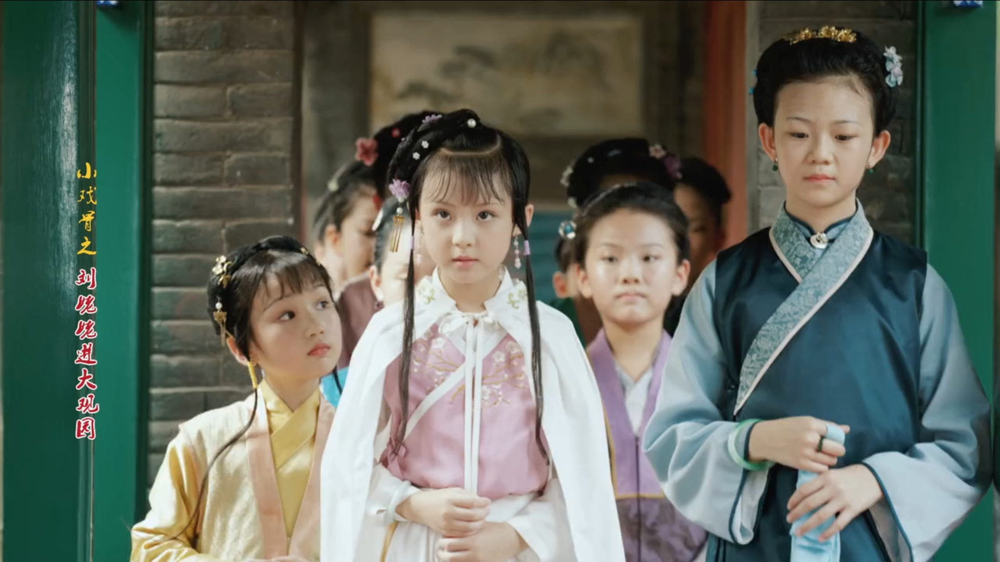
    

    <figcaption>
最符合年龄的黛玉进府（雪雁好评！）
</figcaption> 
    

        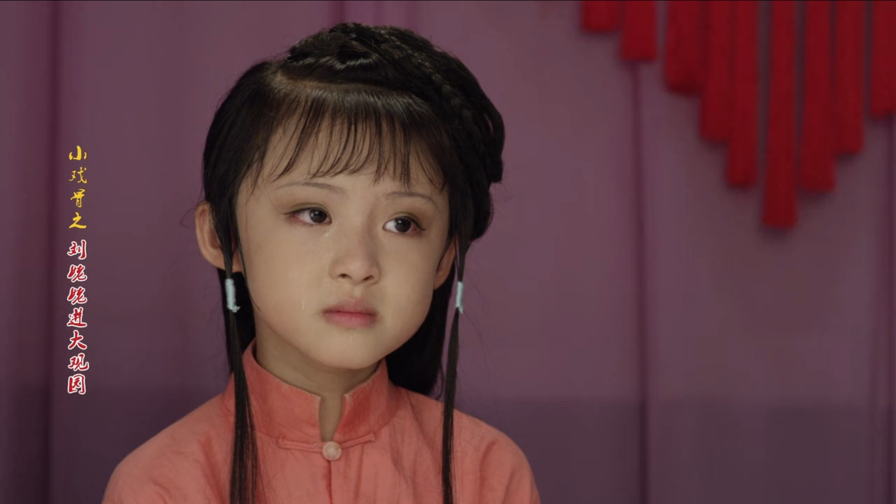
    

    <figcaption>
哭戏
</figcaption>  
    

        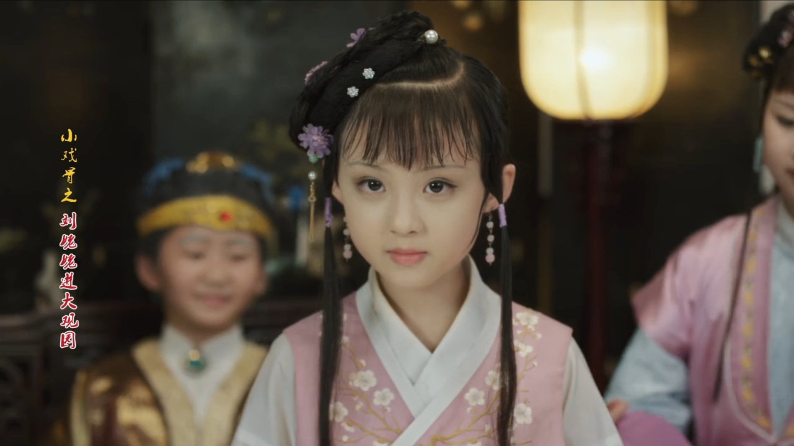
    

    <figcaption>
天上掉下个林妹妹
</figcaption>   
    

        
    

    <figcaption>
怎么可以有人吃醋吃得这么好看？！
</figcaption> 
    

        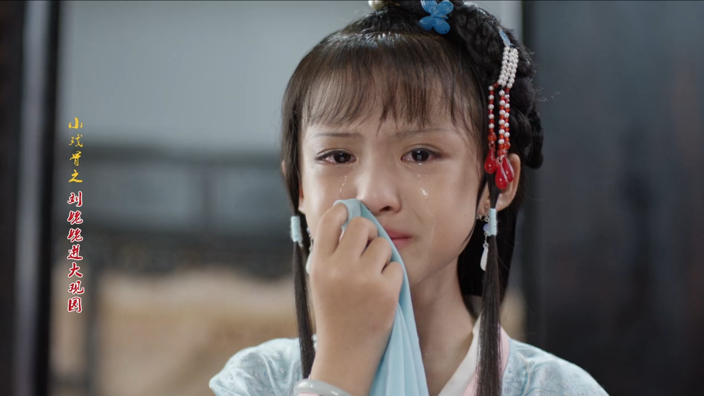
    

    <figcaption>
别哭了我的心都要碎了啊啊啊
</figcaption>      
    

        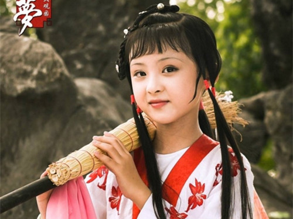
    

    <figcaption>
87黛玉最经典的造型
</figcaption> 
</figure>

周漾玥应该属于陶慧敏一派的，并且大有希望竞争一下最美林黛玉的位置:joy:。最突出的是宝黛初会行礼毕抬眸的镜头（图四），所有的版本中，只有这个林妹妹真是天上掉下来的，连陶慧敏都不能比。而且，周漾玥的年龄也最适合进贾府这一段，其他两版的大姑娘看起来总怪怪的。

因为脸上还有一点点婴儿肥，周漾玥也不太能演出那种清愁之态，但她的哭戏实在了得，梨花带雨我见犹怜，让人真的看得五脏都碎了。至于黛玉俏皮聪明的一面，周漾玥就远远甩开陈晓旭和陶慧敏了，毕竟那种天真是演不出来的。最明显的就是金兰契（快去看B站上剪的棠梨煎雪！）：

<figure>    
    

        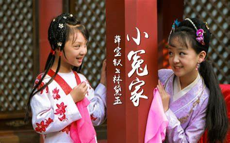
    

    <figcaption>
贼可爱
</figcaption> 
    

        
    

    <figcaption>
钗黛党让我看到你们的双手！！！
</figcaption>
    

        
    

    <figcaption>
钗黛党头顶燕窝！
</figcaption>
    

        
    
    
    <figcaption>
我是不是该安静地走开~
</figcaption> 
</figure>

没错，因为这版的钗黛实在太出众，而且爱情戏删掉友情戏增加，导致宝玉时常显得如此多余:joy:……

周漾玥才10岁，而且差不多是第一次演戏，很多地方还是比较生硬，但已经完成得很不错了。但令人遗憾的是后来潘礼平团队（天真派）和芒果台分家，周漾玥和释小松被留在了芒果台，大概很难再与宝姐姐合作了。祝愿小红楼的各位都能健康发展吧~

**宝玉-释小松**

<figure>    
    

        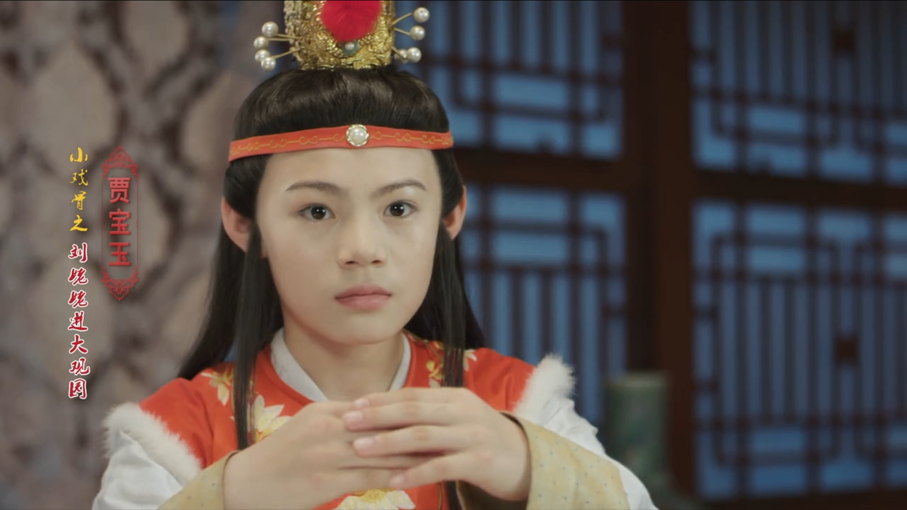
    

    <figcaption>
初会
</figcaption>  
</figure>

~~众所周知，宝钗和黛玉生了一个孩子叫宝玉。~~

宝玉在这部剧中其实是比较逊色的。这也不奇怪，人家释小松少林弟子，性格跟宝玉八竿子打不着。但是毕竟年龄摆在那里，发起痴来其实比其他版本更自然。总的来说，这个宝玉也算完成任务。

**凤姐-郭飞歌**

<figure>   
    

        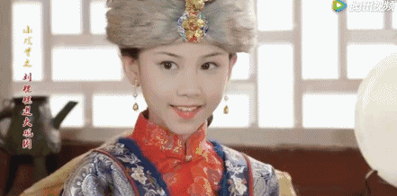
    

    <figcaption>
一见刘姥姥
</figcaption>      
    

        
    

    <figcaption>
二见刘姥姥
</figcaption>
</figure>

郭飞歌的凤姐太惊人了。这小眼神，这笑容，至少演出了九成五的凤姐，剩下那百分之五的阴险恶毒还是被编剧删掉的。更令人难以置信的是，郭飞歌在其他戏里走温婉路线一样能演得很好，真的是天才。表情动作无可挑剔，台词功底也极佳（茄鲞那一大段话噼里啪啦干脆利落），甚至还会唱歌（剧里《秋窗风雨夕》她唱的）！这人真的太可怕了，前途不可限量。

**李纨-孙伊雯**

<figure>   
    

        
    

    <figcaption>
人淡如菊
</figcaption>      
    

        
    

    <figcaption>
我说这个李纨颜值空前绝后，谁赞成，谁反对
</figcaption>
</figure>

红楼梦的翻拍史里从来没有过这么美的李纨，以后恐怕也不会有。然而正是这种美，才能凸显出青春守寡的悲哀（更何况人家原本是~~北大校长~~国子祭酒的女儿，气质妥妥的）。也因为年龄原因，孙伊雯的李纨是和弟弟妹妹在一起最没有违和感的。

**元春-陈舒宜**

<figure>   
    

        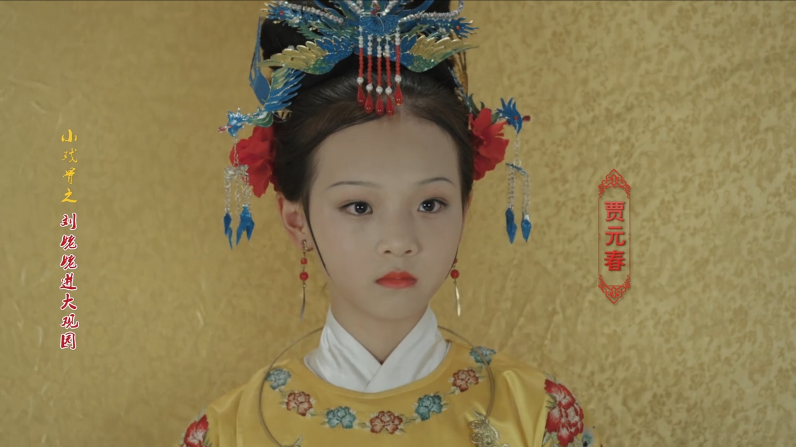
    

    <figcaption>
你以为我贴了一张仕女画，其实它是！截！图！
</figcaption>      
    

        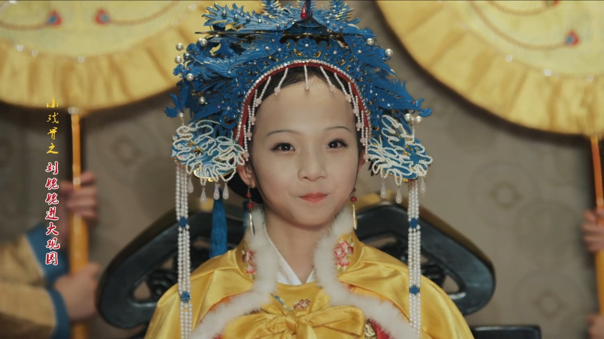
    

    <figcaption>
笑
</figcaption>
    

        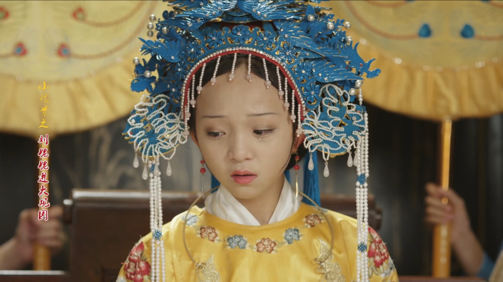
    

    

        
    
    
    <figcaption>
哭
</figcaption>
</figure>

元春的出场极其惊艳。镜头从轿外转到轿内的那一刹那，我真的看到了一张仕女画。陈舒宜演出了娘娘的气场，几次落泪也极为动人，唯一遗憾的就是台词还要多琢磨琢磨。

陈舒宜后来还演过郭芙蓉（飞歌演佟掌柜），贼漂亮了:joy:

**迎春、探春、惜春**

<figure>   
    

        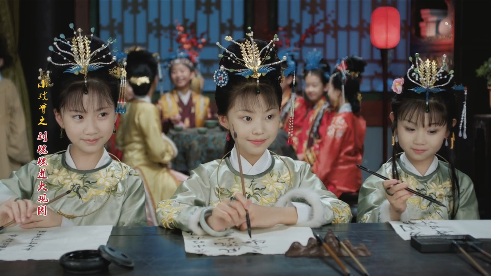
    

    <figcaption>
温柔沉默-文采精华-形容尚小
</figcaption>      
    

        
    
    
    <figcaption>
俄罗斯套娃组
</figcaption>
</figure>

三个人的形象都很符合原著，不过探春稍微欠缺一点诗意。大概因为刘戴恩之前是演花木兰的，所以这版的探春比87还要刚烈:joy:。

八卦：惜春当时在上幼儿园大班。

**湘云-韦梓彤**

<figure>   
    

        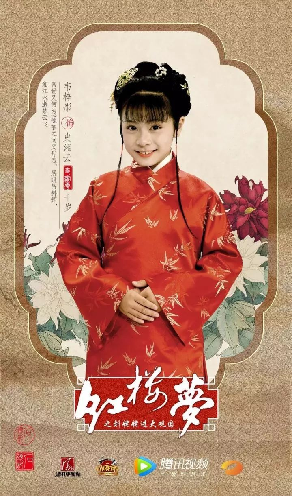
    

    <figcaption>
假小子湘云
</figcaption>
</figure>

湘云的戏太少了，而且有一点放不开，没有了那种豪爽的感觉，但其实演员形象气质应该还是挺符合的，这个锅导演编剧各背一半。

**王夫人-钟奕儿**

<figure>   
    

        
    

    <figcaption>
宝玉挨打
</figcaption>
</figure>

钟奕儿的演技极其惊人，11岁的人完全演出了45岁的感觉。特别是宝玉挨打那一段哭戏，真的完全是母亲的哭法。当然，这其实是因为她的经验特别丰富，从小戏骨栏目开拍就在挑大梁，白蛇传里那段许仕林探母把多少成年人都哭傻了。

饰演贾母的陶冰蓝也是一样，都是小戏骨里的老戏骨，看剧的时候完全不会跳戏。

**袭人、平儿、鸳鸯**

<figure>   
    

        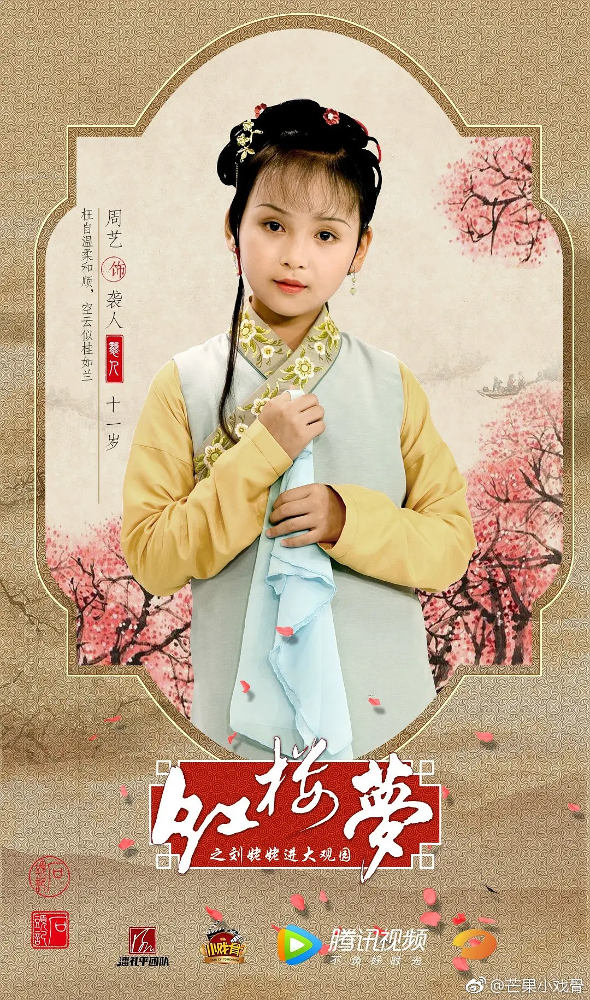
    

    <figcaption>
温柔和顺
</figcaption>      
    

        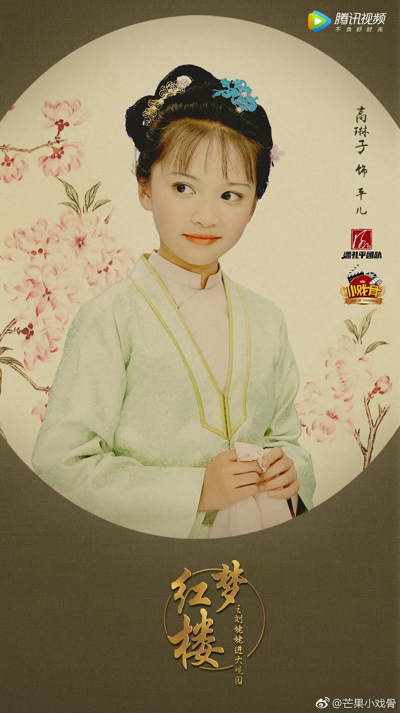
    
    
    <figcaption>
娇俏伶俐
</figcaption>
    

        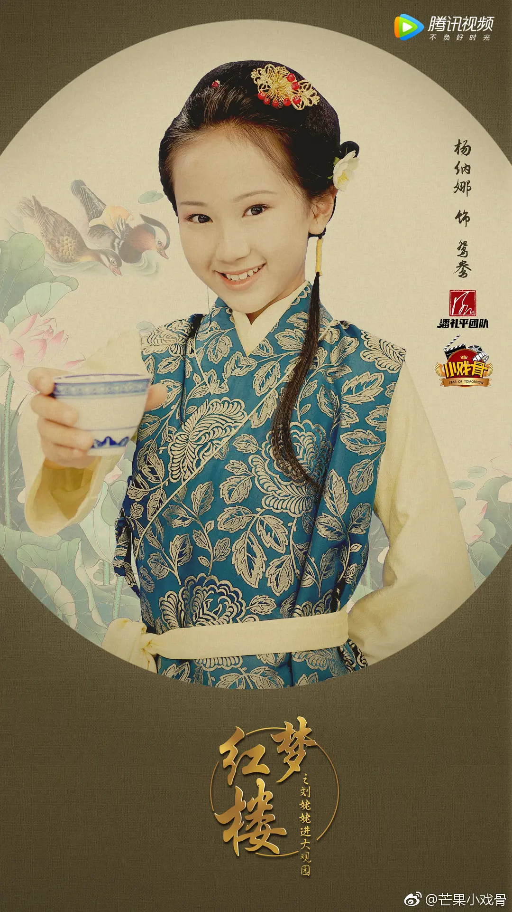
    
    
    <figcaption>
她在戏里绝对没这么大眼睛
</figcaption>    
</figure>

三大丫鬟都很贴合！笑起来见牙不见眼的鸳鸯超可爱~

剩下还有一些角色戏份不多，就不一一介绍了。总而言之，强烈推荐看看小戏骨版，但最好是在看过87版，对红楼梦有一个比较完整的了解之后。至于资源嘛，相信大家有办法的:joy:。

[^1]: 没错，李少红的同人作品不配在正文出现……我当然很想花三天三夜论证为什么10版对于正确理解红楼梦内涵是一个极大的损害，为什么你千万不要在没看过87版前看李少红，但是显然这只会适得其反。万一有人真被我勾起猎奇心，然后又被1080p画质和花里胡哨的服化道吸引，就是我的罪孽了。所以我只请大家去看up主“流澈与裳婀”的对比视频，没有恶意剪辑，没有评论，你甚至可以关掉弹幕。强烈推荐与晴雯有关的所有段落，尤其是跌扇和见王夫人两段，最能集中表现10版杰出的艺术水平[狗头]。

