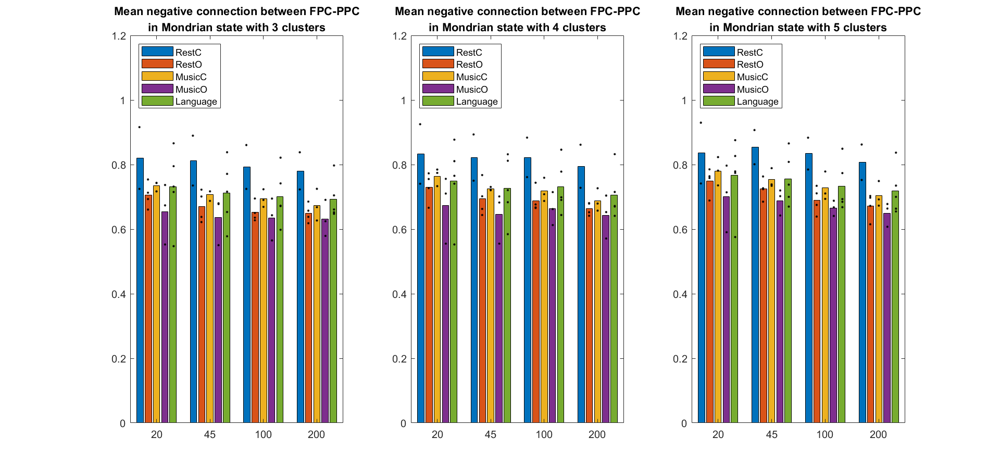

# Functional Connectivity Microstates as Biomarkers of the Mind

After the summer internship, I continued to work on the data analysis for our EEG experiment. Now we have discovered some intriguing results.

## The connectivity-based equivalent of the traditional microstates

EEG microstates were traditionally defined as a "representative" voltage distribution pattern, and they were computed by k-means clustering of the EEG landscape at the peak of the Global Field Power (GFP). However, this paradigm failed to take into consideration the functional connectivity between different brain areas. In Prof. Hong's lab, we adopted another methodology. Instead of static voltage distribution, we clustered the functional connectivity pattern within a certain time window.

Interestingly, we found the connectivity-based microstates analogous to the traditional ones, both in the topology and the time course (here at single-subject level):

<figure>
	

	<figcaption>
        <strong> Figure 1. The FC & GFP microstates </strong>
        
First row: functional connectivity matrices for the "Story" condition; Second - fourth rows: functional connectivity topologies for "Story", "Music" and "Rest" respectively. Only the strongest positive connections were shown; Last row: GFP patterns from <a href = "https://doi.org/10.1016/j.neuroimage.2017.11.062">(Michel & Koenig, 2018)</a>. Note the apparent similarity between FC and GFP microstates.

    </figcaption>
</figure>

<figure>
	

	<figcaption>
        <strong> Figure 2. The temporal overlapping of FC & GFP microstates </strong>
        
This is an intuitive illustration of the similarity in temporal dynamics between two paradigms. We labeled every timepoint by FC & GFP microstates seperately and count the occurance of every (FC, GFP) pairs, then normalized it by the expected number of occurance assuming that the two methods were independent. Therefore, a value higher than 1 indicates the potential connection between these two states. Here we highlighted the largest value in each row, and it's clear that the relationship mimics the result in Figure 1.

    </figcaption>
</figure>

## The "Mondrian" state and Default Mode Network (DMN)

The activity of DMN has been associated with GFP microstate C [(Brechet et al., 2019)](https://doi.org/10.1016/j.neuroimage.2019.03.029), which corresponded to our FC microstate "Mondrian" (by the way, we gave it this nickname since its connectivity matrix resembled Mondrian's paintings). Therefore, we examined the dynamics of this microstate under different experimental conditions. Although we only had few data, it could be concluded from the result that the Mondrian state was more significant when eyes were closed, indicating its potential connection with the DMN.

<figure>
	

	<figcaption>
        <strong> Figure 3. The average length of consecutive Mondrian states under different conditions with different k </strong>
        
We tried different number of clusters in the k-means algorithm and the result was similar. The X value indicated the length of the sliding window (in ms). The Y value indicated the mean number of time windows in a consecutive Mondrian series. It's clear that the Mondrian state was more significant in the RestC and MusicC condition (when eyes were closed).

    </figcaption>
</figure>

<figure>
	

	<figcaption>
        <strong> Figure 4. The proportion of Mondrian state </strong>
        
Similar to the previous result, it's clear that the Mondrian state took up a larger proportion when eyes were closed.

    </figcaption>
</figure>

In order to find out the essential connections that differs between conditions, we examined the strongest negative connections in the Mondrian state so as to avoid the volume conduction problem. It turned out that these connections were mainly frontoparietal, connecting two important area in DMN. Therefore, we averaged the connection strength between these two clusters of channels and the results were in accordance with Figure 3 and 4:

<figure>
	

	<figcaption>
        <strong> Figure 5. The connection strength between frontal and parietal clusters </strong>
        
Similar to the previous result, the frontoparietal connection was stronger when eyes were closed.

    </figcaption>
</figure>

We are now designing new experiments to incorporate more conditions, especially the self-oriented conditions that reflects the activity of DMN. And we also want to test our method with a larger dataset. Please contact me if you want to know the latest result: (crq)(AT)(pku)(DOT)(edu)(DOT)(com).

<a href='https://www.symptoma.es/'>Symptoma</a> 
