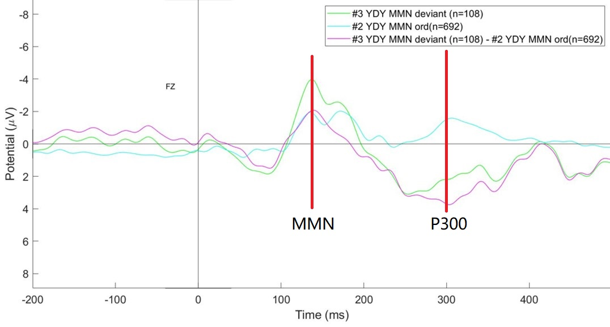
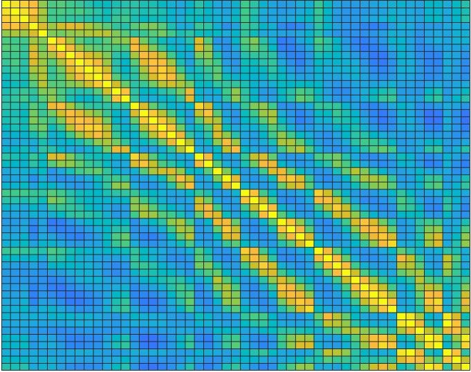
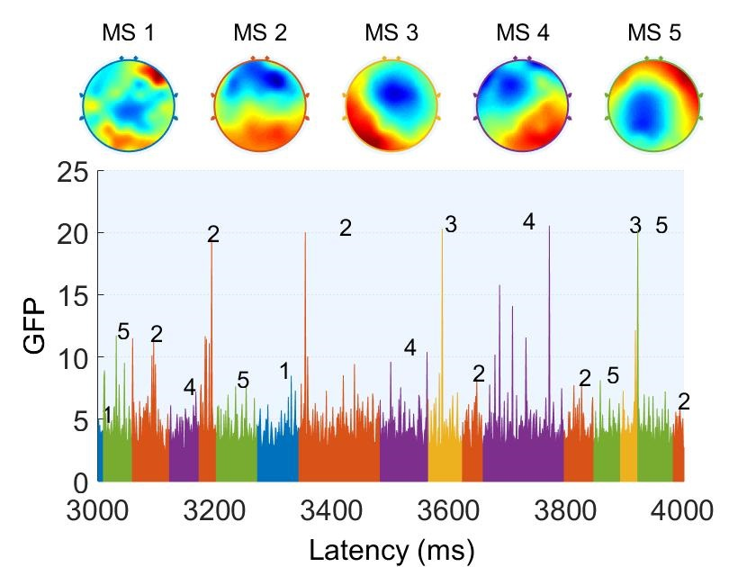
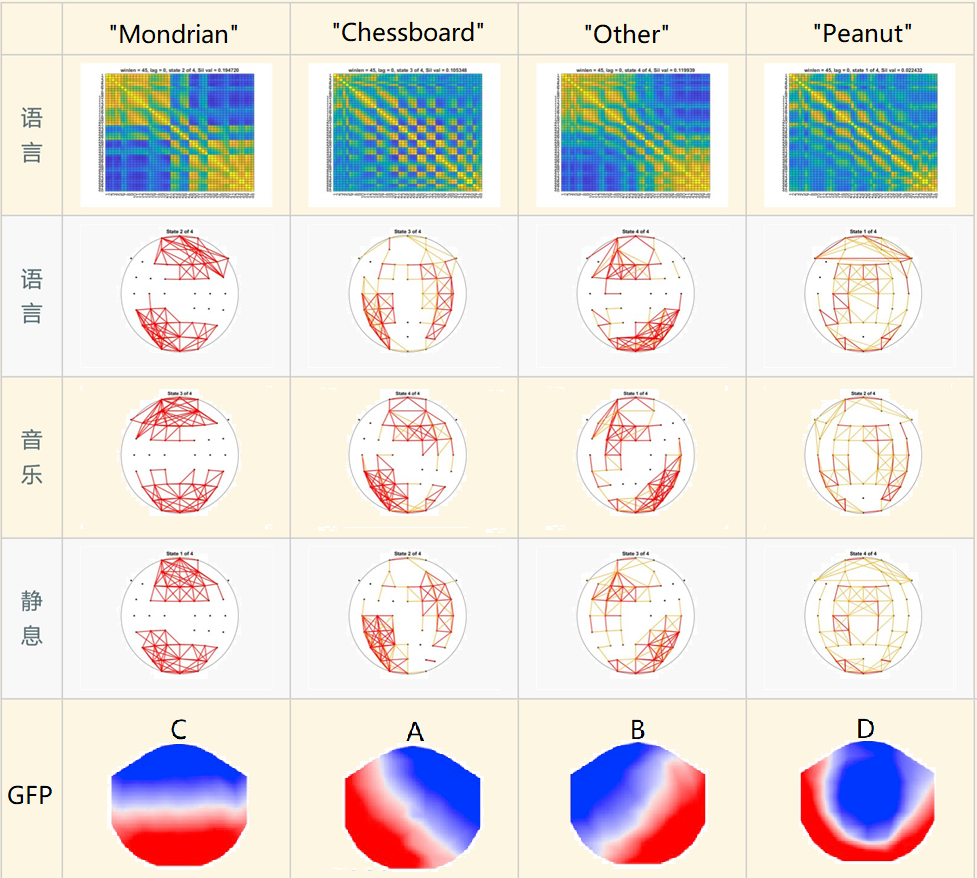
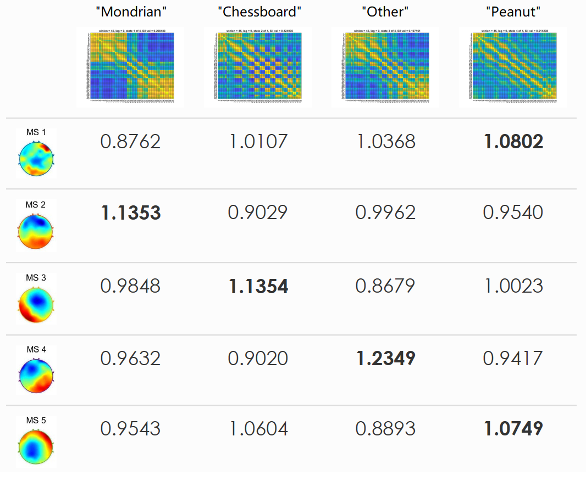

    

    	
    		<a link = "https://rq-chen.github.io/summer-school/index.html">Before: Summer school</a>
    	
        <a link = "https://rq-chen.github.io/index.html">Homepage</a>
    	
    		<a link = "https://rq-chen.github.io/microstate-research/index.html">Next: Microstate research</a>
    	
    

---

# Summer Research at Tsinghua University

**Update:** We replicated our result with a more rigorous pipeline in a larger [dataset](https://dataverse.tdl.org/dataverse/rsed2017)! Several representative figures are shown here. For details see [Microstate project](../microstate-research/index.html).

|                                       |                            Result                            |
| ------------------------------------- | :----------------------------------------------------------: |
| Group States                          |                                       |
| Individual States                     |                                   |
| Proportion and Transition Probability |  |
| Centrality and Connectivity           |  |

**Update:** We have finished the data analysis! Now going on with a modified experiment design and larger dataset. See the details [here](#Functional Connectivity Microstates as Biomarkers of the Mind).

---

From July to August 2019, I finished a five-week summer research at Prof. [Hong, Bo](http://mcgovern.med.tsinghua.edu.cn/en/infoshow-1205.html)'s laboratory at the IDG/McGovern Institute at Tsinghua University, Beijing, China. With the help of Prof. Hong and PhDs at the lab, I got hands-on experience with the electroencephalogram (EEG) operation, and explored the EEG functional connectivity microstates as well as its relation with natural language processing.

**Research Experience Outline**

-   Designed an auditory oddball experiment with *Psychtoolbox*

-   Performed EEG experiment on *Neuracle* and *Neuroscan* platform

-   Conducted an Event-related potential (ERP) analysis with *EEGLAB*

    -   Filtering, artifact rejection / correction, ERP plot, etc.

    -   Read part of *An Introduction to the Event-Related Potential Technique* by *Steven Luck*

-   Finished EEG microstate analysis with *MATLAB*

    -   Global-field-power-based analysis with *Microstate EEGlab Toolbox*

    -   Functional-connectivity-based analysis with the *Statistics and Machine Learning Toolbox*

-   Consolidated a variety of data analysis techniques

    -   k-means clustering, multidimensional scaling, silhouette evaluation

    -   Dynamic general linear model, unsupervised learning

-   Gained insights into the brain

    -   The perspective of signals and systems

    -   The perspective of stochastic process

Details are presented below.

## Design and Perform the MMN Experiment

This exercise was a stepstone for me to learn operating EEG experiments as well as to familiarize myself with the design, execution and analysis of an EEG-based psychological experiment.

**Design an Experiment with *MATLAB* and *Psychtoolbox***

I designed an experiment with the auditory oddball paradigm, following the instruction from [BCILab](http://naplab.ee.columbia.edu/uploads/6/4/8/4/64845489/labinstruction5.pdf) to investigate the mismatch negativity (MMN) and P300. My program ran flawlessly and the event trigger was correctly synchronized with the EEG signal. The source code is available for downloading [here](mmn/Task1A.m).

**Gain Hands-on Experience with EEG recording**

To prepare myself for operating the experiment, I dived into *An Introduction to the Event-Related Potential Technique* by *Steven Luck* and learnt about principles of EEG recording, preprocessing and analysis (My notes are available [here](mmn/the%20Event-related%20Potential%20Technique.md)). Having understood the demonstration by a PhD student, I then collaborated with another intern to perform the experiment on the *Neuracle* digital EEG monitoring system independently, which turned out to be successful.

**Conduct ERP Analysis with *EEGLAB***

I collected EEG raw data and performed ERP analysis with the *EEGLAB* toolbox in *MATLAB*. Result illustration is presented below. I cultivated EEG signal processing and analysis with *EEGLAB techniques*, including filtering, artifact rejection / correction, epoching and ERP plotting, etc. Notes are accessible [here](mmn/Basic%20EEGLAB%20Processing.md).

<figure>
	

	<figcaption>
<strong> Figure 1. Average wave of Fz, time locked to stimulus onset </strong>
</figcaption>
</figure>

## Explore the EEG Functional Connectivity Microstates

EEG microstate has been widely accepted as a powerful tool to investigate functions of our brain. Traditionally, they are defined as the prototypes of the voltage distribution over the scalp at the peak point of the global field power (GFP). The summer research allowed me to perform a pilot study to investigate the possibility of adopting the functional connectivity as another way to segment the EEG signal. Meanwhile, I also explored its potential relation with the processing of natural speech.

**Data Acquisition and Preprocessing**

I operated another experiment to collect EEG data from four participants while listening to natural speech, classical music or resting. My code for the experiment is accessible [here](microstate/Task2A.m). I then used *EEGLAB* to preprocess the data and export them to *MATLAB* for further analysis.

**Clustering and Analysis**

I used the *Statistics and Machine Learning Toolbox* in *MATLAB* to cluster the EEG data according to the functional connectivity among the channels. Here is an example of a "state":

<figure>
	

	<figcaption>
<strong> Figure 2. One of the states we defined </strong>
</figcaption>
</figure>

I also conducted a traditional microstate analysis with the [*Microstate EEGlab Toolbox*](https://github.com/atpoulsen/Microstate-EEGlab-toolbox), in order to make a comparison with my previous analysis.

<figure>
	

	<figcaption>
<strong> Figure 3. the GFP-based microstates </strong>
</figcaption>
</figure>

Besides, I compared the results among different conditions as well as different participants to determine the optimal parameters for clustering. The challenges of this task came from not only the labored work needed but also the high level of creativity and discernment required. To evaluate the performance and uncover the pattern, I printed hundreds of figures for inspection and wrote hundreds of lines of codes (which will be available later), while I employed a variety of strategies, including but not limited to multidimensional scaling, silouette plot, frequency calculation, dynamic general linear model, and unsupervised learning.

I presented my result twice at the lab plenary meeting, which was highly praised by Prof. Hong. He believed that my preliminary research demonstrated the feasibility and credibility of this new approach as well as its potential advantages over the tradition one.

We are now conducting a formal study to further investigate this topic ([Link](../microstate-research/)).

## A Step Further to Academia

The five-week internship provided me with the most authentic experience as a PhD student. I enjoyed the dedicated life in the laboratory, reading research papers, doing experiments, analyzing data and learning new skills. It was fascinating for me to investigate our brain and mind, finding out the most amazing mechanisms underlying the most fundamental functions.

I will summarize what I learnt from the experience with the keywords below:

**Self-Study**

Although I received a lot of valuable suggestions from Prof. Hong and the PhDs about what may be useful, I self-taught almost all skills and techniques. It was amazing to discover my potential that I was able to absorb new knowledge and put them into use so quickly. The success of this summer research gave me more confidence and also set a higher standard for myself to adhere to in my future research.

**Persistence**

Actually, I carried out the investigation with skeptics to the statistical method --whether it is truly able to reveal secrets of our brain, or merely able to reflect some low-level features of the electrical signal. However, a remark from Prof. Hong inspired me a lot:

> "One can never achieve anything if he keeps questioning on his own finding. The only way is to stick to your idea and provide enough evidence for no matter the validity or inaccuracy of it."

Keeping it in mind, I adopted a new attitude towards my research, namely \"*to make hypothesis boldly but provide proof cautiously*\", which turned out to be very helpful.

**Proactivity**

During the summer, I kept myself working and thinking about the project, generating and verifying new ideas, and actively communicating with Prof. Hong. It turned out that most of my interesting findings were results of my \"bold attempts\". That\'s also the reason why Prof. Hong assigned the most challenging task to us undergraduate students - because we were not restricted by presumptions or conventions.

It is definitely necessary to learn more knowledge about the field, but I believe established knowledge should never become an obstacle for new scientific investigation. I will try my best to combine knowledge with innovation in my future research.

## Functional Connectivity Microstates as Biomarkers of the Mind

After the summer internship, I continued to work on the data analysis for our EEG experiment. Now we have discovered some intriguing results.

### The connectivity-based equivalent of the traditional microstates

EEG microstates were traditionally defined as a "representative" voltage distribution pattern, and they were computed by k-means clustering of the EEG landscape at the peak of the Global Field Power (GFP). However, this paradigm failed to take into consideration the functional connectivity between different brain areas. In Prof. Hong's lab, we adopted another methodology. Instead of static voltage distribution, we clustered the functional connectivity pattern within a certain time window.

Interestingly, we found the connectivity-based microstates analogous to the traditional ones, both in the topology and the time course (here at single-subject level):

<figure>
	

	<figcaption>
        <strong> Figure 4. The FC & GFP microstates </strong>
        
First row: functional connectivity matrices for the "Story" condition; Second - fourth rows: functional connectivity topologies for "Story", "Music" and "Rest" respectively. Only the strongest positive connections were shown; Last row: GFP patterns from <a href = "https://doi.org/10.1016/j.neuroimage.2017.11.062">(Michel & Koenig, 2018)</a>. Note the apparent similarity between FC and GFP microstates.

    </figcaption>
</figure>

<figure>
	

	<figcaption>
        <strong> Figure 5. The temporal overlapping of FC & GFP microstates </strong>
        
This is an intuitive illustration of the similarity in temporal dynamics between two paradigms. We labeled every timepoint by FC & GFP microstates seperately and count the occurance of every (FC, GFP) pairs, then normalized it by the expected number of occurance assuming that the two methods were independent. Therefore, a value higher than 1 indicates the potential connection between these two states. Here we highlighted the largest value in each row, and it's clear that the relationship mimics the result in Figure 1.

    </figcaption>
</figure>

### The "Mondrian" state and Default Mode Network (DMN)

The activity of DMN has been associated with GFP microstate C [(Brechet et al., 2019)](https://doi.org/10.1016/j.neuroimage.2019.03.029), which corresponded to our FC microstate "Mondrian" (by the way, we gave it this nickname since its connectivity matrix resembled Mondrian's paintings). Therefore, we examined the dynamics of this microstate under different experimental conditions. Although we only had few data, it could be concluded from the result that the Mondrian state was more significant when eyes were closed, indicating its potential connection with the DMN.

<figure>
	

	<figcaption>
        <strong> Figure 6. The average length of consecutive Mondrian states under different conditions with different k </strong>
        
We tried different number of clusters in the k-means algorithm and the result was similar. The X value indicated the length of the sliding window (in ms). The Y value indicated the mean number of time windows in a consecutive Mondrian series. It's clear that the Mondrian state was more significant in the RestC and MusicC condition (when eyes were closed).

    </figcaption>
</figure>

<figure>
	

	<figcaption>
        <strong> Figure 7. The proportion of Mondrian state </strong>
        
Similar to the previous result, it's clear that the Mondrian state took up a larger proportion when eyes were closed.

    </figcaption>
</figure>

In order to find out the essential connections that differs between conditions, we examined the strongest negative connections in the Mondrian state so as to avoid the volume conduction problem. It turned out that these connections were mainly frontoparietal, connecting two important area in DMN. Therefore, we averaged the connection strength between these two clusters of channels and the results were in accordance with Figure 3 and 4:

<figure>
	

	<figcaption>
        <strong> Figure 8. The connection strength between frontal and parietal clusters </strong>
        
Similar to the previous result, the frontoparietal connection was stronger when eyes were closed.

    </figcaption>
</figure>

We are now designing new experiments to incorporate more conditions, especially the self-oriented conditions that reflects the activity of DMN. And we also want to test our method with a larger dataset. The latest result is in [here](../microstate-research/index.html).

---

    

    	
    		<a link = "https://rq-chen.github.io/summer-school/index.html">Before: Summer school</a>
    	
        <a link = "https://rq-chen.github.io/index.html">Homepage</a>
    	
    		<a link = "https://rq-chen.github.io/microstate-research/index.html">Next: Microstate research</a>
    	
    

  