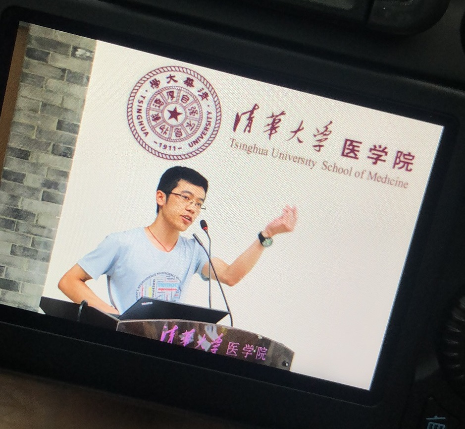
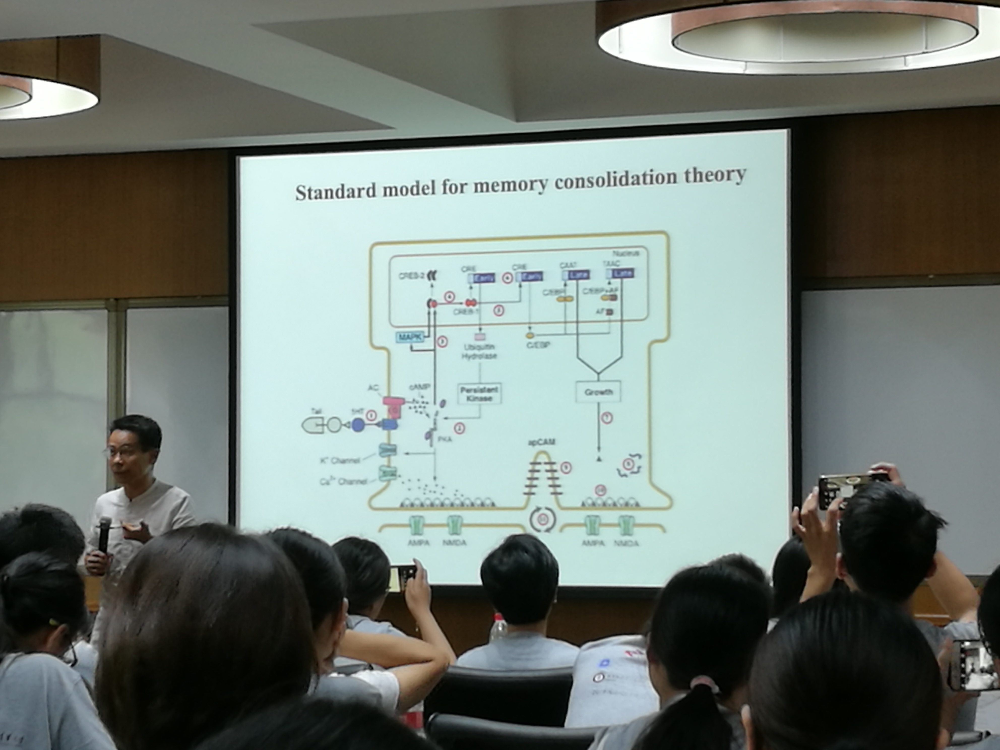

    

    	
    		<a link = "https://rq-chen.github.io/deep-learning-startup/index.html">Before: Deep Learning startup</a>
    	
        <a link = "https://rq-chen.github.io/index.html">Homepage</a>
    	
    		<a link = "https://rq-chen.github.io/summer-research-THU/index.html">Next: Summer research at THU</a>
    	
    

---

# Neuroscience Summer School

In July 2019, I attended the *2019 Tsinghua-Peking McGovern CLS CIBR [Summer Program](http://mcgovern.med.tsinghua.edu.cn/en/infoshow-1824.html) for Neuroscience and Cognitive Science* at Tsinghua University, China. The training equipped me with the principles, methodology and frontiers of neuroscience, provided me the new perspective of neurobiology when thinking about the human mind, and stimulated my motivation to become a researcher in the academia.

<figure>
	

	<figcaption>
<strong> Figure 1. Me at the final presentation </strong>
</figcaption>
</figure>

**Knowledge**

I learnt a lot about neuroscience in the summer program, from the most fundamental level of genes to the highest level of behavioral science, covering a variety of topics including synapse, circuit, diseases and high-level mental processes:

- Epigenetics and its implication with neural diseases (by PI. [Koziol, Magdalena J.](https://dnalaboratory.org))
- Structure of the mechanoreceptor protein (by Prof. [Xiao, Bailong](http://mcgovern.med.tsinghua.edu.cn/en/infoshow-1213.html))
- Neural basis of chemical senses (by Prof. [Zhang, Wei](http://mcgovern.med.tsinghua.edu.cn/en/infoshow-1217.html))
- Neurodegenerative diseases (by Prof. [Jia, Yichang](http://mcgovern.med.tsinghua.edu.cn/en/infoshow-1207.html))
- Neural basis of forgetting (by Prof. [Zhong, Yi](http://mcgovern.med.tsinghua.edu.cn/en/infoshow-1218.html))
- Neural oscillation and its function (by Prof. [Luo, Huan](http://mgv.pku.edu.cn/english/people/lbd/sopacs/220154.htm))
- ...

<figure>
	

	<figcaption>
<strong> Figure 2. Prof. Zhong introducing the standard model for memory consolidation </strong>
</figcaption>
</figure>

**Perspective**

I became more familiar with the methodology of neurobiology after the training, not only the tools - *high-throughput sequencing*, *two-photon excitation microscopy*, *patch clamp recording*, *cryogenic electron microscopy* - but also the philosophy, which is closely connected with the *genetic central dogma* that I had learnt much earlier before but the significance of which I had never really understood.

<figure>
	

	<figcaption>
<strong> Figure 3. Visiting the laboratories in Peking University </strong>
</figcaption>
</figure>

Besides, I was amazed by the degree to which our high-level mental process can be described in a fully biological way. For example, Prof. Zhong introduced his research about the *Rac1* gene which modulates the process of forgetting. Considering that I was researching about working memory at that time, it was such a shame that I had not heard about Prof. Zhong's theory earlier, which really inspired me a lot.

Cognitive science is a highly interdisciplinary field, requiring us to have a broader horizon. After this summer school, I became more aware of the importance to absorb insights from other disciplines, and also more capable to do so, in order to inspire and support my research in psychology.

**Motivation**

During the summer school, I made friends with a lot of fellow students from all over the country, all of whom were passionate in neuroscience research. It was really inspiring to exchange idea with them, and I am sure that I will undoubtedly enjoy working with such people in the future.

Besides, the senior students in several laboratory shared with us their PhD life, explaining how the experience equipped them with independent thinking and strong self-study capability. After hearing their story, I believed that hard as it is, going through the PhD is still worthwhile.

I also visited several laboratories during the summer school, which aroused my interest in really doing some research by myself. Therefore, I communicated with Prof. [Hong, Bo](http://mcgovern.med.tsinghua.edu.cn/en/infoshow-1205.html) at Tsinghua University and finished a five-week-long summer research at his laboratory, which turned out to be very fruitful. For details, please click [here](../summer-research-THU/index.html).

---

    

    	
    		<a link = "https://rq-chen.github.io/deep-learning-startup/index.html">Before: Deep Learning startup</a>
    	
        <a link = "https://rq-chen.github.io/index.html">Homepage</a>
    	
    		<a link = "https://rq-chen.github.io/summer-research-THU/index.html">Next: Summer research at THU</a>
    	
    

  