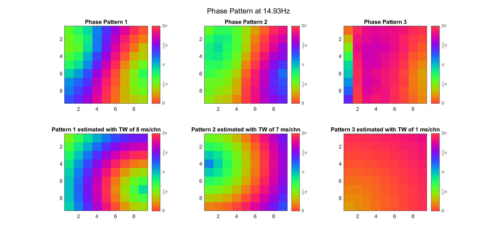
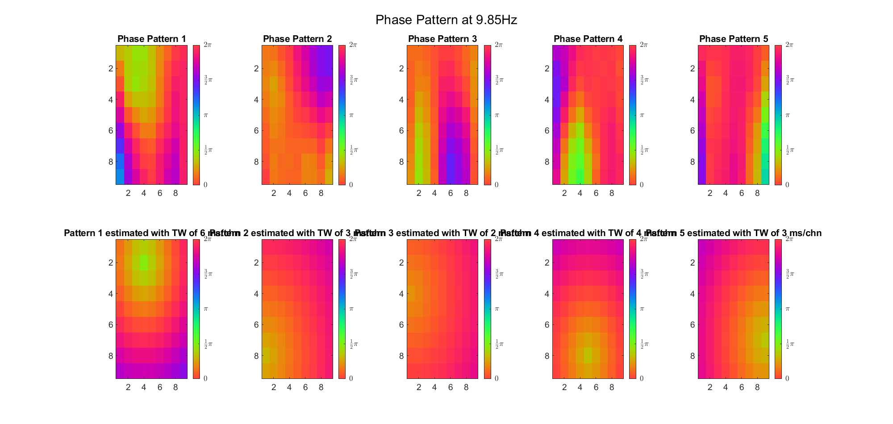
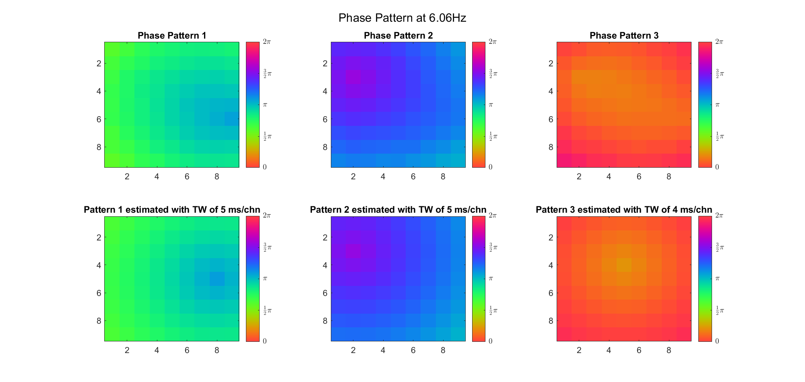

<div>
    <center>
    	<span style = "float: left">
    		<a href = "https://rq-chen.github.io/undergraduate-research/index.html">Before: Working memory project</a>
    	</span>
        <a href = "https://rq-chen.github.io/index.html">Homepage</a>
    	<span style = "float: right">
    		<a href = "https://rq-chen.github.io/traveling-wave/index.html">Next: Mesoscopic traveling wave</a>
    	</span>
    </center>
</div>

---

# SImulation & Detection of Cortical Traveling Waves

I explored the interesting topic of cortical traveling waves (TWs) during summer 2020 with the guidance of Prof. [Sven Bestmann](http://www.bestmannlab.com/). I acquired a lot of new skills and gained new insights into the essence of oscillatory signals. Below is my first experiment about the detection of spherical TWs at a macroscopic scale. For my second (and more formal) experiment about planar TWs at mesoscopic scale, click [here](https://rq-chen.github.io/traveling-wave/index.html).

## Simulation of Cortical Traveling Waves

In this project, I tried to simulate an electrophysiological recording dataset (say, EEG) which contains cortical travelling waves. I spent most of my time on two questions:

1. What exactly is the "travelling wave" in non-periodic data, mathematically?
2. How to make the synthetic data consecutive accross the channels (just like real data) under the requirement of certain TW directions?

Since the first problem might be too simple for experts, I'll put it in the discussion section and work on the second problem first.

In order to make the synthetic data more similar to real EEG recordings, we decided to construct the signal in frequency domain, with a "reference" power spectrum (computed from a long resting EEG dataset) and a phase spectrum that we can manipulate.

Initially, we decided to simulate a wave that travels on a line, from center (Cz) to front/back/left/right (Fpz/Oz/T7/T8). Therefore, we:

- generate a random phase spectrum for Cz
- use iFFT to reconstruct the signals in each frequency band
- extract the envelope and instantaneous phase in each band
- for each band, select a direction and assign (constant) phase lags to the channels in this direction
- assign (independent, time-variant) random phase lag to other channels by a Wiener Process (Brownian motion)
- spatially "blur" the phase lag by a weighted matrix
- compute the new signal by $$s_1(t) = M(t)\cos(\theta(t) - \phi(t))$$ where $$\phi$$ is the phase pertubation
- add up the signal in each band and scale to 30uV in maximum

Here the constant phase lag is linear to the distance between the channel and Cz, as well as the central frequency in each band (namely, the waves travel at a fixed speed - about 5m/s according to the literature).

The codes can be downloaded [here](SynTW1D.m).

The simulation above is based on the assumption that the wave carries specific information that must be conveyed to a certain area. But actually the two-dimensional spherical travelling wave is more common in electrophysiological recording:

| 1D Travelling Wave                                           | 2D Spherical Travelling Wave                                 |
| ------------------------------------------------------------ | ------------------------------------------------------------ |
|  |  |

Therefore, we created another dataset with spherical TWs in the same way as we described before, except that the constant phase lag became $$k||x - s||$$, where k is the (normalized) spatial frequency, x is any channel and s is the "source" of the wave. We randomly picked several channels and the source changed among them in every data segments (2s). We also perturbed the phase lag by a (very small) Brownian-motion-based random phase fluctuation.

The codes can be downloaded [here](SynTW2D.m).

Here is what we got:


The voltage distribution is mostly consecutive. Here is the phase distribution:


Finally, let's compare the voltage sequence and oscillatory power of our data and the reference data:


This is a non-TW channel at the corner, and the simulated data looks quite acceptable. Note that we only add up the delta/theta/alpha/beta band (from 1-25Hz) so the high frequency band is weak.

## Comparison of Different Algorithms

After simulating an EEG dataset with traveling wave, we analyzed this dataset with different algorithms. We implemented the methods in [(Alexander et. al., Plos One, 2016)](https://doi.org/10.1371/journal.pone.0148413) and [(Alexander et. al., Plos Comput. Biol., 2019)](https://doi.org/10.1371/journal.pcbi.1007316). For each frequency-of-interest, the first one uses k-means algorithm to cluster the phase evolution within every cycle (i.e. the input vector length is $$N_{chn}*fs/f$$), while the other uses PCA to find the basis vector of the phase distribution (the input matrix is $$N_{time}*N_{chn}$$). We also tried using k-means instead of PCA. In the following section, we will compare their output with the ground truth.

### K-means on Data Cycles

Following [(Alexander et. al., Plos One, 2016)](https://doi.org/10.1371/journal.pone.0148413), we want to cluster the individual data cycles so that each cluster represents an unique TW with a certain source *s*.

For each frequency (from 1 to 32, log-spaced) and each cycle:

- Compute the wavelet coefficients (at each time point, for each channel) as an estimation of STFT components, using very short Morlet wavelet.
  - "very short" means that for `cmorwavf(LB, UB, N, FB, FC)`, we let $$x_0^2/fb = 10$$ (so the Gaussian pdf is smaller than 5e-5) when $$x_0 = 2/fc$$
- Extract the real-value angles as a nPWin*nChn matrix `m`.
- (Optional) Remove the common phase offset from `m`, either by subtracting `m(1, 1)` or `mean(m(:,1)) `
  - It seems that Alexander et. al. didn't use this method, but we argue that removing the common phase offset will enhance the clustering a lot (see Discussion)

Then:

- Vectorize these matrices and use k-means to get k cluster centers.
  - We use `evalclusters()` to determine the optimal k (ranging from 3 to 8) with *Silouette* criterion
- Spatially unwrapped the phases by nearest neighbour edges.
- Approximate these k patterns by a spherical wave (with the same temporal frequency as the current wavelets), minimizing the square error

First we examined the result in time domain, channels (1-81) aligned by the estimated TW's initial phases in ascending order:


We can see that:

- The wavelet method could estimate the phases quite well (since we can clearly distinghuish the TW pattern (with correct temporal frequency) from individual data cycles)
- The cluster-averaged patterns resembled the individual trials, but they were blurred since k-means couldn't 100% correctly cluster the data. Therefore, it seems that the patterns' temporal frequency became "slower" after averaging, so:
- The TW model could not approximate the pattern very well. For example, the TW estimation for pattern 1 seemed to have a completely different source.

We also tried what would happen if the temporal frequency $$\omega$$ is a free parameter, but not surprisingly the result was bad since it overfit the averaged pattern. Anyway, in the time domain, the TWs were acceptable. But in the space domain, the result was problematic. Here are the intial phase distributions for single cycle, averaged pattern and estimation:


(Note: the ground truth is that there were two possible sources, (3, 2) as in cycle 312 and (6, 9) as in cycle 118; and the speed of the TW was 7ms/chn; same below)

Due to the clustering error, the phase pattern didn't resemble a 6.06Hz wave in time, so there was a large overall phase difference between the pattern and underlying TW at every time point (e.g., the mean value of the estmated TW in the third row was completely different from that of the patterns in the second row). So it's quite hard to correctly estimate the source and spatial frequency of the TW.

Fortunately, we can see that the averaged patterns are basically consistent with the individual cycles, so we may be able to find the correct TW by another linear regression after subtracting `mean(m, 1)` from `m`. But if so, why not just perform k-means on data samples rather than the whole cycle? Therefore, we tried two different methods to find the structure from data samples directly.

### PCA

As is described in [(Alexander et. al., Plos Comput. Biol.)](https://doi.org/10.1371/journal.pcbi.1007316), this method is quite straightforward. We organized the phases (unlike the original paper, we used the real-value phases rather than complex exponentials) into an $$N_{time}*N_{chn}$$ matrix, then calculated its basis vectors by Principle Component Analysis (PCA). It's hypothesized that these basis vectors can represent the TW pattern. In our experiments, we explored the influence of factor rotation and systematic phase lag removal.

A very difficult problem is how to scale the principle components. We tried to multiply each component by the data samples' highest / 5% highest / mean projection on them, and it seems that the second one approximated the real spatial frequency best. Besides, this time we constrained the spatial frequency to be positive in the TW model during linear regression.

Here's the result for theta band (ground truth is still (3, 2) and (6, 9) and 7ms/chn):

|               | Before Rotation                                              | VariMax Rotation                                             |
| ------------- | ------------------------------------------------------------ | ------------------------------------------------------------ |
| With Offset   |  |  |
| Remove Offset |  |  |

For alpha band:

|               | Before Rotation                                              | VariMax Rotation                                             |
| ------------- | ------------------------------------------------------------ | ------------------------------------------------------------ |
| With Offset   |  |  |
| Remove Offset |  |  |

For beta band:

|               | Before Rotation                                              | VariMax Rotation                                             |
| ------------- | ------------------------------------------------------------ | ------------------------------------------------------------ |
| With Offset   |  |  |
| Remove Offset |  |  |

Generally speaking, it seems that:

- The original principle components without removing systematic phase lag or factor rotatation were already good enough (roughly correct source and spatial frequency)
- VariMax didn't change the spatial pattern too much, but it greatly influenced the estimation of spatial frequency
- After removing the phase lag, it was hard to find the second component, but VariMax could help recover it.

However, when we tried using three possible sources, PCA could hardly find the third source. Here's the result without removing phase offset (ground truth is that the sources were (2, 9), (3, 2) and (8, 6), and speed of TW was 7ms/chn):

|       | Before Rotation                                             | VariMax Rotation                                             |
| ----- | ----------------------------------------------------------- | ------------------------------------------------------------ |
| Theta |  |  |
| Alpha |  |  |
| Beta  |  |  |

Besides, removing phase offset didn't help, e.g for alpha band:

| Before Rotation                                              | VariMax Rotation                                             |
| ------------------------------------------------------------ | ------------------------------------------------------------ |
|  |  |

## K-means over Data Samples

Actually this method is very similar to the so-called EEG microstate clustering. The algorithm is roughly the same as the previous one, except that principle components are replaced by cluster centers. One advantage of this method is that we didn't need to scale the component coefficients.

|       | With Offset                                                  | Without Offset                                               |
| ----- | ------------------------------------------------------------ | ------------------------------------------------------------ |
| Theta |  |  |
| Alpha |  |  |
| Beta  |  |  |

Both were excellent, and it seems that removing the phase offset would help exclude the fake clusters.

Increasing the number of possible sources:

|       | With Offset                                                  | Without Offset                                               |
| ----- | ------------------------------------------------------------ | ------------------------------------------------------------ |
| Theta |  |  |
| Alpha |  |  |
| Beta  |  |  |

We can see that k-means could not find the third source (8, 6) either. But after removing the phase lag, the result seems good. However, removing the phase lag will increase the algorithm's sensitivity, so it may generate more clusters than necessary (e.g. for alpha band).

## Discussion

In this part we try to analyze the problem about TWs in a more "mathematic" way, and try to explain why and why not the algorithms performed well.

### the Essence of Travelling Waves

This is what I got in mind about "travelling waves" before I began to really simulate one:


Namely, the activity at each position is a sine wave, and the phase decreases linearly with the distance between the source and the current position: $$u(x, t) = A\sin(kx - \omega t + \phi)$$. Therefore, if I want to simulate a TW from Cz to Fpz, I just need to add a phase lag like (FCz, -5°), (Fz, -10°), (AFz, -15°), (Fpz, -20°).

However, it becomes less clear when the signal is not a simple sine wave. For example, for a theta-band oscillation, what does it means to describe its "phase" and add "phase lag" to it?


It first reminded me of a famous connectivity criterion called Phase-Lag-Index (PLI), so I reviewed the article and found that the "instantaneous" phase of a narrow-band real-value signal is defined by its analytic representation $$s_a(t) = s(t) + j\hat{s}(t) = M(t)e^{j\theta(t)}$$. So I googled for concepts like instantaneous phase, analytic representation, Hibert transform and so on. It finally became clear to me that:

(Here are some of my notes)

- the *Hilbert transform* of a signal s(t) is its convolution (in the sense of Cauchy's principle value integral) with the Cauchy kernel $$\frac{1}{\pi t}$$

  - it can be understood as shifting the phases of the positive frequency components (by Fourier transform) by $$\pi/2$$ and those of the negative components by $$-\pi/2$$, which generates the *harmonic conjugate* of the original signal
  - $$\mathcal {F}{\bigl (}H(u){\bigr )}(\omega )=\mathop {\bigl [} \!-i\operatorname {sgn}(\omega ){\bigr ]}\cdot {\mathcal {F}}(u)(\omega )$$
  - some examples: $$\mathcal{H}[\sin(\omega t)] = -\cos(\omega t), \mathcal{H}[\cos(\omega t)] = \sin(\omega t), \omega > 0$$
  - note that this transform is linear, and the transform of a real function is also real

- the *analytic representation* $$s_a(t)$$ of signal s(t) is to "cut" the negative frequency components (by Fourier transform) and "copy" their complex conjugate on the positive ones:
  $$
  S(f) = \mathcal{F}[s(t)], S_a(f) = \mathcal{F}[s_a(t)] \\
  S_a(f) = S(f) + \text{sgn}(f)S(f)
  $$

- the *analytic representation* can be plotted on the polar plain: $$s_a(t) = s(t) + j\hat{s}(t) = s_m(t)e^{j\phi(t)}$$. 

  - the real part is just the original signal and the imaginary part is the *Hilbert transform* of the signal $$\hat{s}(t) = \mathcal{H}[s(t)]$$, if s(t) is real-valued.
  - $$s_m(t)$$ is called *instantaneous amplitude* or *envelope* (波包), $$\phi(t)$$ is called *instaneous phase* and its derivative is called *instaneous angular frequency*
  - some examples: $$\cos(\omega t + \theta) \to e^{j(\omega t + \theta)}, \omega > 0$$

- **Note that the MATLAB function `hilbert(x)` computes the analytic representation of x rather than the Hilbert transform!!!**

But still I didn't understand the relationship between the instantaneous phase and the phases of the frequency components. So I tried to derive what will happen if I add a small lag to the instantaneous phase and extract the real part of the new "analytic" signal as $$s_1(t)$$:
$$
\begin{aligned}
s_a(t) & = M(t)e^{j\theta(t)}, s_{1a}(t) = M(t)e^{j[\theta(t) - \phi_0]} \\
s_1(t) & = \text{Re}[s_{1a}(t)] = M(t)\cos(\theta(t) - \phi_0) \\
	& = M(t)\cos\theta(t)\cos\phi_0 + M(t)\sin\theta(t)\sin\phi_0 \\
	& = s(t)\cos\phi_0 + \hat{s}(t) \sin\phi_0 \\
S_1(f) & = \mathcal{F}[s_1(t)] = S(f)\cos\phi_0 + \hat{S}(f) \sin\phi_0 \\
	& =
	\begin{cases}
		S(f)(\cos\phi_0 + j\sin\phi_0) & f < 0 \\
		S(f)\cos\phi_0 & f = 0 \\
		S(f)(\cos\phi_0 - j\sin\phi_0) & f > 0
	\end{cases} \\
	& =
	\begin{cases}
		S(f)e^{j\phi_0} & f < 0 \\
		S(f)\cos\phi_0 & f = 0 \\
		S(f)e^{-j\phi_0} & f > 0
	\end{cases}	
\end{aligned}
$$
And we know that if we want to represent a signal as the summation of a series of cosine waves: $$s(t) = d_0 + d(f)\cos(2\pi ft + \phi(f)), f >0$$, then $$|d(f)| = 2|S(f)|, \phi(f) = \text{angle}(S(f))$$. Therefore, the phase of every cosine components in our $$s_1(t)$$ is shifted backward for $$\phi_0$$ comparing with s(t), which is consistent with our intuitive understanding about "phase lag". Besides, $$s_{1a}(t)$$ is indeed the analytic representation of $$s_1(t)$$.

Therefore, if we want to determine whether there is a consistent phase lag between A and B, we just need to band-pass-filter the signals, compute the analytic representation and extract the instantaneous phase sequence. Or we can compute the derivative of the sequence and see whether they have similar instantaneous angular frequencies (which indicates a consistent phase difference).

### the Geometric Way to Look at TWs

For a given frequency or frequency band, what we try to find are unique TW patterns, each with a different source *s* (for planar wave, different orientation). So a "perfect" TW phase pattern should be something like $$k||x-s|| + \omega t + \phi + \epsilon$$, and only $$\phi, \epsilon$$ will change in every data cycle. So the data distribution in $$\R^{N_{chn}*fs/f}$$ (or $$\R^{N_{chn}}$$) space is roughly one-dimensional: $$\phi\begin{bmatrix}1&1&1&\dots&1\end{bmatrix}^{\top} + \text{constant phase lag + noise}$$. Therefore, different clusters' distribution is roughly parallel.

#### K-means

If $$\phi$$ has a large variance (relative to the differnce between phase patterns), k-means may not be suitable for this kind of clustering problem:

```matlab
rng('default');
C1 = [0 1] + rand(300, 1) * [2 2] + [randn(300, 1) randn(300, 1)] * 0.1;
C2 = [1 0] + rand(300, 1) * [2 2] + [randn(300, 1) randn(300, 1)] * 0.1;
C = [C1; C2];
C = C(randperm(length(C)), :);
idx = kmeans(C, 2);
gscatter(C(:, 1), C(:, 2), idx);
title('Problem of k-means');
```


This is consistent with our result in the first and third experiment:

| With Phase Offset                                            | Remove Phase Offset                                          |
| ------------------------------------------------------------ | ------------------------------------------------------------ |
|  |  |
|  |  |

It's clear that with the common phase offset, the algorithm performed worse and the TW structure was distorted.

#### PCA

Actually I don't think the principle components can represent the underlying TW structure, because PCs are the orientations at which the data has a largest variance. If we wish a PC to be something like "distance vector between every channel and the source *s*", then the variance explained by this PC should actually represents a series of TWs with the same source but different spatial frequency. This is not consistent with our data structure, where most of the variance should lie in [1, 1, 1, ... 1] and something like TW1 - TW2, TW3 - TW2 or so:

```matlab
rng('default');
C1 = [0 1] + rand(300, 1) * [2 2] + [randn(300, 1) randn(300, 1)] * 0.1;
C2 = [1 0] + rand(300, 1) * [2 2] + [randn(300, 1) randn(300, 1)] * 0.1;
C = [C1; C2];
idx = randperm(length(C));
C = C(idx, :);
x = pca(C);
gscatter(C(:, 1), C(:, 2), 1 + (idx > 300))
hold on;
X1 = mean(C) - x';
X2 = mean(C) + x';
for i = 1:2
    plot([X1(i,1) X2(i,1)], [X1(i,2), X2(i,2)])
end
legend({'Cluster 1', 'Cluster 2', 'Component 1', 'Component 2'})
title('PCA');
axis equal
```


When there are few clusters, maybe we can scale the PCs so that they luckily look like the real TWs (especially when we scale them by the maximum dot product between PC and data sample - as it is in our experiment). But when there are more clusters, it will be hard to find out the TWs in this way. Afrer all, PCA is not a clustering algoithm.

### Future Work

First, we need to try more algorithms. For example, actually we can simply average all samples within each cycle and approximate each of these patterns by a TW, then merge the similar TWs by clustering. We also need to try other methods from the literature.

Second, we need to increase the complexity of TW structures and the level of noise. For example, the TWs may have smaller scope, more possible sources, or even overlap with each other. And we will reduce the SNR by pink noise.

Third, we may use some statistics to quantify the performance of different algorithms, so as to find out the optimal one.

Finally, we may apply these methods to experimental data.

For my second (and more formal) experiment about planar TWs at mesoscopic scale, click [here](https://rq-chen.github.io/traveling-wave/index.html).

---

<div>
    <center>
    	<span style = "float: left">
    		<a href = "https://rq-chen.github.io/undergraduate-research/index.html">Before: Working memory project</a>
    	</span>
        <a href = "https://rq-chen.github.io/index.html">Homepage</a>
    	<span style = "float: right">
    		<a href = "https://rq-chen.github.io/traveling-wave/index.html">Next: Mesoscopic traveling wave</a>
    	</span>
    </center>
</div>