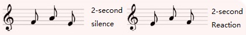
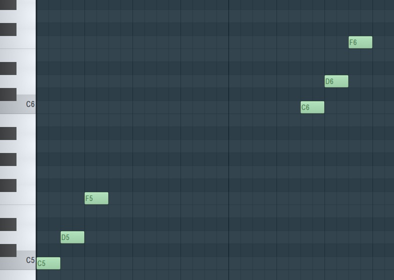
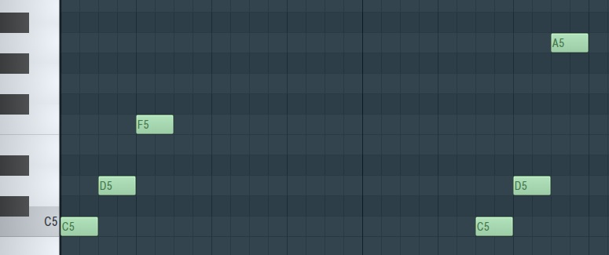
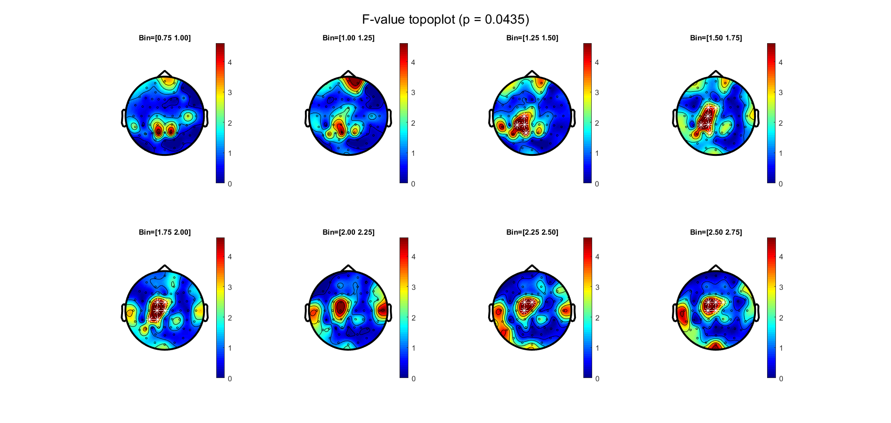

    

    	
    		<a link = "https://rq-chen.github.io/microstate-research/index.html">Before: Microstate research</a>
    	
        <a link = "https://rq-chen.github.io/index.html">Homepage</a>
    	
    		<a link = "https://rq-chen.github.io/index.html">Next: None</a>
    	
    

---

# Undergraduate Research in Working Memory

I have been researching in the neural basis of sequential working memory in the Lab of [Prof. Luo, Huan](http://psy.pku.edu.cn/english/people/faculty/professor/huanluo/index.htm) for nearly a year. I reviewed the literature, selected the research topic, designed the experiment, collected the data and analyzed the result on my own. This experience enabled me to carry out a research project independently and equipped me with many useful tools including experiment presentation, ERP and time-frequency analysis with Psychtoolbox, EEGLAB and Fieldtrip. More details about my project is available [here](https://github.com/rq-Chen/Undergraduate_Research_at_PKU).

## Background

***Selective Entrainment of Theta Oscillations in the Dorsal Stream Causally Enhances Auditory Working Memory Performance***

- *Neuron*, 2017
- DMS (delay matching to sample), melodic, manipulation (reversed order)
- mental manipulation ability, MEG/EEG with rhythmic-TMS
- **Main result: the 5Hz theta oscillation in the Auditory dorsal pathway is causually and positively correlated with the mental manipulation ability (reversing the order).**

## Experiment

### Intuition

Although this paper regarded backward replaying as a kind of mental manipulation, this manipulation is apparently special since it has something to do with the temporal organization of the memory contents. Besides, theta oscillation is often associated with temporal organization in the literature. Therefore, probably this result only reflects the neural mechanism for temporal organization instead of mental manipulation. So we want to design another kind of mental manipulation to examine whether this condition triggers different oscillatory pattern with the original ones.

### Target

- To explore whether this theta oscillation is specifically correlated with the organization of temporal information
- To explore the neural mechanism underlying different kinds of mental manipulation for auditory working memory

### Design

The pipeline is similar to the original one, but we incorporate two more kinds of mental manipulation in the delay period:

- **Transposition**

  During the delay period, the participants should raise S1 (the sequence they hear) by an octave in their mind. During the reaction period, the participants should compare S2 with the sequence in their mind (the manipulated one).

  

- **Contour**

  During the delay period, participants should categorize S1 acoording to the contour of the melody: “rise-rise” / “rise-fall” / “fall-rise” / “fall-fall”. During the reaction period, they should categorize S2 likewise and compare their categories.

  

## Method

- EEG data was collected from 16 participants.
- The data was preprocessed by EEGLAB. ([Details]([https://github.com/rq-Chen/Undergraduate_Research_at_PKU/tree/master/Auditory%20Working%20Memory/Processing](https://github.com/rq-Chen/Undergraduate_Research_at_PKU/tree/master/Auditory Working Memory/Processing)))
- Preliminary behavioral, ERP and time-frequency analysis was done by MATLAB ([Detais]([https://github.com/rq-Chen/Undergraduate_Research_at_PKU/tree/master/Auditory%20Working%20Memory/Analysis](https://github.com/rq-Chen/Undergraduate_Research_at_PKU/tree/master/Auditory Working Memory/Analysis))):

  - Reaction time:

    

  - Cluster-level permutation-based ANOVA for delay period ERP amplitude:

    

    This result was consistent with the reference paper that the left centroparietal channels' ERPs were significantly modulated by task conditions. For comparison see [Figure 2](https://els-jbs-prod-cdn.literatumonline.com/cms/attachment/880b178a-385c-4d53-9ff8-598c72ebbc45/gr2.jpg) in the original paper.

---

    

    	
    		<a link = "https://rq-chen.github.io/microstate-research/index.html">Before: Microstate research</a>
    	
        <a link = "https://rq-chen.github.io/index.html">Homepage</a>
    	
    		<a link = "https://rq-chen.github.io/index.html">Next: None</a>
    	
    

